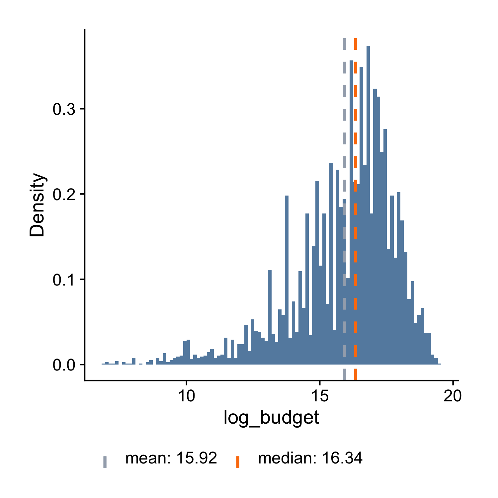

# Plot the Distribution of a Continuous Variable

Let's begin with an example. The `ezplot` package contains a dataset of films from IMBD.com. Let's load the package and look at the variables from the `films` dataset.

A>
```r
library(ezplot)
str(films)
```
A>
```
'data.frame':	5944 obs. of  53 variables:
 $ title         : chr  "'Gung Ho!': The Story of Carlson's Makin Island Raiders" "'Til There Was You" "(500) Days of Summer" "10 Questions for the Dalai Lama" ...
 $ year          : int  1943 1997 2009 2006 1999 1983 2008 2008 1996 2000 ...
 $ budget        : num  866898 10000000 7500000 100000 16000000 ...
 $ length        : int  88 113 95 86 97 101 109 104 103 100 ...
 $ rating        : num  6.2 4.7 7.8 7.5 7.2 6.2 5 5.6 5.6 4.8 ...
 $ votes         : num  898 2214 320459 568 187762 ...
 $ r1            : num  4.5 4.5 4.5 4.5 4.5 4.5 4.5 4.5 4.5 4.5 ...
 $ r2            : num  4.5 4.5 4.5 4.5 4.5 4.5 4.5 4.5 4.5 4.5 ...
 $ r3            : num  4.5 4.5 4.5 4.5 4.5 4.5 4.5 4.5 4.5 14.5 ...
 $ r4            : num  4.5 14.5 4.5 4.5 4.5 4.5 14.5 14.5 14.5 14.5 ...
 $ r5            : num  14.5 14.5 4.5 4.5 4.5 14.5 14.5 14.5 24.5 24.5 ...
 $ r6            : num  24.5 14.5 4.5 4.5 14.5 24.5 14.5 24.5 24.5 14.5 ...
 $ r7            : num  14.5 4.5 14.5 14.5 24.5 24.5 14.5 14.5 14.5 4.5 ...
 $ r8            : num  14.5 4.5 34.5 24.5 24.5 14.5 4.5 4.5 4.5 4.5 ...
 $ r9            : num  4.5 4.5 14.5 14.5 14.5 4.5 4.5 4.5 4.5 4.5 ...
 $ r10           : num  4.5 4.5 14.5 24.5 14.5 4.5 4.5 4.5 4.5 4.5 ...
 $ mpaa          : chr  NA "PG-13" "PG-13" NA ...
 $ boxoffice     : num  2176489 13564657 60722734 1698530 737720177 ...
 $ actor         : chr  "Wong,Bruce(I)" "Winant,Bruce" "Woodward,JonMorgan" "Tethong,Tenzin" ...
 $ actress       : chr  "McDonald,Grace" "Zima,Yvonne" "Weiss,Gelsey" NA ...
 $ director      : chr  "Enright,Ray" "Winant,Scott(I)" "Webb,Marc(I)" "Ray,Rick(II)" ...
 $ writer        : chr  "LeFran\xe7ois,W.S." "Holzman,Winnie" "Weber,MichaelH." "Ray,Rick(II)" ...
 $ short         : Factor w/ 2 levels "0","1": 1 1 1 1 1 1 1 1 1 1 ...
 $ drama         : Factor w/ 2 levels "0","1": 2 1 2 1 2 2 2 1 1 1 ...
 $ comedy        : Factor w/ 2 levels "0","1": 1 2 2 1 2 1 1 1 2 2 ...
 $ documentary   : Factor w/ 2 levels "0","1": 1 1 1 2 1 1 1 1 1 1 ...
 $ adult         : Factor w/ 2 levels "0","1": 1 1 1 1 1 1 1 1 1 1 ...
 $ action        : Factor w/ 2 levels "0","1": 1 1 1 1 1 1 2 1 1 1 ...
 $ romance       : Factor w/ 2 levels "0","1": 1 2 2 1 2 1 1 1 1 1 ...
 $ thriller      : Factor w/ 2 levels "0","1": 1 1 1 1 1 2 1 2 1 1 ...
 $ animation     : Factor w/ 2 levels "0","1": 1 1 1 1 1 1 1 1 1 1 ...
 $ family        : Factor w/ 2 levels "0","1": 1 1 1 1 1 1 1 1 2 2 ...
 $ crime         : Factor w/ 2 levels "0","1": 1 1 1 1 1 2 1 1 1 1 ...
 $ horror        : Factor w/ 2 levels "0","1": 1 1 1 1 1 1 1 2 1 1 ...
 $ music         : Factor w/ 2 levels "0","1": 1 1 1 1 1 1 1 1 1 1 ...
 $ adventure     : Factor w/ 2 levels "0","1": 1 1 1 1 1 1 2 1 2 2 ...
 $ fantasy       : Factor w/ 2 levels "0","1": 1 1 1 1 1 1 2 1 1 1 ...
 $ sci_fi        : Factor w/ 2 levels "0","1": 1 1 1 1 1 1 1 1 1 1 ...
 $ mystery       : Factor w/ 2 levels "0","1": 1 1 1 1 1 1 1 2 1 1 ...
 $ biography     : Factor w/ 2 levels "0","1": 1 1 1 1 1 1 1 1 1 1 ...
 $ history       : Factor w/ 2 levels "0","1": 2 1 1 1 1 1 1 1 1 1 ...
 $ sport         : Factor w/ 2 levels "0","1": 1 1 1 1 1 1 1 1 1 1 ...
 $ musical       : Factor w/ 2 levels "0","1": 1 1 1 1 1 1 1 1 1 1 ...
 $ western       : Factor w/ 2 levels "0","1": 1 1 1 1 1 1 1 1 1 1 ...
 $ war           : Factor w/ 2 levels "0","1": 2 1 1 1 1 1 1 1 1 1 ...
 $ reality_tv    : Factor w/ 2 levels "0","1": 1 1 1 1 1 1 1 1 1 1 ...
 $ news          : Factor w/ 2 levels "0","1": 1 1 1 1 1 1 1 1 1 1 ...
 $ talk_show     : Factor w/ 2 levels "0","1": 1 1 1 1 1 1 1 1 1 1 ...
 $ film_noir     : Factor w/ 2 levels "0","1": 1 1 1 1 1 1 1 1 1 1 ...
 $ yrs_since_1913: int  30 84 96 93 86 70 95 95 83 87 ...
 $ year_cat      : chr  "1913-1950" "1990-2014" "1990-2014" "1990-2014" ...
 $ bo_bt_ratio   : num  2.51 1.36 8.1 16.99 46.11 ...
 $ made_money    : Factor w/ 2 levels "no","yes": 2 2 2 2 2 2 2 1 2 2 ...
```

If you want to learn more about this dataset, for example, the meaning of each variable, you can run `?films` to pull up its documentation. 

Let's focus on the variable `budget`. Its type is numeric, so it's continuous and we can examine its distribution by making a histogram.

A>
```r
plt = mk_histdens(films, "histogram") # plt is a function
plt("budget", bins = 100) 
```


Alternatively, we can make a density plot.

A>
```r
plt = mk_histdens(films, 'density') 
plt("budget") 
```


Instead of looking at its density curve, we can plot its Cumulative Distribution Function (CDF).

A>
```r
plt = mk_cdfplot(films) 
plt("budget", add_vline_median = TRUE) 
```


Finally, we can also draw a boxplot.

A>
```r
plt = mk_boxplot(films) 
plt(yvar = "budget") 
```


All four plots tell the same story, for example, that the distribution of budget has a long right tail and it's not normal. (It may take you sometime to learn how to read the CDF plot. But once you get used to it, you'll find it's very powerful.) We can further confirm `budget` is NOT normally distributed by looking at its [normal probability plot](https://en.wikipedia.org/wiki/Normal_probability_plot). A normal distribution would have all the dots scattered along the trend line within the blue-grayish confidence band.

A>
```r
plt = mk_qqplot(films) 
plt("budget") 
```


Pay attention to how we used the `mk_xxxx()` functions. First, we passed in
the data frame `films` and got back a function `plt`. Next, we called `plt()` with the name of the variable we want to visualize (`"budget"`) as an argument. As you'll see in later chapters, this usage pattern will occur over and over again. All ezplot plotting functions are designed as [functions that return functions](http://masterr.org/r/functions-that-return-functions/), which has two benefits: 

1. Consistent Interface. Every plotting function takes a data frame as the only
input and returns a function. The consistent interface allows you to focus on 
what a function does, for example, draw a boxplot or histogram, rather than how 
it does it. 

2. Reusability. The returned function can be used to visualize many variables 
from the same data frame. For example, we ran `plt("budget")` to visualize
the distribution of `budget`. If we want to see the distribution of `boxoffice`,
we can just run `plt("boxoffice")`. This is really handy since we almost always 
want to visualize every variable in a dataset when performing descriptive and
exploratory analyses. 

Coming back to the distribution of `budget`, it's hard to see how it's 
distributed in the center because it's highly skewed to the right by a few 
extremely large values. To solve this, we take the log of `budget` and visualize its log values afterwards.

A>
```r
films$log_budget = log(films$budget)
plt2 = mk_histdens(films) # returns a function for making histograms by default
plt2("log_budget", bins = 100)
```



A>
```r
plt2 = mk_histdens(films, 'density')
plt2("log_budget")
```


A>
```r
plt2 = mk_cdfplot(films)
plt2("log_budget", add_vline_median = TRUE)
```


A>
```r
plt2 = mk_boxplot(films)
plt2(yvar = "log_budget")
```


A>
```r
plt2 = mk_qqplot(films)
plt2("log_budget")
```


We see the distribution of the log values of `budget` is also not normal. By the way, the reason why we care about normality is because many statistical models, such as linear regression, require the outcome variable to be normally distributed. When encountering long right-tailed data, we can often make it approximately normal by taking the log transformation. 
