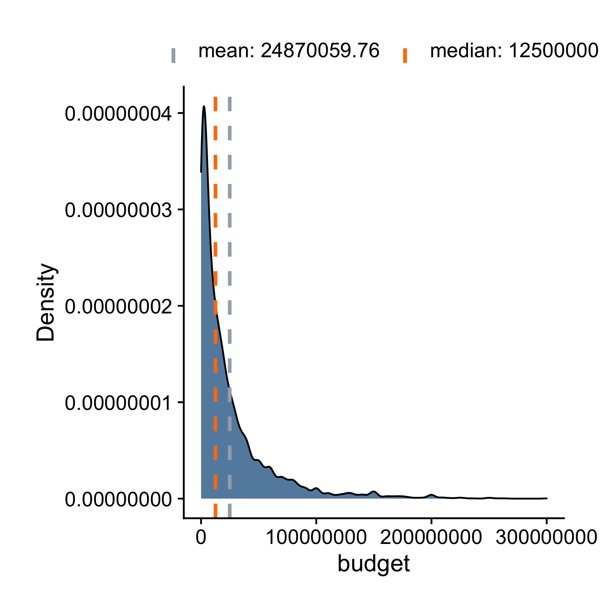
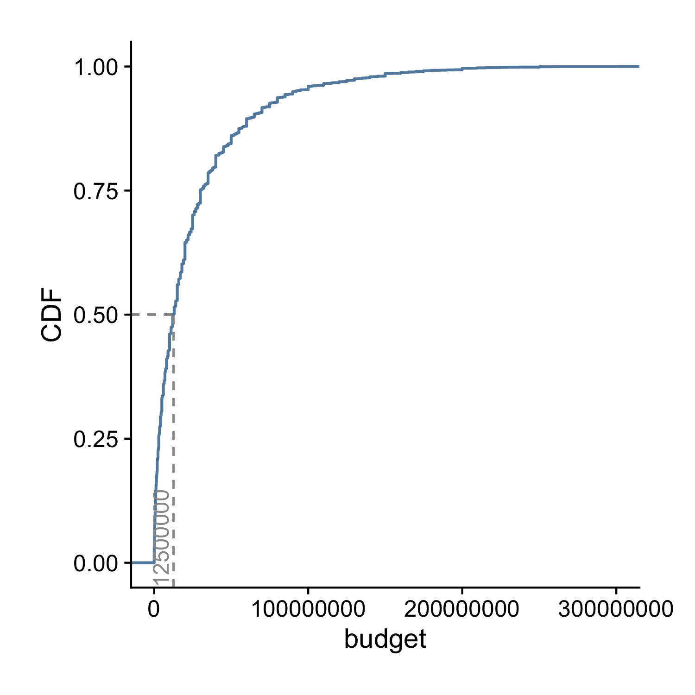
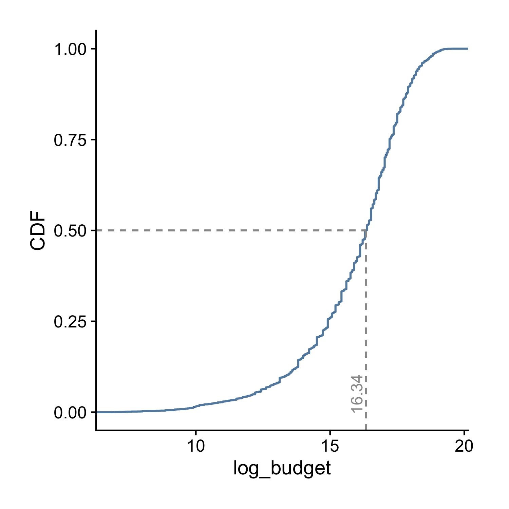

# Plot the Distribution of a Continuous Variable

When showing the univariate distribution of a continuous variable, if the number of observations is relatively small, a dot plot is often used. For example, the `ezplot` package comes with a dataset of all past American presidents (as of 2020) and the number of days each spent in office. It's a small dataset of 44 records and 2 columns.

```r
library(ezplot)
str(days_in_office)
```

```
'data.frame':    44 obs. of  2 variables:
 $ president: chr  "Franklin D. Roosevelt" "Thomas Jefferson" "James Madison" "James Monroe" ...
 $ days     : num  4422 2922 2922 2922 2922 ...
```

Let's create a dot plot to see if we can discover any patterns. 

```r
plt = mk_dotplot(days_in_office) # plt is a function
plt("days", legend_pos = 'top') 
```


We see that there are two clusters of data points located at a value that's a little less than 1500 and at a value that's a little less than 3000, indicating that these two values occur more frequently than others. Not surprisingly, these are 1461 and 2922 days, which correspond to one and two full 4-year terms in office. What may be a little surprising, is the relatively large number of points that occur outside these clusters. Apparently, quite a few presidents left office without finishing their first or second full term.

When the data size is large, a dot plot is inappropriate, instead, a histogram, density plot, CDF plot or boxplot is often used. For example, the `ezplot` package contains a dataset of 5944 films from IMBD.com. You can run `?films` inside Rstudio to pull up its documentation if you want to find out the meaning of each variable. For our purpose here, let's look at the distribution of the variable `budget` in a histogram.

```r
plt = mk_histdens(films) # plt is a function
plt("budget", bins = 100, legend_pos = 'top')
```


We can also make a density plot instead of histogram.

```r
plt("budget", type = 'density', legend_pos = 'top') 
```



Instead of the density curve, we can plot its Cumulative Distribution Function (CDF).

```r
plt = mk_cdfplot(films) 
plt("budget", add_vline_median = TRUE) 
```



Finally, we can also draw a boxplot.

```r
plt = mk_boxplot(films) 
plt(yvar = "budget") 
```


All four plots tell the same story, for example, that the distribution of budget has a long right tail and it's not normal. (It may take you sometime to learn how to read the CDF plot. But once you get used to it, you'll find it's very powerful.) We can further confirm `budget` is NOT normally distributed by looking at its [normal probability plot](https://en.wikipedia.org/wiki/Normal_probability_plot). A normal distribution would have all the dots scattered along the trend line within the blue-grayish confidence band.

```r
plt = mk_qqplot(films) 
plt("budget") 
```


Pay attention to how we used the `mk_xxxx()` functions. First, we passed in
the data frame `films` and got back a function `plt`. Next, we called `plt()` with the name of the variable we want to visualize (`"budget"`) as an argument. As you'll see in later chapters, this usage pattern will occur over and over again. All ezplot plotting functions are designed as [functions that return functions](http://masterr.org/r/functions-that-return-functions/), which has two benefits: 

1. Consistent Interface. Every plotting function takes a data frame as the only
   input and returns a function. The consistent interface allows you to focus on 
   what a function does, for example, draw a boxplot or histogram, rather than how 
   it does it. 

2. Reusability. The returned function can be used to visualize many variables 
   from the same data frame. For example, we ran `plt("budget")` to visualize
   the distribution of `budget`. If we want to see the distribution of `boxoffice`,
   we can just run `plt("boxoffice")`. This is really handy since we almost always 
   want to visualize every variable in a dataset when performing descriptive and
   exploratory analyses. 

Coming back to the distribution of `budget`, it's hard to see how it's 
distributed in the center because it's highly skewed to the right by a few 
extremely large values. To solve this, we take the log of `budget` and visualize its log values afterwards.

```r
films$log_budget = log(films$budget)
plt2 = mk_histdens(films) 
plt2("log_budget", bins = 100, legend_pos = 'bottom') # draw histogram by default
```


```r
plt2("log_budget", type = 'density', adjust = 0.6, legend_pos = 'bottom') 
```


```r
plt2 = mk_cdfplot(films)
plt2("log_budget", add_vline_median = TRUE)
```



```r
plt2 = mk_boxplot(films)
plt2(yvar = "log_budget")
```


```r
plt2 = mk_qqplot(films)
plt2("log_budget")
```


We see the distribution of the log values of `budget` is also not normal. By the way, the reason why we care about normality is because many statistical models, such as linear regression, require the outcome variable to be normally distributed. When encountering long right-tailed data, we can often make it approximately normal by taking the log transformation. 
