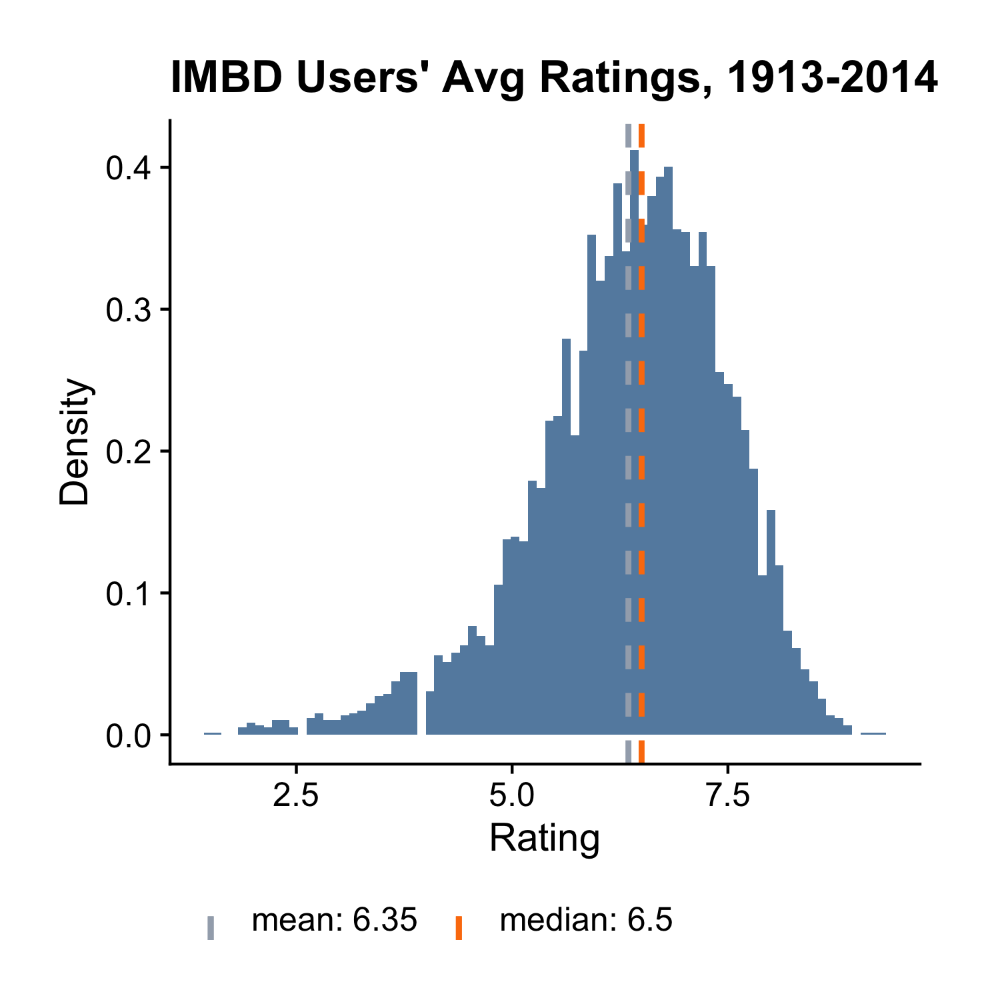

## Histogram

We've seen that we can use histogram, density plot, cdf plot, boxplot and qqplot to understand the distribution of a continuous variable. In this section, we'll take a deeper look at how to make histograms using `ezplot`. Let's first load the `ezplot` library and examine the variable `rating` from the `films` data frame by calling `str()` on it. The variable `rating` measures IMDB users' average ratings.


```r
library(ezplot)
str(films$rating)
```

```
 num [1:5944] 6.2 4.7 7.8 7.5 7.2 6.2 5 5.6 5.6 4.8 ...
```

The output `num` says that its type is numeric. Looking at the first few data values, it's clear `rating` is continuous. We can use a histogram to understand its distribution.


```r
plt = mk_histdens(films)
p = plt("rating", bins = 80, legend_pos = 'bottom') 
add_labs(p, xlab = "Rating", title = "IMBD Users' Avg Ratings, 1913-2014")
```



We first called the function `mk_histdens()` on the data frame `films`, and 
obtained another function `plt()` in return. We then passed the string `"rating"` into `plt()` to draw the histogram. Note `"rating"` is the name of the variable, not the variable symbol. The object returned by `plt()` is a ggplot2 chart. We passed it into the function `add_labs()` to give it a new x-axis label and title. 

The function `plt()` also takes other arguments. In the example aboved, we passed in `bins = 80` to tell `plt()` to make a histogram of 80 bins. (The default value of `bins` is 30.) You can also supply a value to the `binwidth` parameter. For example, you can set `binwidth = 0.1` to change the size
of each bin, and this will overwrite the number of bins. In practice, I often play with different values of `binwidth` or `bins` until the obtained histogram has a large number of bins to show how the data are really distributed. Another useful parameter is `add_vline_median` or `add_vline_mean`. For example, setting `add_vline_median = FALSE` will not show the vertical line at the median.


```r
plt("rating", binwidth = 0.1, add_vline_median = FALSE, legend_pos = "top") 
```


Now I want you to run `?mk_histdens()` and read the documentation. Pay attention to the bullet point `facet_by`.

We've looked at the distribution of users' average ratings for all films. What do users' average ratings look like for films that made money vs. those that didn't? We can answer this question by bringing in another variable called 
`made_money`. Let's `str` it first.


```r
str(films$made_money)
```

```
 Factor w/ 2 levels "no","yes": 2 2 2 2 2 2 2 1 2 2 ...
```

So `made_money` is a factor with two levels (yes, no), indicating if a film made money or not. We can create 2 facets, one with a histogram of profitable films
and the other of unprofitable films, by simply setting `facet_by = "made_money"`. 


```r
p = plt("rating", facet_by = "made_money", bins=100, add_vline_mean = F)
add_labs(p, subtitle = 'Avg. ratings of unrofitable vs. profitable films')
```


We see profitable films have a higher median average rating, and it seems
there're more profitable films (the height of the bottom histogram is higher).
Let's check if this is true.


```r
table(films$made_money)
```

```

  no  yes 
1831 4113 
```

We see the number of profitable films is more than twice of the unprofitable 
ones. Oh, there's another thing I want to point out. The colors in those
charts we made are color-blind friendly. For homework, read the document of
`mk_histdens()` (`?mk_histogram`) and run the examples. 
