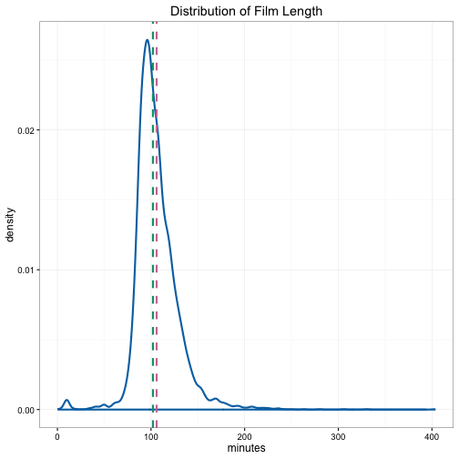
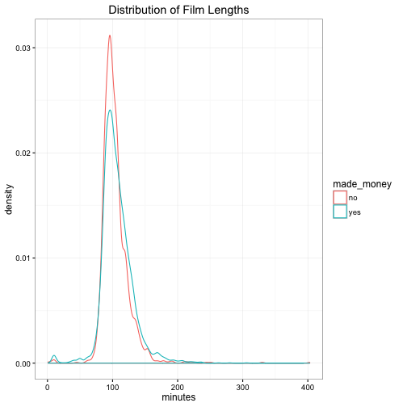
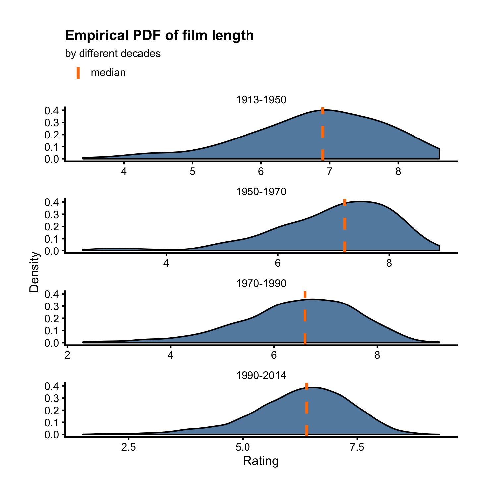

## Density Plot

Previously we learned how to make histograms. A density plot is similar to a histogram except it draws a smooth curve tracing out the hights of the bins instead of drawing the bins themselves. In other words, density plots show the empirical [probability density function](https://en.wikipedia.org/wiki/Probability_density_function). The `films` dataset has a variable `length` that measures the duration of each film in minutes. Let's draw a density plot to show its distribution. 


```r
library(ezplot)
plt = mk_histdens(films)
p = plt("length", type = 'density', legend_pos = 'bottom')
add_labs(p, xlab = "minutes", title = "Empirical PDF of film length")
```



We can also draw two density curves of `length`, one for profitable films and one for unprofitable films, by setting `facet_by = "made_money"`, where `"made_money"` is the name of a categorical variable indicating if a film made money or not.


```r
p = plt(xvar = "length", type = 'density', 
        facet_by = "made_money", facet_ncol = 2,
        add_vline_mean = FALSE, legend_pos = 'top') 
add_labs(p, xlab = "minutes", ylab = "made money?", 
         title = "Empirical PDF of film length")
```



As another example, let's plot the density of `rating` by `year_cat`.


```r
plt("rating", type = 'density', facet_by = "year_cat", 
    font_size = 9, add_vline_mean = FALSE, legend_pos = 'top') 
```



For homework, read the document of `mk_histdens()` and run the examples. 
You can pull up the document by running `?mk_histdens()`. 
