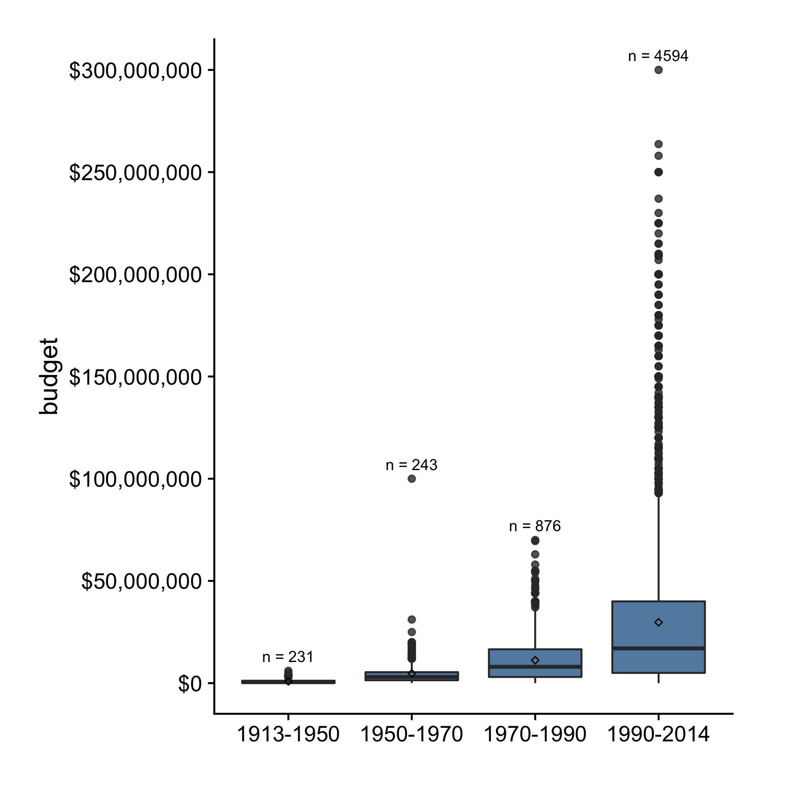
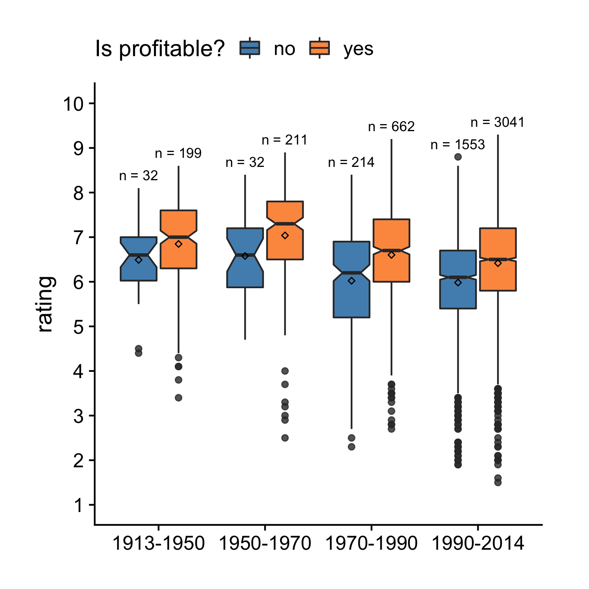

## Boxplot

Previously we learned histograms and density plots. When visualizing 
the distribution of a continuous variable, there's yet another type of plot we 
can use, the boxplot. A boxplot shows the minimum, the 25th percentile, the median, (optionally the mean,) the 75th percentile and the maximum. It also shows outliers that are far away from the majority of data points. Let's start with an example by making a boxplot for `budget`.


```r
library(ezplot)
library(dplyr)
```


```r
plt = mk_boxplot(films)
p = plt(yvar = "budget")
p = scale_axis(p, axis = "y", scale = "log10") # use log10 scale on y-axis
add_labs(p, ylab = "budget ($)", title = "Distribution of budget",
         subtitle = 'on a log10-y scale') 
```


Notice we didn't specify `xvar` inside the function `plt()`, so `plt()` uses
the default setting `xvar = '1'`. The number 5944 is the total number of 
observations. If we want to show how `budget` is distributed for different groups, we can supply a categorical variable name to `xvar`. For example, the films were made between 1913 and 2014, and it's interesting to see how 
budget changed over the years. To find out, we can draw a boxplot of `budget` 
vs. `year_cat`. 


```r
plt(xvar = "year_cat", yvar = "budget") %>% 
        # apply dollar scale to y-axis 
        scale_axis(axis="y", scale = "dollar") 
```



We see budget has increased over the decades. There were only 231 films released between 1913 and 1950, but 4594 films released between 1990 and 2014. Yes, 
ezplot is smart enough to tally these numbers and display them at the top of 
each boxplot. You can choose not to show them by setting `label_size = 0` inside
`plt()`. Try it.  

Here's a caveat: when making a boxplot, the x variable must be character or factor type, and cannot be integer or numeric. For example, if we try to plot `budget` by `year`,  it'll throw an error because `year` has type integer.


```r
plt(xvar = "year", yvar = "budget") # throws error since "year" is integer
```

```
Error in plt(xvar = "year", yvar = "budget"): The x variable, year, is integer or numeric. Change to factor or character.
```

To make it work, we can change `year` to factor first. 


```r
f = mk_boxplot(
        films %>% filter(year %in% 2010:2014) %>% 
                mutate(year = factor(year))
        )
f("year", "budget", notched = T) %>% # draw notched boxplot
        add_labs(caption = 'data period: 2010 - 2014')
```


Notice the "notches" or narrowing of the box around the median. We did that by 
setting `notched = T`. Notches are useful in offering a rough guide to the significance of difference of medians. If the notches of two boxes do not overlap, we have evidence of a statistically significant difference between the medians.

In addtion to `xvar` and `yvar`, we can also supply a `fillby` varname to
draw boxplots in different colors for different groups. For example, we can show the distribution of users' average ratings for profitable and unprofitable films at each period.


```r
plt("year_cat", "rating", fillby = "made_money", notched = TRUE,
    legend_title = "Is profitable?", legend_pos = "top")
```



For homework, try the following exercises.

1. Read the document of `mk_boxplot()` and run the examples. You can pull up the document by running `?mk_boxplot`. 
2. Draw a plot to show how the distributions of `boxoffice` change over the years.
3. Draw a plot to show how the distributions of `rating` change over the years.
4. Draw a plot to show how the distributions of `length` change over the years.
5. The `films` dataset has a variable `mpaa` that has the MPAA rating of each 
film. What type of a variable is it? Can you draw a plot to show the 
distribution of `boxoffice` at each MPAA rating?
6. The `films` dataset has a bunch of variables that record the genres, 
for example, `action`, `comedy`, and etc. Can you draw a plot to show the 
distribution of `boxoffice` for each genre?
