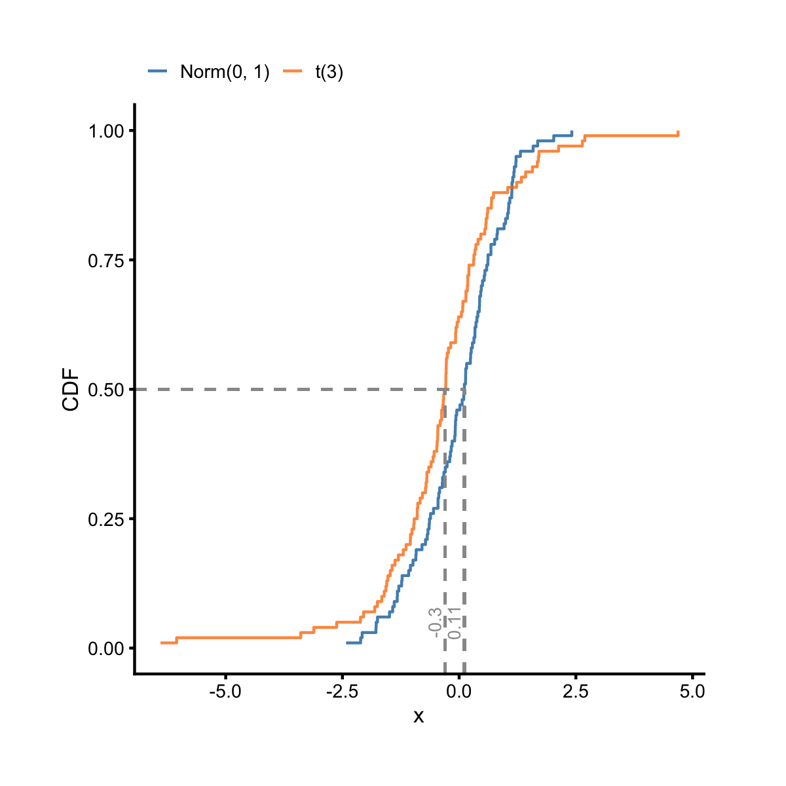
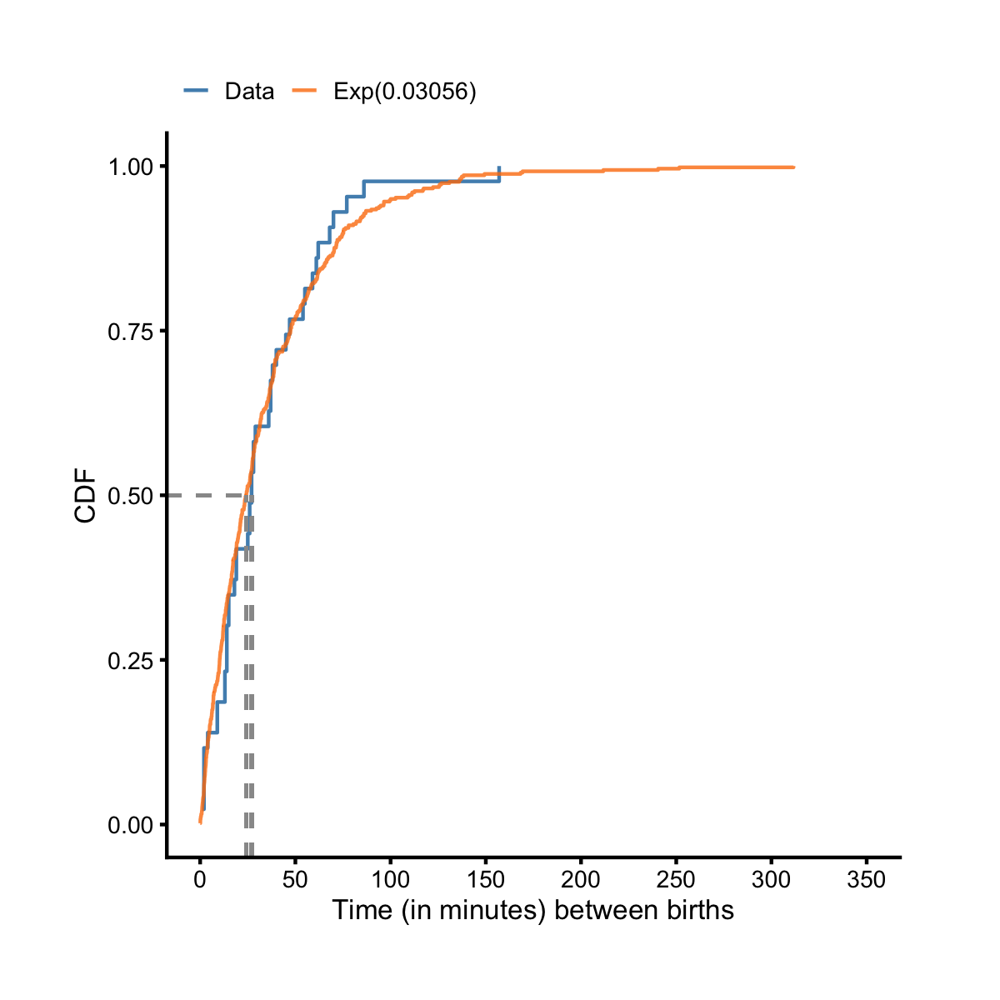
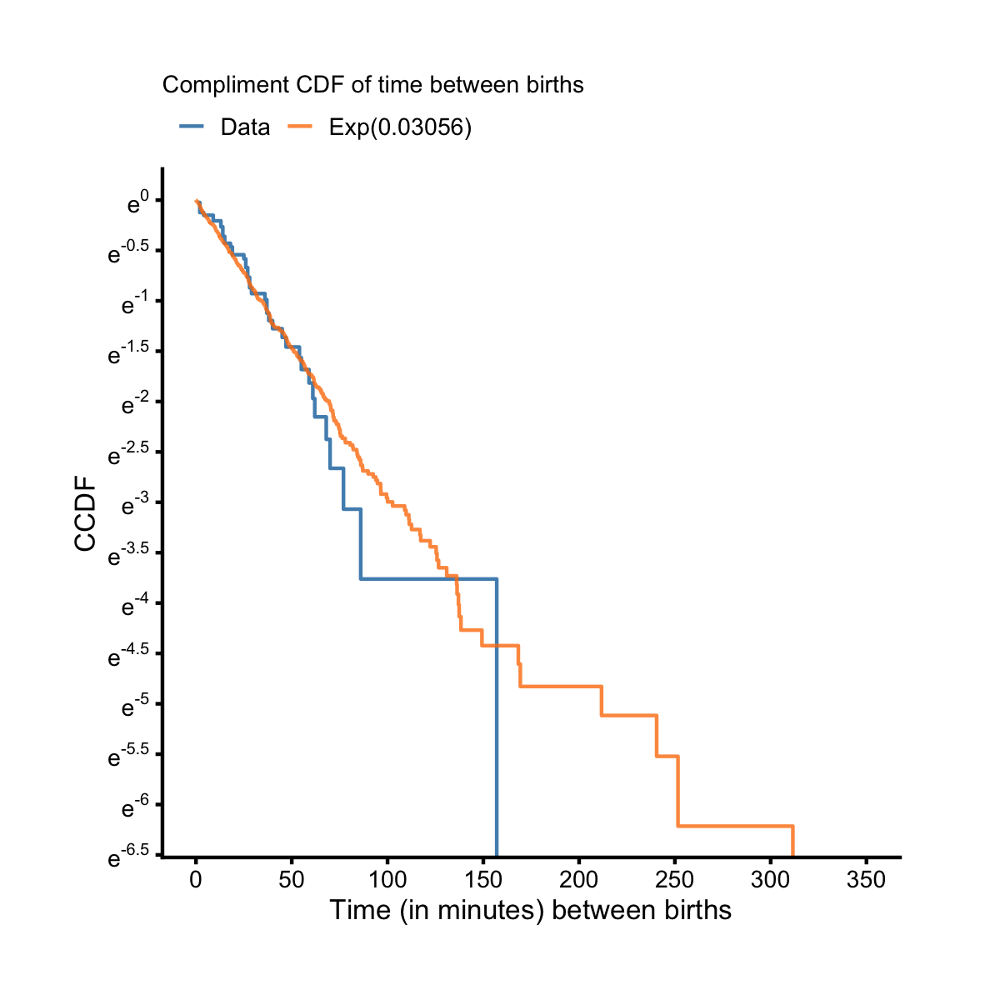

## CDF Plot

So far we've learned how to make histograms, density plots and boxplots, which are the most common visual aids for understanding the distribution of a continuous variable. In this section, we'll look at the CDF plot, which is used less common but can be equally effective. The CDF plot has the cumulative probabilities on the y-axis so its y-limits are from 0 to 1. As a first example, let's take a random sample of size 100 from the standard normal distribution and a random sample of size 100 from the Student's t-distribution with 3 degrees of freedom. Let's plot their respective empirical CDFs on the same cdf plot. 


```r
library(dplyr)
library(ezplot)
set.seed(123923)
df = rbind(data.frame(x = rnorm(100), type = 'Norm(0, 1)'),
           data.frame(x = rt(100, df = 3), type = 't(3)'))
plt = mk_cdfplot(df)
plt('x', colorby='type', add_vline_median = TRUE, 
    legend_title = NULL, legend_pos = 'top', pad = FALSE) %>% 
        square_fig()
```



We see both distributions are symmetric, but the t-distribution has heavier tails, meaning that it is more prone to producing values that are far from its mean and median. See how the blue curve stops at x = -2.5 and x = 2.5, while the orange curve extends beyond -5 and 5. 

As a second example, let's look at a dataset from the real world. On December 18, 1997, 44 babies were born in a hospital in Brisbane, Australia. Their information at birth were stored in the `births` dataset that comes with the `ezplot` package. In particular, the time (in minutes) between consecutive births was recorded in the `diffs` variable. It's common that the time between events often follows an exponential distribution. Let's check if this is the case. First of all, because 44 babies were born in a 24-hour period, the average number of births per minute is just `44 / (24 * 60) = 0.03056`. We can take a random sample of 500 values from the exponential distribution with a rate of 0.03056, and plot their empirical CDF together with the empirical CDF of the `diffs` data on the same cdf plot. 


```r
set.seed(9203)
dat = rbind(births %>% filter(!is.na(diffs)) %>% 
                    mutate(type = 'Data') %>%
                    select(type, diffs),
            # stack 500 random numbers from Exp(rate=0.03056)
            data.frame(type = 'Exp(0.03056)', 
                       diffs = rexp(500, 0.03056))
            )
# plot CDFs of observed data and sample data from exponential model
f = mk_cdfplot(dat)
f("diffs", colorby = 'type', pad = F, 
  legend_title = NULL, legend_pos = 'top',
  add_vline_median = T, show_label_median = F) %>%
        scale_axis(axis = 'x', nticks = 10) %>%
        add_labs(xlab = 'Time (in minutes) between births')
```



We see the blue (data) and the orange (model) curves overlap up to about 60 minutes and then start separating a little. This tells us the time between births of those 44 babies up to 60 minutes can be modeled by an exponential distribution with rate 0.03056, and beyond 60 minutes, the exponential model fails to fit the data well. We can also plot the Compliment CDF (CCDF), which is calculated as `1 - CDF`. If data were from an exponential distribution, their CCDF on a log-y scale would be a line with a negative slope, and the absolute value of the slope would be a good estimate to the rate of the exponential distribution from which the data were drawn. Let's plot the CCDF of the `diffs` data on a log-y scale. We see blue (data) curve is a straight line up to 60 minutes, and this confirms with what we saw in the cdf plot. 


```r
f("diffs", complement = TRUE, colorby = 'type', pad = FALSE, 
  legend_title = NULL, legend_pos = 'top',
  add_vline_median = T, show_label_median = F) %>%
        scale_axis(axis = 'y', scale = 'log') %>%
        scale_axis(axis = 'x', nticks = 10) %>%
        add_labs(xlab = 'Time (in minutes) between births',
                 subtitle = 'Compliment CDF of time between births')
```



Now it's your turn. Try the following exercises for homework.

1. Read the document of `mk_cdfplot()` and run the examples. You can pull up the document by running `?mk_cdfplot` in Rstudio. 
2. Draw a cdf plot to check if `Sepal.Length` from the `iris` dataset is normally distributed. You can compute the sample mean and standard deviation of `Sepal.Length`, and use them as estimates of the population parameters of a normal distribution to generate a random sample of 500 normal numbers. Plot the empirical CDFs of both the observed data and the sample from the normal model on the same cdf plot.
