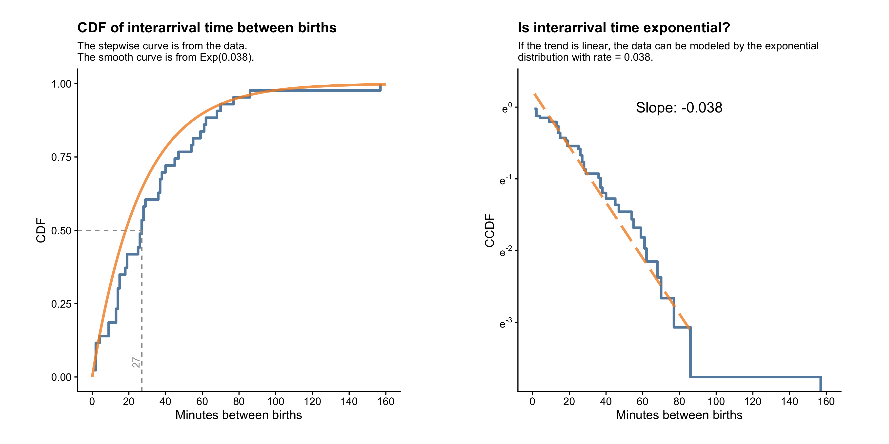
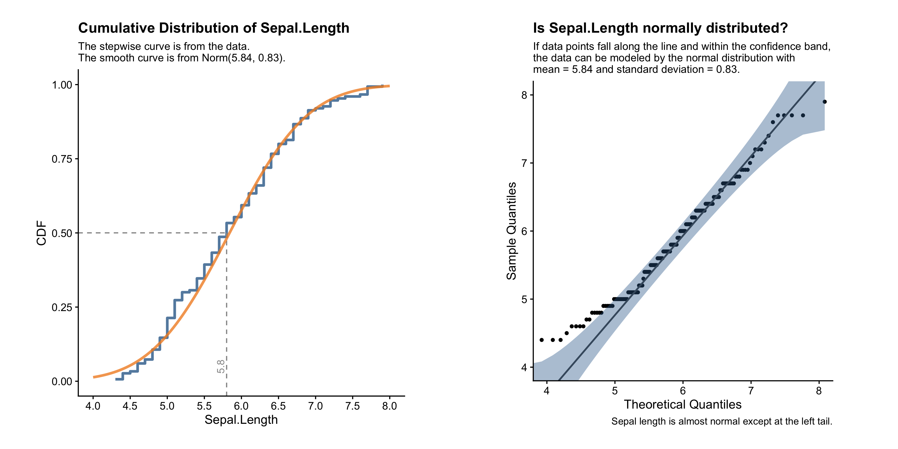
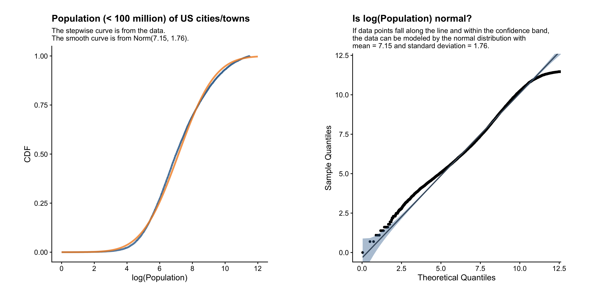
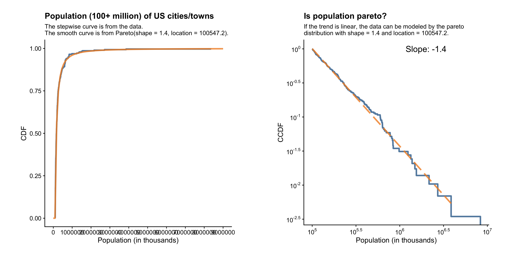

In the last two sections, we discussed how to use CDF, CCDF and Q-Q plots to check if observed data follow a well known distribution. Real world data can often be modeled by four common probability distributions: normal, lognormal, exponential and pareto. To make it easy to check if observed data follow any of those four distributions, the `ezplot` package provides three functions: `check_expdist()`, `check_normality()`, and `check_pareto()`. Before we go into the details, let's first load the `ezplot` and `dplyr` packages.


```r
library(ezplot)
library(dplyr)
```

## Check if observed data follow the exponential distribution.

The exponential distribution is the probability distribution of the time between events in a process in which events occur continuously and independently at a constant average rate. Its mean and standard deviation are equal to the inverse of the rate. In the section on CDF plot, we've already established `births$diffs` can be modeled by the exponential distribution. Instead of making separate CDF and CCDF plots one by one manually like we did before, we can use the `check_expdist()` function to produce both plots at one shot and display them side by side. Moreover, `check_expdist()` also automatically calculates the parameter (rate) estimate of the best fitting exponential model based on the observed data. 


```r
df = births %>% filter(!is.na(diffs))
f = check_expdist(df)
f('diffs', linew = 0.5, font_size = 8, xlab = 'Minutes between births',
  title_left = 'CDF of interarrival time between births',
  title_right = 'Is interarrival time exponential?',
  add_vline_median = TRUE, digits = 3)
```



## Check if observed data follow the normal distribution.

The `iris` dataset contains a variable `Sepal.Length`. Let's check if it follows the normal distribution. 


```r
plt = check_normality(iris)
plt("Sepal.Length", add_vline_median = TRUE, linew = 0.5, font_size = 8, 
    caption_right = 'Sepal length is almost normal except at the left tail.')
```



We see `check_normality()` produces a funtion that draws the CDF plot and the Normal Probability Plot side by side on one canvas. Moreover, it finds the normal distribution that best fits the data, and overlays its CDF on top of the empirical CDF of the observed data. This allows us to see at a glance if the two CDF curves agree or not.

## Check if observed data follow the lognormal distribution.

Sometimes the data do not follow the normal distribution, but their log-transformations do. When this happens, we say the data follow the lognormal distribution. To check if some observed data are lognormal, we can add their log values to the data frame and `check_normality` of the log values. Let's look at an example. The 2012 population of every incorporated city and town in the United States was stored in the `pops` dataset. Let's focus on populations that are less than 100 million and see if they can be modeled by the lognormal distribution.


```r
# focus on cities/towns with <100 million people
df = pops %>% filter(!is.na(pop), pop < 10^5) %>% # pop is in thousands
        mutate(logpop = log(pop)) 
plt = check_normality(df)
plt('logpop', linew = 0.5, font_size = 8, 
    xlab_left = 'log(Population)',
    title_left = 'Population (< 100 million) of US cities/towns',
    title_right = 'Is log(Population) normal?')
```



In the above code block, we first filtered out records with population < 100 million. (We used 10^5 because the `pop` column is in thousands.) Then we took the log of those population values and assigned them to a new variable called `logpop`. Finally, we called `check_normality(df)` to get a plotting function and used it to draw the CDF plot and the normal probability plot of `logpop` side by side. It was clear that the log values followed approximately the normal distribution. In other words, the original values of population upto 100 million could be modeled by the lognormal distribution. 

## Check if observed data follow the pareto distribution.

The pareto distribution is a power-law probability distribution that describes the phenomenon that a large portion of something (for example, wealth or income) is concentrated in a small fraction of the population. To check if some observed data values are consistent with samples generated from a Pareto distribution, we can plot the CCDF (1 - CDF) on a log10-log10 scale. If their empirical CCDF on a log10-log10 scale is a straight line, the observed data can be modeled by a pareto distribution with a shape parameter of -slope, and a location parameter of 10^(intercept / -slope). Let's take the same `pops` dataset and focus on the 289 cities and towns with 100 million or more people. Let's use `check_pareto()` to see if the populations of those mega cities follow a pareto distribution.


```r
# focus on cities/towns with 100+ million people
df = pops %>% filter(!is.na(pop), pop >= 10^5) # pop is in thousands
f = check_pareto(df)
f('pop', linew = 1, font_size = 8, digits = 1,
  xlab = 'Population (in thousands)',
  title_left = 'Population (100+ million) of US cities/towns',
  title_right = 'Is population pareto?')
```



The answer is yes as seen clearly from the above figure. Notice how we customized the plots by passing in arguments to parameters `xlab`, `title_left`, `title_right`, `linew` and `digits`. These are the common ones that you often want to specify according to your application. There are also less common ones that you can find out more about by reading the document.

Here's your homework.

1. Run `?check_expdist` in Rstudio to read the document. Run the examples.
2. Run `?check_normality` to read the document. Run the examples.
3. Run `?check_pareto` to read the document. Run the examples.
4. Check if `boxoffice` from the `films` dataset follows the normal distribution. Check if it can be modeled by the lognormal distribution. What about the boxoffice of profitable comedy films?
5. Check if the male `weight_g` from the `births` dataset is normal or lognormal.

