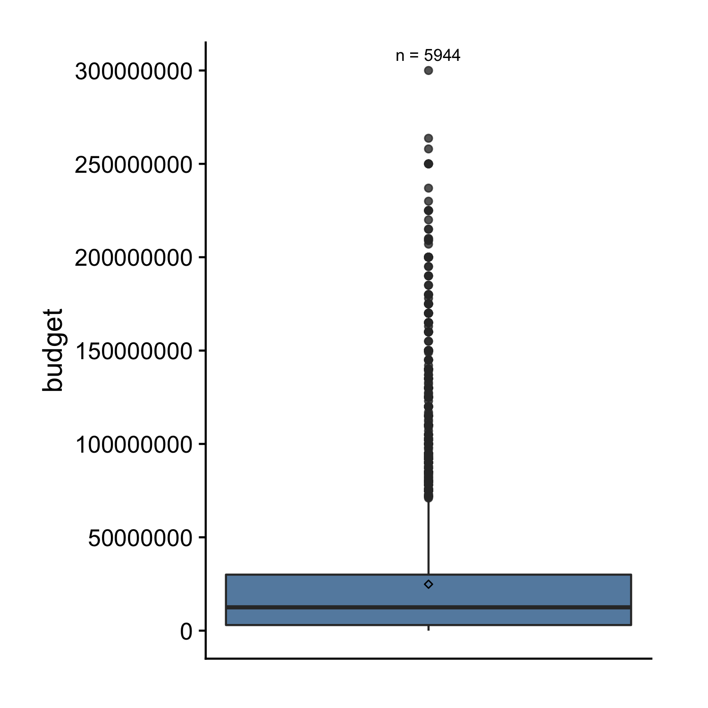
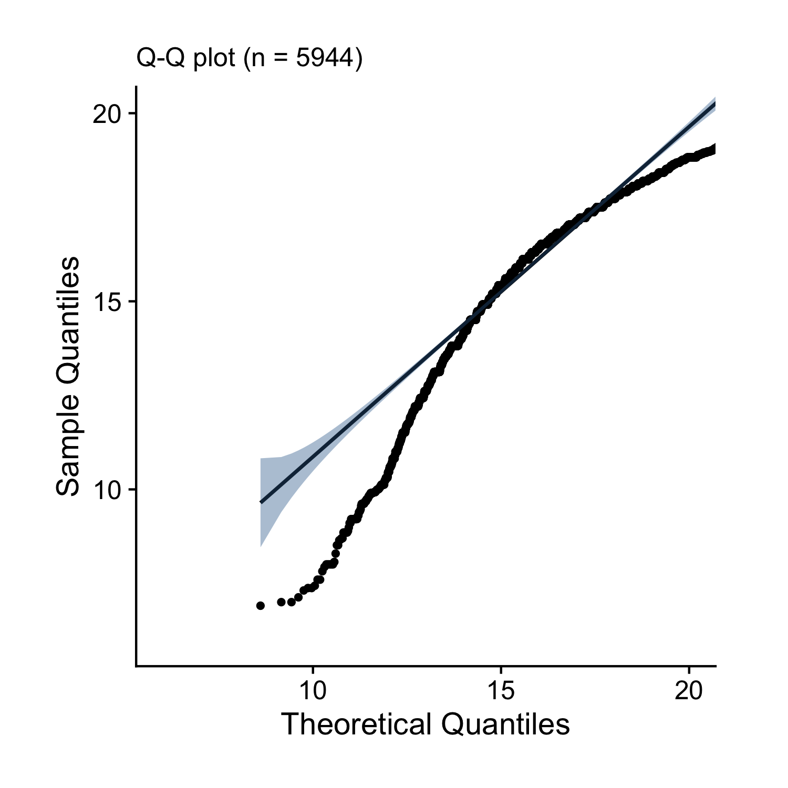

# Plot the Distribution of a Continuous Variable

Let's begin with an example. The `ezplot` package contains a dataset of films from IMBD.com. Let's load the package and look at the variables from the `films` dataset.

```r
library(ezplot)
dplyr::glimpse(films)
```

```
Observations: 5,944
Variables: 53
$ title          <chr> "'Gung Ho!': The Story of Carlson's Makin Island …
$ year           <int> 1943, 1997, 2009, 2006, 1999, 1983, 2008, 2008, 1…
$ budget         <dbl> 866898, 10000000, 7500000, 100000, 16000000, 4520…
$ length         <int> 88, 113, 95, 86, 97, 101, 109, 104, 103, 100, 107…
$ rating         <dbl> 6.2, 4.7, 7.8, 7.5, 7.2, 6.2, 5.0, 5.6, 5.6, 4.8,…
$ votes          <dbl> 898, 2214, 320459, 568, 187762, 3722, 98539, 9447…
$ r1             <dbl> 4.5, 4.5, 4.5, 4.5, 4.5, 4.5, 4.5, 4.5, 4.5, 4.5,…
$ r2             <dbl> 4.5, 4.5, 4.5, 4.5, 4.5, 4.5, 4.5, 4.5, 4.5, 4.5,…
$ r3             <dbl> 4.5, 4.5, 4.5, 4.5, 4.5, 4.5, 4.5, 4.5, 4.5, 14.5…
$ r4             <dbl> 4.5, 14.5, 4.5, 4.5, 4.5, 4.5, 14.5, 14.5, 14.5, …
$ r5             <dbl> 14.5, 14.5, 4.5, 4.5, 4.5, 14.5, 14.5, 14.5, 24.5…
$ r6             <dbl> 24.5, 14.5, 4.5, 4.5, 14.5, 24.5, 14.5, 24.5, 24.…
$ r7             <dbl> 14.5, 4.5, 14.5, 14.5, 24.5, 24.5, 14.5, 14.5, 14…
$ r8             <dbl> 14.5, 4.5, 34.5, 24.5, 24.5, 14.5, 4.5, 4.5, 4.5,…
$ r9             <dbl> 4.5, 4.5, 14.5, 14.5, 14.5, 4.5, 4.5, 4.5, 4.5, 4…
$ r10            <dbl> 4.5, 4.5, 14.5, 24.5, 14.5, 4.5, 4.5, 4.5, 4.5, 4…
$ mpaa           <chr> NA, "PG-13", "PG-13", NA, "PG-13", NA, "PG-13", "…
$ boxoffice      <dbl> 2176489, 13564657, 60722734, 1698530, 737720177, …
$ actor          <chr> "Wong,Bruce(I)", "Winant,Bruce", "Woodward,JonMor…
$ actress        <chr> "McDonald,Grace", "Zima,Yvonne", "Weiss,Gelsey", …
$ director       <chr> "Enright,Ray", "Winant,Scott(I)", "Webb,Marc(I)",…
$ writer         <chr> "LeFran\xe7ois,W.S.", "Holzman,Winnie", "Weber,Mi…
$ short          <fct> 0, 0, 0, 0, 0, 0, 0, 0, 0, 0, 0, 0, 0, 0, 0, 0, 0…
$ drama          <fct> 1, 0, 1, 0, 1, 1, 1, 0, 0, 0, 1, 1, 0, 1, 1, 1, 0…
$ comedy         <fct> 0, 1, 1, 0, 1, 0, 0, 0, 1, 1, 0, 0, 0, 0, 0, 0, 1…
$ documentary    <fct> 0, 0, 0, 1, 0, 0, 0, 0, 0, 0, 0, 0, 0, 0, 0, 0, 0…
$ adult          <fct> 0, 0, 0, 0, 0, 0, 0, 0, 0, 0, 0, 0, 0, 0, 0, 0, 0…
$ action         <fct> 0, 0, 0, 0, 0, 0, 1, 0, 0, 0, 0, 0, 1, 0, 0, 0, 0…
$ romance        <fct> 0, 1, 1, 0, 1, 0, 0, 0, 0, 0, 0, 0, 0, 0, 0, 0, 1…
$ thriller       <fct> 0, 0, 0, 0, 0, 1, 0, 1, 0, 0, 1, 1, 1, 0, 0, 1, 0…
$ animation      <fct> 0, 0, 0, 0, 0, 0, 0, 0, 0, 0, 0, 0, 0, 0, 0, 0, 0…
$ family         <fct> 0, 0, 0, 0, 0, 0, 0, 0, 1, 1, 0, 0, 0, 0, 0, 0, 0…
$ crime          <fct> 0, 0, 0, 0, 0, 1, 0, 0, 0, 0, 1, 1, 1, 0, 0, 0, 0…
$ horror         <fct> 0, 0, 0, 0, 0, 0, 0, 1, 0, 0, 0, 0, 0, 0, 0, 0, 0…
$ music          <fct> 0, 0, 0, 0, 0, 0, 0, 0, 0, 0, 0, 0, 0, 0, 0, 0, 0…
$ adventure      <fct> 0, 0, 0, 0, 0, 0, 1, 0, 1, 1, 0, 0, 0, 0, 0, 1, 0…
$ fantasy        <fct> 0, 0, 0, 0, 0, 0, 1, 0, 0, 0, 0, 0, 0, 0, 0, 0, 1…
$ sci_fi         <fct> 0, 0, 0, 0, 0, 0, 0, 0, 0, 0, 0, 0, 0, 0, 0, 0, 0…
$ mystery        <fct> 0, 0, 0, 0, 0, 0, 0, 1, 0, 0, 0, 0, 0, 0, 0, 0, 0…
$ biography      <fct> 0, 0, 0, 0, 0, 0, 0, 0, 0, 0, 0, 0, 0, 1, 0, 1, 0…
$ history        <fct> 1, 0, 0, 0, 0, 0, 0, 0, 0, 0, 0, 0, 0, 1, 0, 0, 0…
$ sport          <fct> 0, 0, 0, 0, 0, 0, 0, 0, 0, 0, 0, 0, 0, 0, 0, 0, 0…
$ musical        <fct> 0, 0, 0, 0, 0, 0, 0, 0, 0, 0, 0, 0, 0, 0, 0, 0, 0…
$ western        <fct> 0, 0, 0, 0, 0, 0, 0, 0, 0, 0, 0, 0, 0, 0, 0, 0, 0…
$ war            <fct> 1, 0, 0, 0, 0, 0, 0, 0, 0, 0, 0, 1, 0, 0, 0, 0, 0…
$ reality_tv     <fct> 0, 0, 0, 0, 0, 0, 0, 0, 0, 0, 0, 0, 0, 0, 0, 0, 0…
$ news           <fct> 0, 0, 0, 0, 0, 0, 0, 0, 0, 0, 0, 0, 0, 0, 0, 0, 0…
$ talk_show      <fct> 0, 0, 0, 0, 0, 0, 0, 0, 0, 0, 0, 0, 0, 0, 0, 0, 0…
$ film_noir      <fct> 0, 0, 0, 0, 0, 0, 0, 0, 0, 0, 0, 0, 0, 0, 0, 0, 0…
$ yrs_since_1913 <int> 30, 84, 96, 93, 86, 70, 95, 95, 83, 87, 93, 94, 9…
$ year_cat       <chr> "1913-1950", "1990-2014", "1990-2014", "1990-2014…
$ bo_bt_ratio    <dbl> 2.5106633, 1.3564657, 8.0963645, 16.9853000, 46.1…
$ made_money     <fct> yes, yes, yes, yes, yes, yes, yes, no, yes, yes, …
```

If you want to learn more about this dataset, for example, the meaning of each variable, you can run `?films` to pull up its documentation. 

Let's focus on the variable `budget`. Its type is numeric, so it's continuous and we can examine its distribution by making a histogram.

```r
plt = mk_histdens(films, "histogram") # plt is a function
plt("budget") # plt() takes in a string
```


Alternatively, we can make a density plot.

```r
plt = mk_histdens(films, 'density') 
plt("budget") 
```


As another alternative, we can draw a boxplot.

```r
plt = mk_boxplot(films) 
plt(yvar = "budget") 
```



All three plots show pretty much same information, for example, the distribution of budget has a long right tail. We can confirm budget is NOT normally distributed by looking at its qq-normal plot, also called [normal probability plot](https://en.wikipedia.org/wiki/Normal_probability_plot). 

```r
plt = mk_qqplot(films) 
plt("budget", detrend = F) 
```


A normal distribution would have the data points aligned linearly along the 
trend line connecting the bottom left corner to the upper right corner. 

Pay attention to how we used the `mk_xxxx()` functions. First, we passed in
the data frame `films` and got back a function `plt`. Next, we called 
`plt()` with the name of the variable we want to visualize (`"budget"`) as an
argument. As you'll see in later chapters, this usage pattern will occur over 
and over again. All ezplot plotting functions are designed as [functions that return functions](http://masterr.org/r/functions-that-return-functions/), which has two 
benefits: 

1. Consistent Interface. Every plotting function takes a data frame as the only
input and returns a function. The consistent interface allows you to focus on 
what a function does, for example, draw a boxplot or histogram, rather than how 
it does it. 

2. Reusability. The returned function can be used to visualize many variables 
from the same data frame. For example, we ran `plt("budget")` to visualize
the distribution of `budget`. If we want to see the distribution of `boxoffice`,
we can just run `plt("boxoffice")`. This is really handy since we almost always 
want to visualize every variable in a dataset when performing descriptive and
exploratory analyses. 

Coming back to the distribution of `budget`, it's hard to see how it's 
distributed in the center because it's highly skewed to the right by a few 
extremely large values. To solve this, we can apply the log transformation. 
For example, we can add to `films` a new variable called `log_budget` by 
taking the log of `budget` and visualize `log_budget` afterwards.

```r
films$log_budget = log(films$budget)
plt2 = mk_histdens(films) # by default, we get a function for making histograms
plt2("log_budget")
```


```r
plt2 = mk_histdens(films, 'density')
plt2("log_budget")
```


```r
plt2 = mk_qqplot(films)
plt2("log_budget", detrend = F)
```



We see that after taking log, budget becomes a bit left-skewed and is still
not normal. By the way, the reason why we care about normality is that many 
statistical methods, for example, linear regression, are devised based on the 
assumption of normal distribution. When encountering long right tailed data, 
we can often make it approximately normal by taking the log. 

The rest of the book is organized into four chapters. In chapter 3, we'll learn
how to make histogram, density plot, boxplot and qqplot. In chapter 4, we'll 
learn how to make regular, dodged and stacked bar charts, their horizontal
cousins and likert plot. In chapter 5, we'll learn how to make scatterplot, 
lineplot, dumbbell plot and heatmap.

