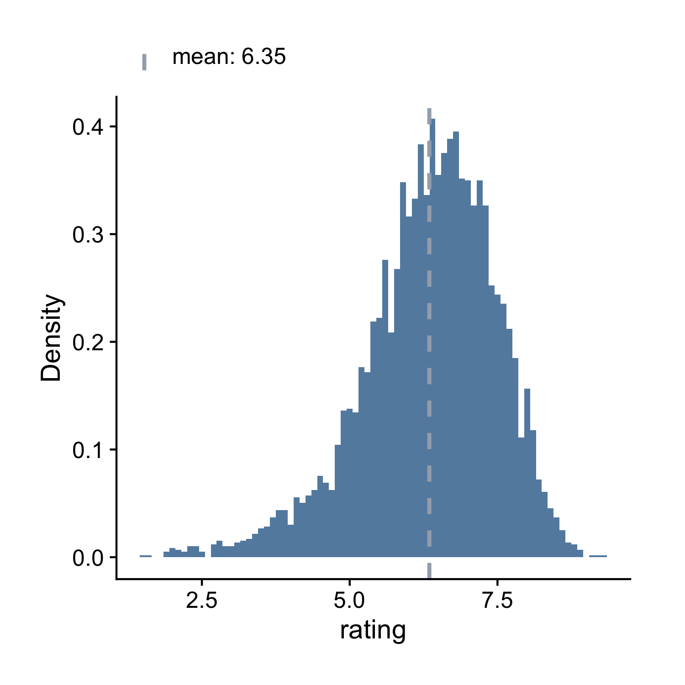

## Histogram

As we've seen from chapter 2, we can use histogram, density plot, boxplot and 
qqplot to understand the distribution of a continuous variable. We'll take a 
deeper look at how to make histograms using ezplot in this section, and density 
plot, boxplot and qqplot in the next three sections. 

First let's load the `ezplot` library and examine the variable `rating` from the `films` data frame by calling `str()` on it. The variable `rating` measures IMDB users' average ratings.

A>
```r
library(ezplot)
str(films$rating)
```

A>
```
 num [1:5944] 6.2 4.7 7.8 7.5 7.2 6.2 5 5.6 5.6 4.8 ...
```

The output `num` says that its type is numeric. Looking at the first few data values, it's clear `rating` is continuous. We can use a histogram to understand its distribution.

A>
```r
plt = mk_histdens(films, 'histogram')
p = plt("rating") 
p = add_labs(p, xlab = "IMDB Users' Average Rating", 
             title = "Distribution of Users' Average Ratings (1913-2014)")
print(p)
```


We first called the function `mk_histdens()` on the data frame `films`, and 
obtained another function `plt()` in return. We then called the function `plt()` 
on the variable name `"rating"` to draw the histogram. Note `"rating"` is in 
quotes. It is the name of the variable instead of the variable symbol. 
The object `p` returned by `plt()` is a ggplot2 chart. We passed it to an
ezplot function `add_labs()` and gave it a new x-axis label and title. 

The function `plt()` also takes other arguments in addition to the variable name
of interest. For example, we can set `add_vline_median = FALSE` to only show
the vertical line at the mean. We can also set `binwidth = 0.1` to change the size
of each bin and hence the number of bins. In practice, I often set `binwidth` or 
`bins` a few times until I have a sufficiently large number of bins to show how 
raw data are distributed without any smoothing.

A>
```r
p = plt("rating", add_vline_median = FALSE, binwidth = 0.1, legend_pos = "top") 
print(p)
```



Now I want you to run `?mk_histdens()` and read the documentation. When you 
encounter the bullet point `facet_by`, stop and ask yourself if you understand 
what it does. 

We've looked at the distribution of users' average ratings for all films. 
What do users' average ratings look like for films that made money vs. films 
that didn't? We can answer this question by bringing in another variable called 
`made_money`. Let's `str` it first.

A>
```r
str(films$made_money)
```

A>
```
 Factor w/ 2 levels "no","yes": 2 2 2 2 2 2 2 1 2 2 ...
```

So `made_money` is a factor with two levels (yes, no), indicating if a film made 
money or not. We can create 2 facets, one with a histogram of profitable films
and the other of unprofitable films, by simply setting `facet_by = "made_money"`.    

A>
```r
p = plt("rating", facet_by = "made_money", binwidth=0.1, add_vline_mean = F) 
print(p)
```


We see profitable films do have a higher median average rating, and it seems
there're more profitable films (the height of the bottom histogram is higher).
Let's check if this is true.

A>
```r
table(films$made_money)
```

A>
```
  no  yes 
1831 4113 
```

We see the number of profitable films is more than twice of the unprofitable 
ones. Oh, there's another thing I want to point out. The colors in those
charts we made are color-blind friendly. For homework, read the document of
`mk_histdens()` (`?mk_histogram`) and run the examples. 
