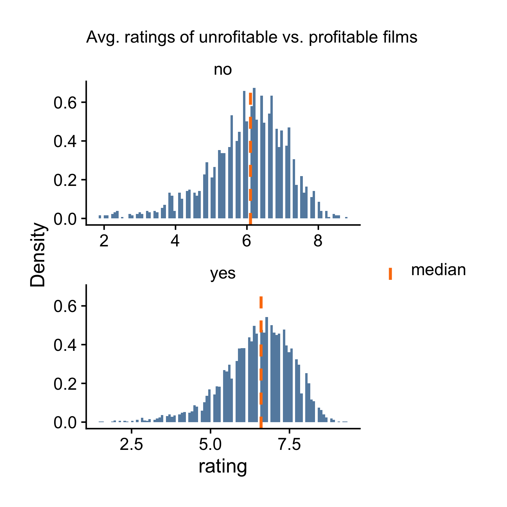

## Histogram

As we've already seen from the last chapter, histogram, density plot and boxplot are for displaying the distribution of a continuous variable. We'll look at histogram in this section, density plot and boxplot in the next two sections. Before we start, make sure you load the `ezplot` library. The ezplot function we'll use is `mk_distplot()`.

A>
```r
library(ezplot)
```

The `ezplot` library comes with a dataset of films. You can run the command `?films` to see the descriptions of its variables. If you do that, you'll see that it has a variable called `rating`, which measures the IMDB users' average ratings. Now, check its type by running the command `str()`.

A>
```r
str(films$rating)
 num [1:5944] 6.2 4.7 7.8 7.5 7.2 6.2 5 5.6 5.6 4.8 ...
```

The output `num` says that R treats it as a numeric variable. A numeric variable can be discrete (whole numbers) or continuous (decimal numbers). From the first few data values (6.2, 4.7, ...) shown in the output, it's clear that `rating` is continuous. And we can draw a histogram to help us understand its distribution.

A>
```r
plt = mk_distplot(films)
title = "Distribution of Users' Average Ratings (1913-2014)"
p = plt("rating", binw=0.3, xlab="IMDB Users' Average Rating", main=title,
        add_vline_mean=T) 
print(p)
```

 

Notice how we used `mk_distplot()`. We passed it the data frame `films` as input. It returned a function, and we assigned it to the variable `plt`. We then used the function `plt()` to draw the histogram. Note that once again, we had to feed `plt()` the variable name, in this case, `"rating"` in quotes, instead of the variable itself. Do you recall the same usage from the last chapter? Yes, this is how you use every plotting function in ezplot. I assure you this usage pattern will reappear again and again in later chapters. 

Here're some explanations for the other parameters: a histogram is made of bins, and `binw` is the width of the bins; `xlab` is the x-axis label; `main` is the plot title; `add_vline_mean` decides whether to add a vertical line at the mean or not, and when setting `add_vline_mean=T`, it draws a purple line vertically at the mean value of the x's, just like shown in the above histogram. We can also add a vertical line at the median by setting `add_vline_median=T`, and as shown by the plot below, the median vertical line is colored green.

A>
```r
p = plt("rating", binw=0.3, xlab="IMDB Users' Average Rating", main=title,
        add_vline_mean=T, add_vline_median=T) 
print(p)
```

 

Now, I want you to run `?mk_distplot()` and read the complete description line by line. When you meet the word `fillby`, stop and read it again. Do you understand what it does? No? That's ok because that's what we're talking about next. The data frame `films` has a variable called `made_money`. Let's use `str()` to check its type.

A>
```r
str(films$made_money)
 Factor w/ 2 levels "no","yes": 2 2 2 2 2 2 2 1 2 2 ...
```

We see `made_money` is a factor with two levels: yes, no. It indicates if a film made money or not. We've looked at the overall distribution of the users' average ratings. An interesting question is what do the distributions of the users' average ratings look like for films that made money vs. the ones that lost money. It turns out we can easily answer this question pictorially by setting `fillby = "made_money"`.    

A>
```r
p = plt("rating", fillby="made_money", binw=0.3, 
        xlab="IMDB Users' Average Rating", main=title) 
print(p)
```

 

One thing I'd like to point out: the default red and green colors in the above plot are not color-blind friendly. And it's good to use color-blind friendly colors whenever possible. Luckily, the ezplot package comes with 9 color-blind friendly colors, and we'll now use the color-blind friendly versions of red and green to re-do the above chart.

A>
```r
red = cb_color("reddish_purple")
green = cb_color("bluish_green")
p = p + ggplot2::scale_fill_manual(values = c(red, green))
print(p)
```

 

We see the green histogram (films that made money) completely overshadows the red histograms (films that didn't make money or lost money). What conclusion can you draw? Write it down. Now, let's check the size of each group.

A>
```r
table(films$made_money)
  no  yes 
1831 4113 
```

We see the number of films that made money is more than twice of the number of films that didn't make money or lost money. Does this change your initial conclusion? What's your new conclusion?
