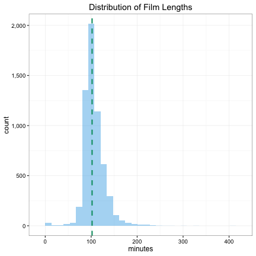

```r
library(knitr)
opts_chunk$set(comment = "", warning = FALSE, message = FALSE, tidy = FALSE,
               echo = TRUE, fig.width = 6, fig.height = 6, dev = 'png')
options(width = 100, scipen = 5, digits = 5)
```


## Plot The Distribution of A Continuous Variable


```r
library(ezplot)
```


```r
plt = mk_distplot(films)
title = "Distribution of Film Lengths"
p = plt("length", xlab="minutes", main=title, add_vline_median=T)
# use comma scale for y-axis
p = scale_axis(p, "y", scale="comma")
print(p)
```

 

