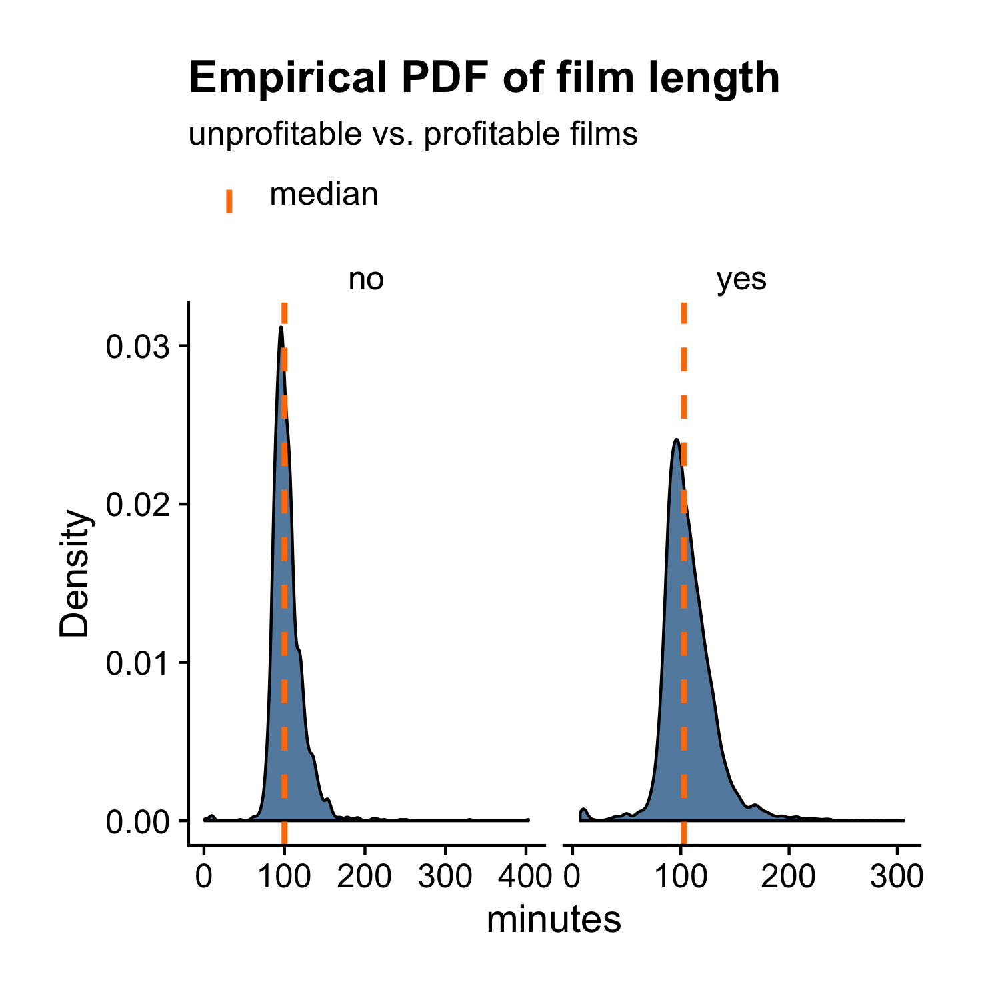

## Density Plot

Previously, we learned how to make histograms. Density plot is similar to histogram except it draws a smooth curve tracing out the hights of the bins instead of drawing the bins themselves. The `films` dataset has a variable `length` that measures the duration of each film in minutes. Let's draw a density plot to show its distribution. 

```r
library(ezplot)
plt = mk_histdens(films, type = 'density') # there're 2 possibilities for type: 'histogram' and 'density', which will allow us to draw histogram or density plot respectively.
p = plt("length")
add_labs(p, xlab = "minutes", title = "Distribution of Film Length")
```


We can also draw two density curves of `length`, one for profitable films and one for unprofitable films, by setting `facet_by = "made_money"`, where `"made_money"` is the name of a categorical variable indicating if a film made money or not.

```r
p = plt(xvar = "length", facet_by = "made_money", facet_ncol = 2,
        add_vline_mean = FALSE) 
add_labs(p, xlab = "minutes", ylab = "made money?", 
         title = "Distribution of Film Length")
```



As another example, let's plot the density of `rating` by `year_cat`.

```r
plt("rating", facet_by = "year_cat", font_size = 9, add_vline_mean = FALSE) 
```


For homework, read the document of `mk_histdens()` and run the examples. 
You can pull up its document by running `?mk_densityplot`. 
