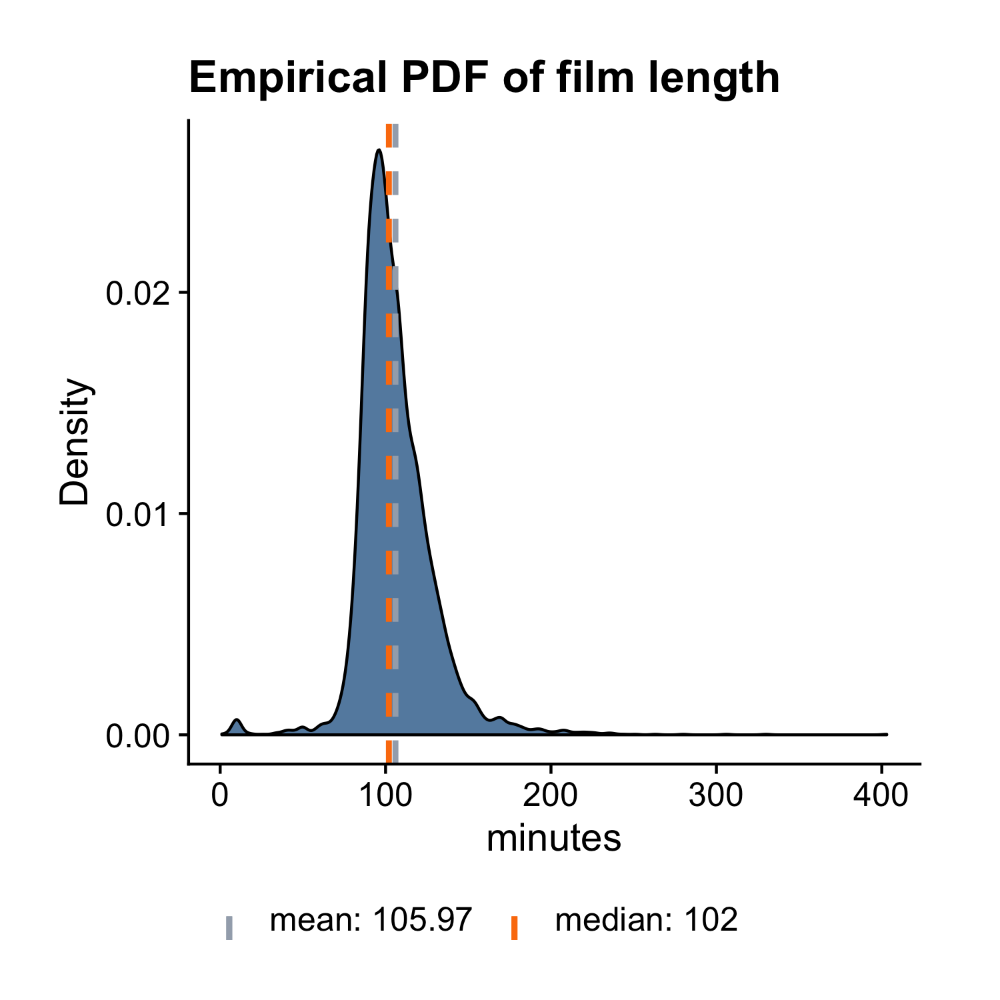

## Density Plot

Density plot is quite similar to histogram except it uses a smooth line to trace out the hights of the bins instead of drawing the bins themselves. To make a density plot, we can use the same ezplot function `mk_distplot()`. The `films` dataset has a variable called `length` that measures the lengths of the films in minutes. Let's draw a density plot to reveal its distribution. First, we load the `ezplot` library. 

A>
```r
library(ezplot)
```

Next, we call `mk_distplot()` on `films` to get a function `plt()`, and we use `plt()` to draw a density plot for `length` by specifying `type="density"`. This is the key here since by default, `type = "histogram"`, which results a histogram.

A>
```r
plt = mk_distplot(films)
title = "Distribution of Film Length"
p = plt("length", xlab="minutes", type="density", main=title, 
        add_vline_mean=T, add_vline_median=T)
print(p)
```

 

Recall that the purple line is the mean and the green line is the median. We see the median film length is slightly greater than 100 minutes, while the average is even a little bigger. As a result, the distribution is slightly right skewed. 

We can also draw two density curves for `length`, one is for the group of films that made money, and the other is for the group that didn't make money. 

A>
```r
plt = mk_distplot(films)
title = "Distribution of Film Lengths"
p = plt("length", fillby="made_money", xlab="minutes", type="density",
        main=title)
print(p)
```

 