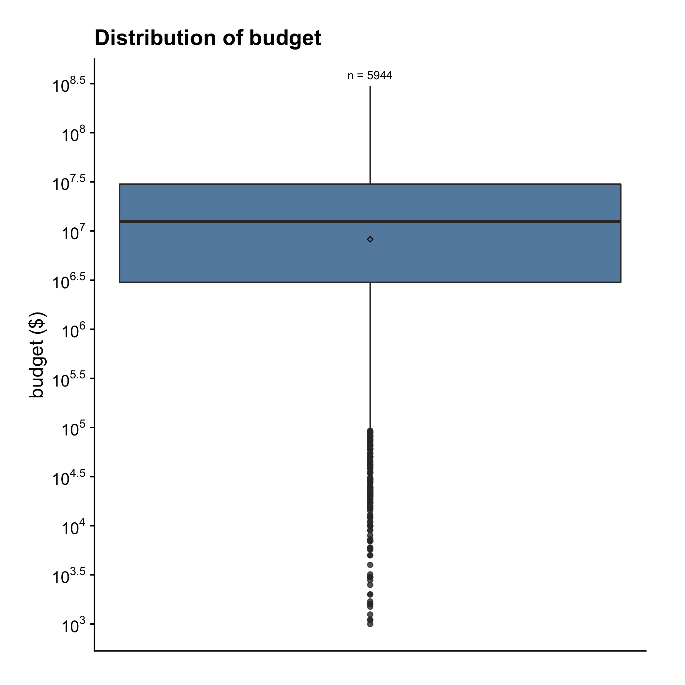
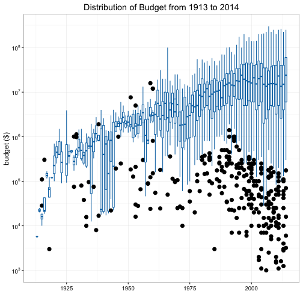
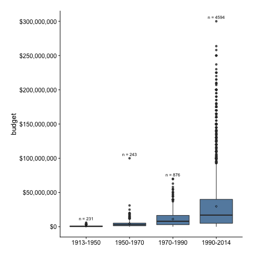
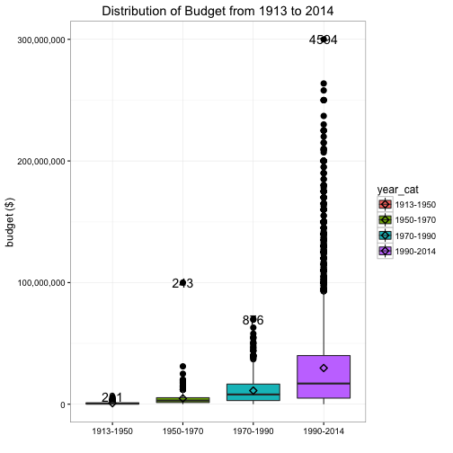
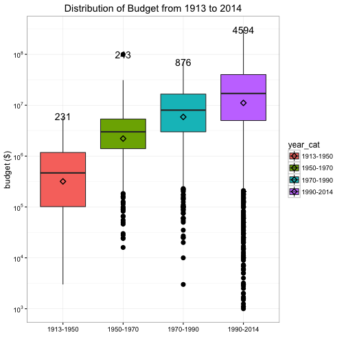
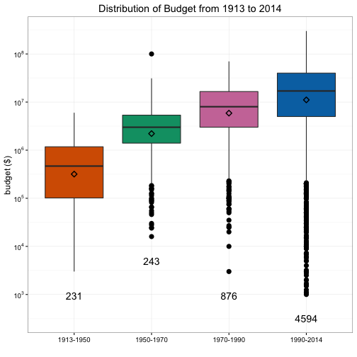

## Boxplot

When visualizing the distribution of a continuous variable, instead of histogram or density plot, you can also use boxplot. For example, we can make a boxplot for `budget` with 5 lines of code.

A>
```r
library(ezplot)
plt = mk_boxplot(films)
title = "Distribution of Budget"
p = plt(xvar="1", yvar="budget", ylab="budget ($)", main=title)
scale_axis(p, axis="y", scale="log10")
```

 

Note the usage of `scale_axis()` above. It changes the y-axis to log10 scale. Also note the usage of `xvar="1"`. The parameter `xvar` needs to take a string representing the x variable name. We pass it the string `"1"` here because we are visualizing `budget` (on the y-axis) by itself and hence don't need a x variable. The number 5944 is the number of observations in `budget`. The function `mk_boxplot()` is smart enough to figure this out and display it on the graph.

Let's do an example where we require a x variable. The films are made between 1913 and 2014, so an interesting thing to look at is how the distribution of budget changes over the years. To do that, we need to draw a boxplot with `budget` on the y-axis and `year` on the x-axis. Note that we can turn off the display of the count of observations by setting the parameter `add_label = F`.

A>
```r
title = "Distribution of Budget from 1913 to 2014"
p = plt("year", "budget", ylab="budget ($)", main=title, add_label = F)
scale_axis(p, scale = "log10")
```

 

We see a general pattern of budget increase over the years, however, it seems the details are too granular and hence a bit distracting. Luckily, there's another variable called `year_cat` that aggregate `year` into 4 brackets. We can use `year_cat` instead of `year` to redraw the plot.

A>
```r
table(films$year_cat)
1913-1950 1950-1970 1970-1990 1990-2014 
      231       243       876      4594 
```

A>
```r
p = plt("year_cat", "budget", ylab="budget ($)", main=title)
# apply comma scale to the y-axis to display the numbers in 000,000 format
scale_axis(p, "y", scale = "comma")
```

 

Observe that all the boxes are squashed down, indicating `budget` is heavily right-skewed. We can use the function `scale_axis()` to apply the log10 scale on the y-axis.

A>
```r
# change y-axis to log10 scale
p = scale_axis(p, scale = "log10")
print(p)
```

 

Finally, we can use color-blind friendly colors to color the boxes.

A>
```r
red = cb_color("vermilion")
green = cb_color("bluish_green")
purple = cb_color("reddish_purple")
blue = cb_color("blue")
p = p + ggplot2::scale_fill_manual(values = c(red, green, purple, blue))
print(p)
```

 

Notice the numbers at the top of each boxplot, they are the sizes of the x-variable groups. For example, there are 231 films released between 1913 and 1950, and 4594 films released between 1990 and 2014. Yes, the ezplot function is smart enough to tally these numbers and display them at the top of each boxplot. We can also choose to display them at the bottom, and we can adjust their vertical distances using the `vpos` parameter. Finally, we can turn off the legend by setting `legend=F`.

A>
```r
p = plt("year_cat", "budget", ylab="budget ($)", main=title, lab_at_top = F,
        vpos = -0.5, legend=F)
p = scale_axis(p, scale = "log10")
p = p + ggplot2::scale_fill_manual(values = c(red, green, purple, blue))
print(p)
```

 

Now, it's your turn. Try the following exercises.

1. Draw a plot to show how the distributions of boxoffice change over the years.
2. Draw a plot to show how the distributions of rating change over the years.
3. Draw a plot to show how the distributions of length change over the years.
4. The `films` dataset has a variable named `mpaa` that records the MPAA rating of each film. What type of a variable is it? Can you draw a plot to show the distribution of boxoffice at each MPAA rating?
5. The `films` dataset has a bunch of variables that record the genres, for example, `action`, `comedy`, and etc. Can you draw a plot to show the distribution of boxoffice for each genre?
