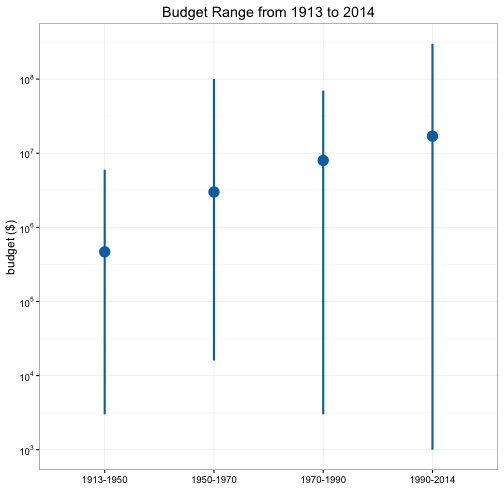
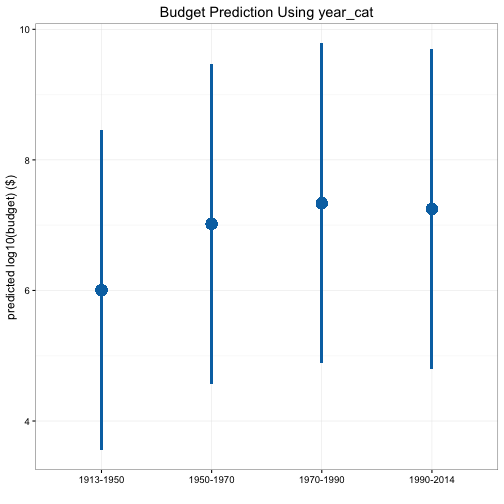

## Interval Plot

In the previous section, we learned how to make boxplot. If you go back and look at the boxplots we made, you'll realize a boxplot actually contains a lot of information, for example, it displays the median, mean, lower quartile (25th percentile), upper quartile (75th percentile), minimum and maximum. Sometimes we want to quickly look at the range and the center of a continuous variable, and we can do that using something called interval plot. An interval plot only visualizes three things: the center, the upper bound and the lower bound. Let's draw `budget` vs. `year_cat` again using interval plot. We first need to group `budget` by `year_cat`, and at each unique value of `year_cat`, we calculate the median, minimum and maximum of `budget`.

A>
```r
library(ezplot)
library(tidyr)
library(dplyr)
dat = films %>% select(year_cat, budget) %>% group_by(year_cat) %>%
        summarise(med = median(budget), lwr = min(budget), upr = max(budget))
dat
```

A>
```
Source: local data frame [4 x 4]

   year_cat      med   lwr       upr
1 1913-1950   467000  3000   6000000
2 1950-1970  3000000 16000 100000000
3 1970-1990  8000000  3000  70000000
4 1990-2014 17000000  1000 300000000
```

We can then visualize the (lwr, med, upr) triple on an interval plot. 

A>
```r
plt = mk_intervalplot(dat)
title = "Budget Range from 1913 to 2014"
p = plt(xvar="year_cat", yvar="med", ymin_var="lwr", ymax_var="upr",
        ylab="budget ($)", main=title)
scale_axis(p, scale = "log10")
```

 

A more common application of the interval plot is to visualize the predictions and their uncertainties of some statistical model. The smaller the uncertainties, the more confident we'd feel about the predictions. Here's an example. Let's say we build a linear regression to predict `log10(boxoffice)` using `year_cat`. We can look at the fitted values (predictions on the data used to build the model) and their 95% prediction intervals (uncertainties) using an interval plot.

A>
```r
# fit a linear regression
fit = lm(log10(boxoffice) ~ year_cat, data=films)
# obtain the fitted values and their 95% prediction intervals
pred = predict(fit, films, interval="prediction")
# make data frame for plotting
dat = data.frame(year_cat=films$year_cat, pred)
# make interval plot
plt = mk_intervalplot(dat)
p = plt("year_cat", "fit", ymin_var="lwr", ymax_var="upr", 
        ylab="predicted log10(budget) ($)", 
        main="Budget Prediction Using year_cat")
p
```

 

Now, it's your turn. Try the following exercises.

1. Fit a simple linear regression, `boxoffice ~ drama`, and draw an interval plot to show the fitted values and their 95% prediction interval. 
2. Same task as in problem 1, except this time, use confidence interval instead of prediction interval. To calculate 95% confidence interval, use `predict(fit, films, interval="confidence")`. Compare with the plot you drew in problem 1. What do you discover?
3. Read this excellent [answer](http://stats.stackexchange.com/questions/16493/difference-between-confidence-intervals-and-prediction-intervals) on the differences between prediction interval and confidence interval.
