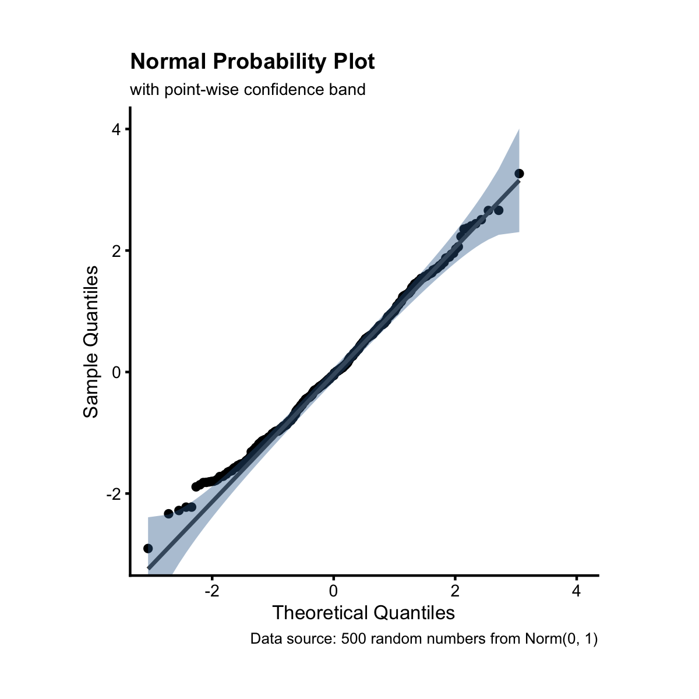
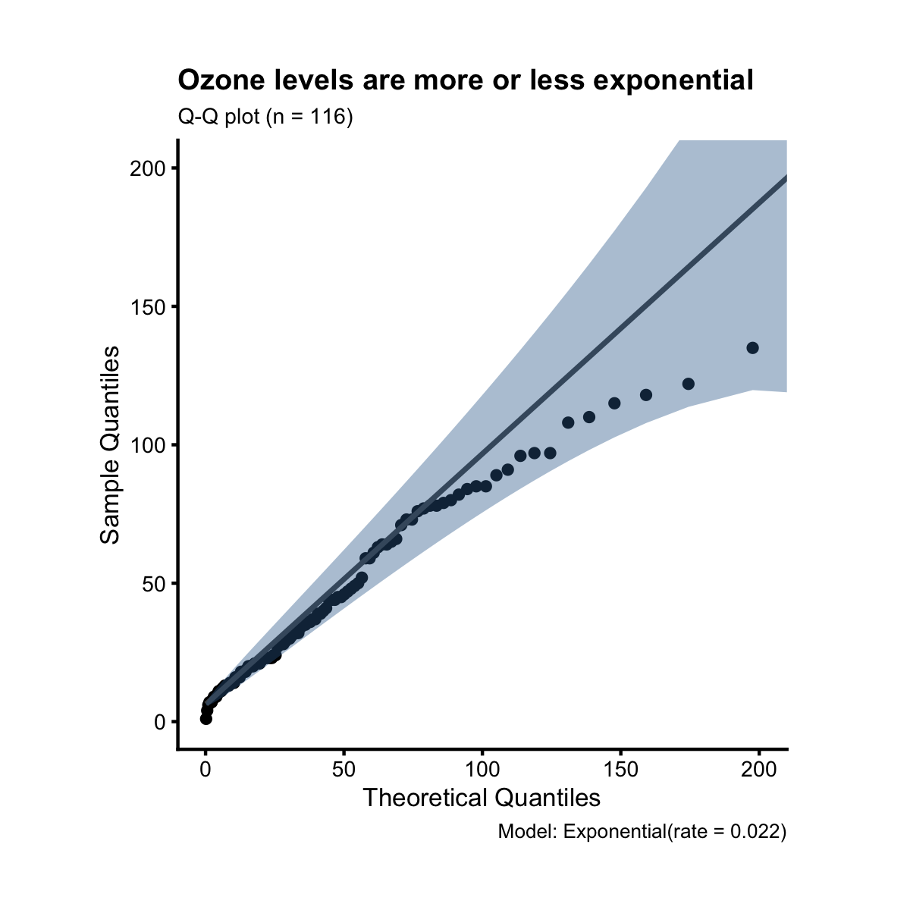

## Q-Q Plot

In the last three sections, we learned how to make histogram, density plot and
boxplot. These charts don't directly tell us if the plotted variable is normally
distributed or not. To check normality, we need Q-Q plot. Let's start with an
example. First, let's generate 100 data points from a standard normal distribution.

```r
library(ezplot)
library(dplyr)
set.seed(0)
smp = data.frame(x = rnorm(100))

# get a function to draw qqplot of variables from the data frame smp
plt = mk_qqplot(smp)
```

Next, let's draw a normal Q-Q plot using the simulated data. We'll set 
`detrend = FALSE` to draw a conventional Q-Q plot. We'll then pass the
plot (rectangular shaped) to the ezplot function `square_fig()` to make it 
square shaped. 

```r
plt("x", detrend = FALSE) %>% square_fig() 
```



We see all data points fall closely along the 45 degree diagonal line and within 
the default point-wise confidence band. This implies the data are normally 
distributed. (What else can it be? The data are randomly drawn from a standard 
normal distribution.) 

Alternatively, we can draw the Aldor-Noiman tail-sensitive confidence band
by setting `ci_band_type = "ts"`. 

```r
plt("x", detrend = FALSE, ci_band_type = "ts") %>% square_fig()
```


And we see all data points still fall within the tail-sensitive confidence band.  
Finally, there're visual biases when looking at trends, so we can create 
detrended qqplot. To do that, we just need to remove `detrend = FALSE` 
because the parameter `detrend` is set to `TRUE` by default.

```r
plt("x", ci_band_type = "ts", font_size = 10) %>% square_fig()
```


We see all data points randomly scattered around the horizontal line $y = 0$ and
within the confidence band. This implies normality. To summarize, when
looking at a conventional qqplot, check if data points are aligned along the 45
degree diagonal line. If yes, conclude the data are normally distributed. When
looking at a detrended qqplot, check if data points are randomly scattered 
around $y = 0$. If yes, conclude normality. 

Not only qqplot can be used to check normality, it can also be used to check if
a set of data values follow another well-known theoretical distribution such as
beta, cauchy, chi-squared, exponential, F, gamma, geometric, log-normal, 
logistic, binomial, poisson, t, and weibull distribution. For example, let's 
check if the ozone levels from the air quality data are exponentially 
distributed.

```r
plt = mk_qqplot(airquality)
plt("Ozone", dist = "exp", dparams = list(rate = 0.022)) %>% 
        square_fig() %>%
        add_labs(title = "The ozone levels are mostly\nexponential except at the tail",
                 caption = "Theoretical Distribution: Exponential with rate 0.022")
```



In the code block above, we set `dist = "exp", dparams = list(rate = 0.022)`. 
This tells `plt()` we want to compare the empirical distribution of the 
observations with an exponential distribution of rate 0.022. 

Now it's your turn. Try the following exercises for homework.

For homework, try the following exercises.

1. Read the document of `mk_qqplot()` and run the examples. You can pull up the 
document by running `?mk_qqplot` in Rstudio. 
2. Draw a qqplot to check if `boxoffice` from the `films` dataset is normally distributed.
3. What about `log(boxoffice)`?
