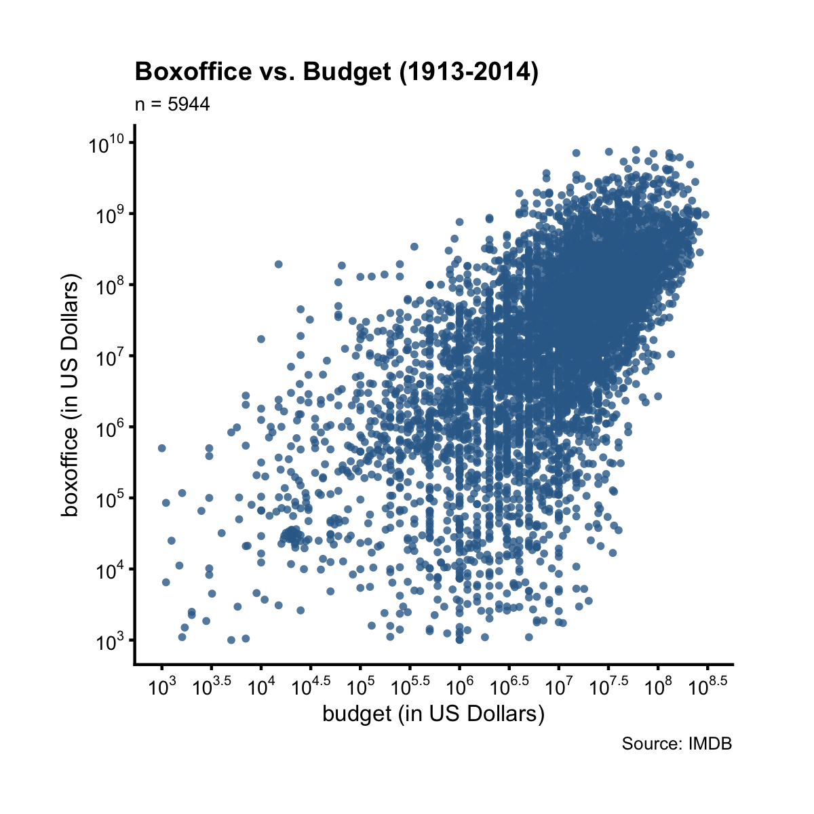
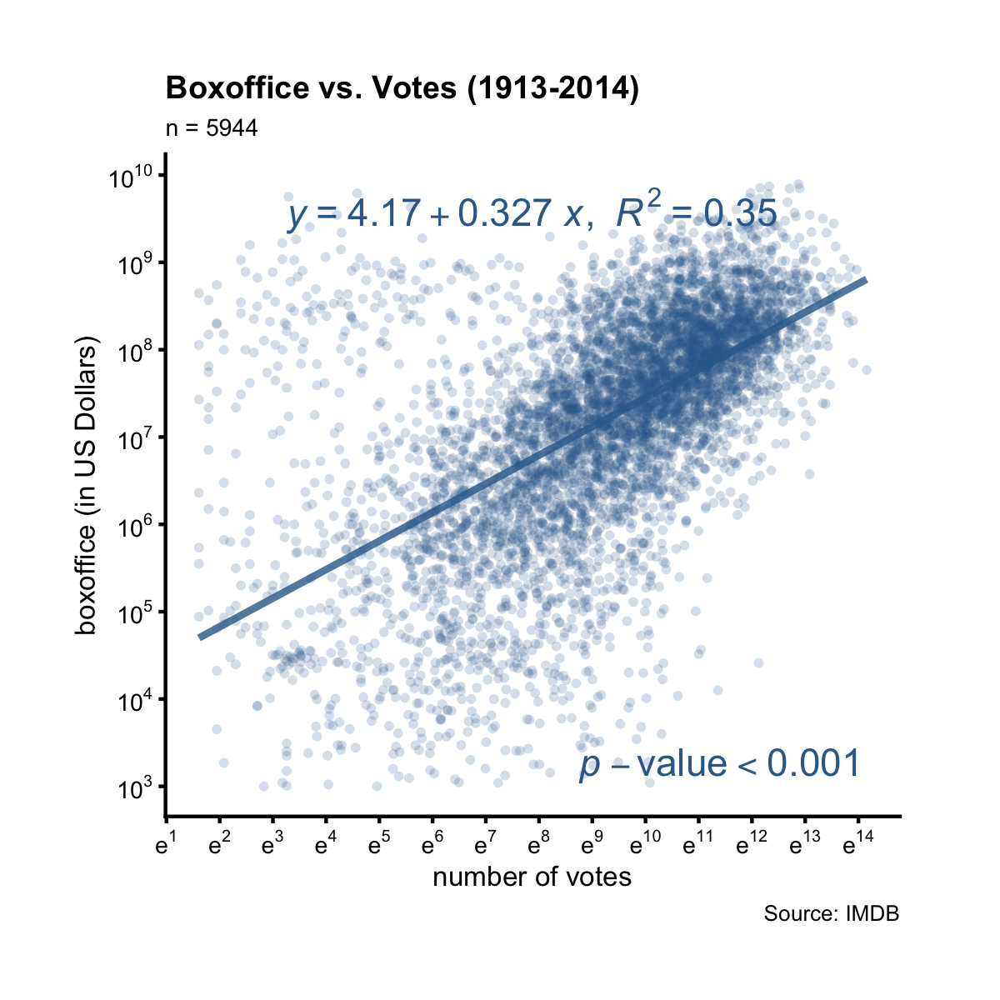

## Scatter Plot

A scatter plot is good for showing the relationship between two continuous variables. Let's call the `mk_scatterplot()` function on the data frame `films` to obtain a function that we can use to make scatter plots for any two continuous variables in `films`.

A>
```r
library(ezplot)
plt = mk_scatterplot(films)
# get color-blind friendly colors
purple = cb_color("reddish_purple")
green = cb_color("bluish_green")
```

For example, we can use `plt()` to draw a scatter plot to reveal if there's a relationship between `boxoffice` and `budget`, and if there is, what kind of relationship it is. 

A>
```r
# make plot title 
title = "Boxoffice vs. Budget (1913-2014)"
# plot boxoffice vs. budget
p = plt(xvar="budget", yvar="boxoffice", xlab="budget (in US Dollars)",
        ylab="boxoffice (in US Dollars)", main=title, 
        pt_size=1.2, pt_alpha=0.5, add_line=T)
# use log10 scale on both axes
p = scale_axis(p, scale="log10") # default is y-axis
p = scale_axis(p, axis="x", scale="log10")
# display plot
print(p)
```

 

Like mentioned in previous chapters, the function `plt()` can be re-used. Just give it two different variable names. For example, we now use it to draw a scatter plot of `boxoffice` vs. `votes`.

A>
```r
title = "Boxoffice vs. Votes (1913-2014)"
p = plt("votes", "boxoffice", xlab="number of votes", 
        ylab="boxoffice (in US Dollars)", main=title, 
        pt_size=1.5, pt_alpha=0.5, add_line=T)
p = ezplot::scale_axis(p, scale="log10")
p = ezplot::scale_axis(p, "x", scale="log10")
print(p)
```

 

One thing I want to point out is that the plots created by default is too small for web display. If you are making a [analytic web app](http://app.cabaceo.com/ocpu/github/gmlang/imdb/www/#/bo), you want bigger font size, bigger point size and bigger everything. Luckily, the `web_display()` function does that for you. Many times, all you need to do is to pass the plot object to it, and it'll return a plot object that just works.

A>
```r
web_display(p)
```

 

We can also use a categorical variable to color the points. To demo this, let's first ask ourselves an interesting question: did action movies make money year after year? To answer it, we'll need to draw a scatter plot of `bo_bt_ratio` vs. `year` and color the points by the binary factor `action`. 

A>
```r
p = plt(xvar="year", yvar="bo_bt_ratio", fillby="action", 
        ylab="boxoffice/budget ratio", 
        main="Boxoffice / Budget ratio (1913-2014)", 
        pt_size=1.5, pt_alpha=0.5, add_line=T)
# use log10 scale on y-axis
p = scale_axis(p, scale="log10")
# use color-blind friendly colors
p = p + ggplot2::scale_color_manual(values = c(purple, green))
# display plot
print(p)
```

 

The green dots are action films, while the purple dots are non-action films. First, notice there are more purple dots than green dots. Second, our impression is that the green line has a steeper negative slope, and if we pay attention to the green dots before 1962, we'll see the reason is because action films always made money before 1962 (none of the green dots before 1962 are below the y = 1 line), while non-action films weren't as lucky as the action films. And after 1962, some action films also started losing money. 

Now, it's your turn. Make scatter plots to answer the following questions:
1. Did drama make money year after year? What about comedy? 
2. Was it true that the higher the `rating`, the bigger the boxoffice/budget ratio? What about when looking at romance films vs. non-romance films?
3. Was it true that the more `votes` a films got, the bigger its the boxoffice/budget ratio? What about when looking at drama vs. non-drama?

Finally, let's talk about style and taste. There's a well known name in information visualization, [Edward Tufte](https://en.wikipedia.org/wiki/Edward_Tufte), and he's famous for his minimalistic designs. For example, here's how it looks if we apply Tufte's design principles to the scatter plot of boxoffice vs. budget.

A>
```r
library(ggplot2)
library(ggthemes)
p = plt(xvar="budget", yvar="boxoffice", xlab="budget (in US Dollars)",
        ylab="boxoffice (in US Dollars)", 
        main="Boxoffice vs. Budget (1913-2014)", 
        pt_size=1.2, pt_alpha=0.5, add_line=T)
# use log10 scale on both axes
p = scale_axis(p, scale="log10") # default is y-axis
p = scale_axis(p, axis="x", scale="log10")
# apply Tufte's style
p = p + geom_rangeframe() + theme_tufte()
print(p)
```

 

Compare this plot with the first plot we drew in the beginning of this chapter, what differences do you notice? We'll talk more about Tufte styles in later chapters. For now, let's take a break. In the next chapter, we'll talk about bar chart, which is commonly used for showing the distribution of a quantitative variable. See you then. 
