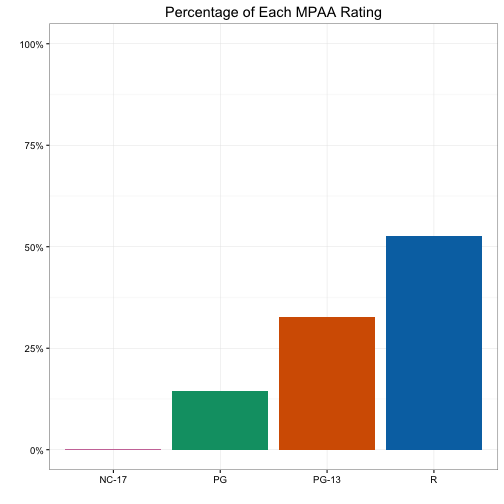
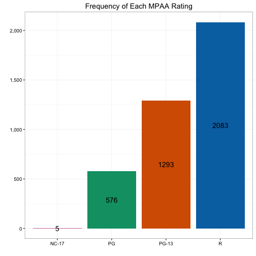

### Regular Bar Chart

A bar chart is often used for displaying the distribution (a.k.a., the frequencies or percentages of all the levels) of a categorical variable, or the bivariate distribution of two categorical variables. When making a bar chart, the first step is to count the frequencies and/or calculate the corresponding percentages of all the levels in that categorical variable. For example, the `mpaa` variable in the data frame `films` has 4 levels: NC-17, PG, PG-13 and R, and we can tally up their frequencies and percentages using the following code.

A>
```r
library(ezplot)
tbl = table(films$mpaa)
tbl_cnt = data.frame(tbl)
names(tbl_cnt) = c("lvl", "cnt")
tbl_pct = data.frame(prop.table(tbl))
names(tbl_pct) = c("lvl", "pct")
tbl = merge(tbl_cnt, tbl_pct)
tbl
```

A>
```
    lvl  cnt       pct
1 NC-17    5 0.0012636
2    PG  576 0.1455648
3 PG-13 1293 0.3267627
4     R 2083 0.5264089
```
  
We can then draw bar charts to display them, but first, let's get some color-blind friendly colors.

A>
```r
purple = cb_color("reddish_purple")
green = cb_color("bluish_green")
red = cb_color("vermilion")
blue = cb_color("blue")
```

Now let's draw bar charts using these color-blind friendly colors.

A>
```r
plt = mk_barplot(tbl)
title = "Frequency of Each MPAA Rating"
p = plt("lvl", "cnt", fillby="lvl", main=title, legend=F)
p = scale_axis(p, scale="comma")  
p = p + ggplot2::scale_fill_manual(values = c(purple, green, red, blue))
p
```

 
  
A>
```r
title = "Percentage of Each MPAA Rating"
p = plt("lvl", "pct", fillby="lvl", main=title, legend=F)
p = scale_axis(p, scale="pct", pct_jump=0.25)
p = p + ggplot2::scale_fill_manual(values = c(purple, green, red, blue))
p
```

 

Sometimes, we may want to label the bars with the frequencies or percentages. To do that, we need to first use the function `add_bar_label_pos()` to prep data a little bit. 

A>
```r
# make a function that can be used to append columns of 
# bar label positions to the input data frame
f = add_bar_label_pos(tbl)
# append bar label positions based on pct
tbl = f("lvl", "pct", vpos=0.03) # if putting labels at the top of the bars, label positions are 0.03 higher than values of pct.
tbl
```

A>
```
    lvl  cnt       pct pct_pos_top pct_pos_mid
1 NC-17    5 0.0012636    0.031264  0.00063179
2    PG  576 0.1455648    0.175565  0.07278241
3 PG-13 1293 0.3267627    0.356763  0.16338135
4     R 2083 0.5264089    0.556409  0.26320445
```

We see `tbl` has two extra columns now, namely, `pct_pos_top` and `pct_pos_mid`. The former is the label position if we choose to put the labels above the bars, and the latter is the label position if we choose to put the labels in the middle of the bars. We can use these two columns when the y-axis is percent, like in the second plot above. We can also append to `tbl` two more columns of label positions based on the variable `cnt`. For example, we can run the following code to append to `tbl` the columns `cnt_pos_top` and `cnt_pos_mid`, which can be used when the y-axis is frequency, like in the first plot shown above. 

A>
```r
# because tbl is updated, we need to call add_bar_lable_pos again
f = add_bar_label_pos(tbl)
# append bar label positions based on cnt
tbl = f("lvl", "cnt") # if putting labels at the top of the bars, label positions are 0.2 higher than values of cnt.
tbl
```

A>
```
    lvl  cnt       pct pct_pos_top pct_pos_mid cnt_pos_top cnt_pos_mid
1 NC-17    5 0.0012636    0.031264  0.00063179         5.2         2.5
2    PG  576 0.1455648    0.175565  0.07278241       576.2       288.0
3 PG-13 1293 0.3267627    0.356763  0.16338135      1293.2       646.5
4     R 2083 0.5264089    0.556409  0.26320445      2083.2      1041.5
```

Let's re-draw the above bar charts with labels at the top of the bars.

A>
```r
plt = mk_barplot(tbl)
title = "Frequency of Each MPAA Rating"
p = plt("lvl", "cnt", fillby="lvl", main=title, legend=F,
        barlab="cnt", barlab_at_top=T, barlab_size=5)
p = scale_axis(p, scale="comma")  
p = p + ggplot2::scale_fill_manual(values = c(purple, green, red, blue))
p
```

 

A>
```r
title = "Percentage of Each MPAA Rating"
p = plt("lvl", "pct", fillby="lvl", main=title, legend=F,
        barlab="pct", barlab_use_pct=T, decimals=2, 
        barlab_at_top=T, barlab_size=5)
p = scale_axis(p, scale="pct", pct_jump=0.25)
p = p + ggplot2::scale_fill_manual(values = c(purple, green, red, blue))
p
```

 

Let's place the labels in the middle of the bars.

A>
```r
title = "Frequency of Each MPAA Rating"
p = plt("lvl", "cnt", fillby="lvl", main=title, legend=F,
        barlab="cnt", barlab_at_top=F, barlab_size=5)
p = scale_axis(p, scale="comma")  
p = p + ggplot2::scale_fill_manual(values = c(purple, green, red, blue))
p
```

 

A>
```r
title = "Percentage of Each MPAA Rating"
p = plt("lvl", "pct", fillby="lvl", main=title, legend=F,
        barlab="pct", barlab_use_pct=T, decimals=2, 
        barlab_at_top=F, barlab_size=5)
p = scale_axis(p, scale="pct", pct_jump=0.25)
p = p + ggplot2::scale_fill_manual(values = c(purple, green, red, blue))
p
```

 
