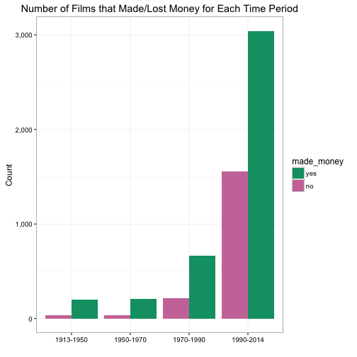
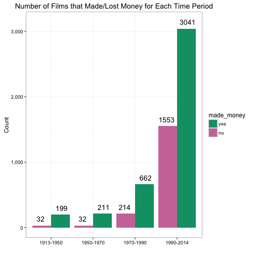
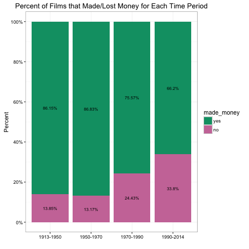

### Dodged and Stacked Bar Chart

A dodged or stacked bar chart is often used to show relationships amongst two categorical and one continous variables. For example, take the variables `year_cat` and `made_money` from the data frame `films`. The former brackets time (measured in years) into 4 categories and the latter indicates if a film made money or not. Maybe we are interested in the number or percentage of films made or lost money for each time period. We can use `table()` and `prop.table()` to easily get the answers.

A>
```r
library(ezplot)
tbl = with(films, table(year_cat, made_money))
tbl_pct = prop.table(tbl, margin = 1)
print(tbl)
```

A>
```
           made_money
year_cat      no  yes
  1913-1950   32  199
  1950-1970   32  211
  1970-1990  214  662
  1990-2014 1553 3041
```

A>
```r
print(tbl_pct)
```

A>
```
           made_money
year_cat         no     yes
  1913-1950 0.13853 0.86147
  1950-1970 0.13169 0.86831
  1970-1990 0.24429 0.75571
  1990-2014 0.33805 0.66195
```

But of course, instead of reading these numbers, we'd very much want to look at them, so we prefer to turn them into a graph. We'll do that in a moment, but first of all, let's get some colors that are color-blind friendly.

A>
```r
purple = cb_color("reddish_purple")
green = cb_color("bluish_green")
red = cb_color("vermilion")
blue = cb_color("blue")
```

And let's turn `tbl` and `tbl_pct` into data frames because ezplot only works with data frames. 

A>
```r
dat = data.frame(tbl)
dat_pct = data.frame(tbl_pct)
names(dat) = tolower(names(dat))
names(dat_pct)[3] = "pct"
print(dat)
```

A>
```
   year_cat made_money freq
1 1913-1950         no   32
2 1950-1970         no   32
3 1970-1990         no  214
4 1990-2014         no 1553
5 1913-1950        yes  199
6 1950-1970        yes  211
7 1970-1990        yes  662
8 1990-2014        yes 3041
```

A>
```r
print(dat_pct)
```

A>
```
   year_cat made_money     pct
1 1913-1950         no 0.13853
2 1950-1970         no 0.13169
3 1970-1990         no 0.24429
4 1990-2014         no 0.33805
5 1913-1950        yes 0.86147
6 1950-1970        yes 0.86831
7 1970-1990        yes 0.75571
8 1990-2014        yes 0.66195
```
  
Now let's make a dodged bar chart to show the number of films that made or lost money for each time period. 

A>
```r
plt = mk_barplot(dat)
title = "Number of Films that Made/Lost Money for Each Time Period"
p = plt("year_cat", "freq", fillby="made_money", barpos="dodge", 
        main=title, ylab = "Count")
p = scale_axis(p, scale="comma")  
p = p + ggplot2::scale_fill_manual(values = c(purple, green))
p
```


 
To be a little bit fancier, we can label the bars with the actual counts. To do that, we need to first use the function `add_bar_label_pos()` to prep `dat` a little bit. 

A>
```r
# split dat into two data frames based on the values of made_money
lst_of_dfs = split(dat, dat$made_money)
dat_no = lst_of_dfs[["no"]]
dat_yes = lst_of_dfs[["yes"]]
# make functions to be used for adding columns of 
# bar label positions to the input data frame
f_no = add_bar_label_pos(dat_no)
f_yes= add_bar_label_pos(dat_yes)
# add bar label positions based on freq
dat_no = f_no("year_cat", "freq", vpos=100) # if putting labels at the top of the bars, label positions are 0.03 higher than values of pct.
dat_yes = f_yes("year_cat", "freq", vpos=100)
# rbind dat_no and dat_yes
dat_w_pos = rbind(dat_no, dat_yes)
print(dat_w_pos)
```

A>
```
   year_cat made_money freq freq_pos_top freq_pos_mid
1 1913-1950         no   32          132         16.0
2 1950-1970         no   32          132         16.0
3 1970-1990         no  214          314        107.0
4 1990-2014         no 1553         1653        776.5
5 1913-1950        yes  199          299         99.5
6 1950-1970        yes  211          311        105.5
7 1970-1990        yes  662          762        331.0
8 1990-2014        yes 3041         3141       1520.5
```

Notice the columns `freq_pos_top` in `dat_w_post`. We'd use it if we want to put the labels above the bars. Let's try it.

A>
```r
plt = mk_barplot(dat_w_pos)
title = "Number of Films that Made/Lost Money for Each Time Period"
p = plt("year_cat", "freq", fillby="made_money", barpos="dodge", 
        main=title, ylab = "Count", 
        barlab="freq", barlab_at_top=T, barlab_size=5)
p = scale_axis(p, scale="comma")  
p = p + ggplot2::scale_fill_manual(values = c(purple, green))
p
```



At a glance, we see there are more films that made money than not for each period. This is good news. However, the above dodged bar chart doesn't tell us immediately the relative proportions. To do that, we need to turn to stacked bar chart and visualize the percentages. First, let's use the function `add_bar_label_pos()` to add to `dat_pct` the label positions so that we can label the stacked bars.

A>
```r
# make a functions to be used for adding columns of 
# bar label positions to the input data frame
f = add_bar_label_pos(dat_pct)
# add bar label positions based on pct
dat_pct_w_pos = f("year_cat", "pct") 
print(dat_pct_w_pos)
```

A>
```
   year_cat made_money     pct pct_pos_top pct_pos_mid
1 1913-1950         no 0.13853     0.33853    0.069264
2 1913-1950        yes 0.86147     1.20000    0.569264
3 1950-1970         no 0.13169     0.33169    0.065844
4 1950-1970        yes 0.86831     1.20000    0.565844
5 1970-1990         no 0.24429     0.44429    0.122146
6 1970-1990        yes 0.75571     1.20000    0.622146
7 1990-2014         no 0.33805     0.53805    0.169025
8 1990-2014        yes 0.66195     1.20000    0.669025
```

We can now draw the stacked bar chart with labels in the middle of the bar bodies.

A>
```r
plt = mk_barplot(dat_pct_w_pos)
title = "Percent of Films that Made/Lost Money for Each Time Period"
p = plt("year_cat", "pct", fillby="made_money", barpos="stack", 
        main=title, ylab = "Percent", barlab="pct", barlab_use_pct=T)
p = scale_axis(p, scale="pct")  
p = p + ggplot2::scale_fill_manual(values = c(purple, green))
p
```



Now, it's your turn. Use `str(films)` to explore the variable types in the `films` data. Pick two categorical variables and one continuous variable. Try to visualize the relationships amongst them. See if you can dig out any hidden relationships. To do that, you may need to perform some data aggregation or slicing. Good luck and I'll see you in the next section, where we'll learn how to make Tufte bar chart. 
