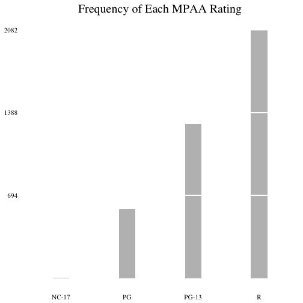
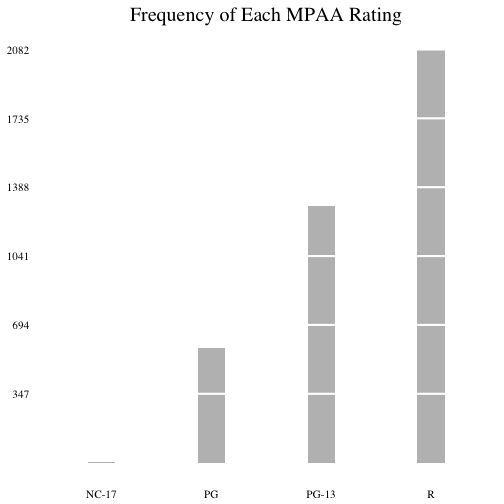
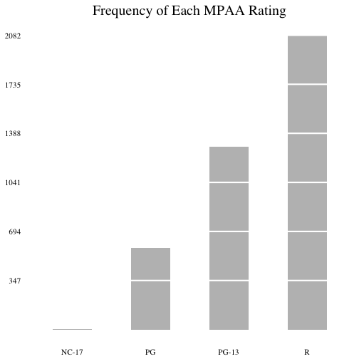
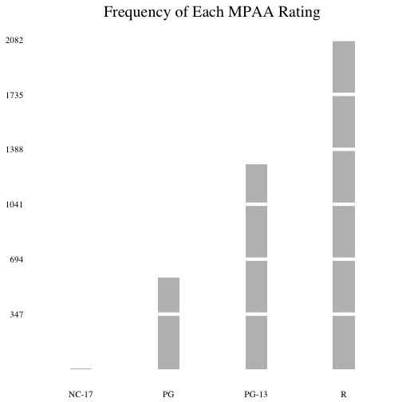
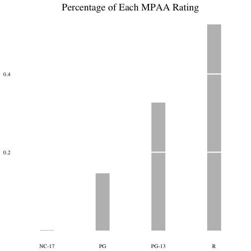
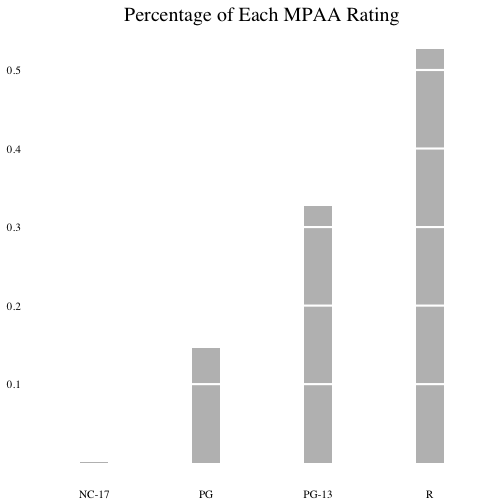
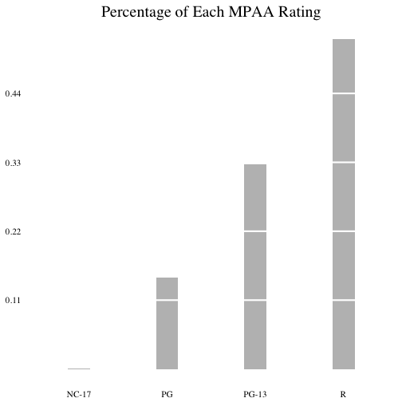
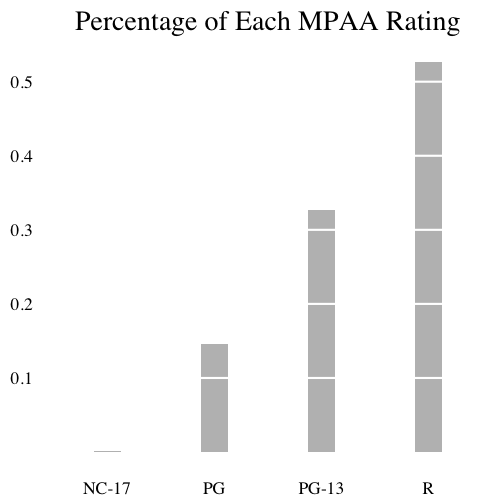

### Tufte Bar Chart

[Edward Tufte](https://en.wikipedia.org/wiki/Edward_Tufte) is famous for his simple and elegant statistical graphs. If you revisit the Regular Bar Chart section, you can see the bar charts presented there are already pretty simplistic. But Tufte would even strip away a few more elements that he thinks are extraneous and distracting. Let's now re-create the same bar charts in Tufte's way. First we prepare data and make a function by calling `mk_barplot_tufte()`.

```r
library(ezplot)
# prep data
tbl = table(films$mpaa)
tbl_cnt = data.frame(tbl)
names(tbl_cnt) = c("lvl", "cnt")
tbl_pct = data.frame(prop.table(tbl))
names(tbl_pct) = c("lvl", "pct")
tbl = merge(tbl_cnt, tbl_pct)
# make a function for creating tufte bar charts
plt = mk_barplot_tufte(tbl)
```

We can now use `plt()` to make a bar chart to display the frequency counts of each MPAA rating.

```r
# make plot title
title = "Frequency of Each MPAA Rating"
# draw a tufte bar chart, breaking the bars into 3 chunks
plt("lvl", "cnt", main=title, ybreak_n=3) 
```



```r
# draw a tufte bar chart, breaking the bars into 6 chunks
plt("lvl", "cnt", main=title, ybreak_n=6) 
```



```r
# draw a tufte bar chart, making the bars wider
plt("lvl", "cnt", main=title, ybreak_n=6, bar_w=0.5)
```



```r
# draw a tufte bar chart, making the breaks between bars wider
plt("lvl", "cnt", main=title, ybreak_n=6, ybreak_h=2)
```



Next, let's try to draw a Tufte bar chart to display the percentages of the MPAA ratings.

```r
# make plot title
title = "Percentage of Each MPAA Rating"
# draw a tufte bar chart, breaking the bars into 3 chunks
plt("lvl", "pct", main=title, ybreak_n=3)
```



```r
# draw a tufte bar chart, breaking the bars into 5 chunks
plt("lvl", "pct", main=title, ybreak_n=5)
```



```r
# draw a tufte bar chart, showing y tick text with 2 decimal points
plt("lvl", "pct", main=title, ybreak_n=5, ytick_decimals=2)
```



```r
# draw a tufte bar chart, showing y-axis ticks
plt("lvl", "pct", main=title, ybreak_n=5, show_axis_ticks=T)
```


```r
# draw a tufte bar chart, enlarge font size
plt("lvl", "pct", main=title, ybreak_n=5, font_size=22)
```



So what do you think? I really like the minimalistic look of these tufte styled bar charts. If you also love them, why don't you start making some yourself? Take a look at the variables in the `films` data, and have fun graphing Tufte bar charts! We'll talk about another graph type called slopegraph by Tufte near the end of the book. But before then, we need to learn a few other common chart types. In the next chapter, we'll look at the area plot. See you then. 
