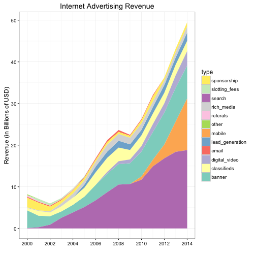
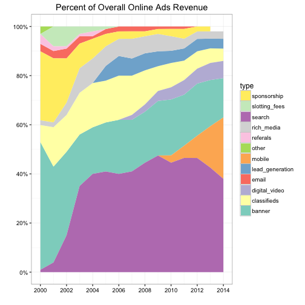

## Stacked Area Chart

Stacked area chart is something Economists use frequently. For example, if you leaf through the book [Capital in the Twenty-First Century](http://www.amazon.com/gp/product/067443000X/ref=as_li_tl?ie=UTF8&camp=1789&creative=9325&creativeASIN=067443000X&linkCode=as2&tag=cabaceo-20&linkId=VFX64EPFR3YKA7OG), you'll find many stacked area charts. A stacked area chart is the continuous analog of a stacked bar chart. We can use it to show how different components of the whole vary over time. It's important
to choose the order in which the different components are stacked because as you move up the stacks, it becomes increasingly difficult to see the patterns. I don't use stacked area chart that often, but if you ever need to use it, the `mk_areaplot()` function can save you a lot of time. Let's see how it works. The ezplot package comes with a dataset of online advertising revenues between 2000 and 2014 broken down by 13 different revenue channels. We'll make a stacked area chart to show how revenue progressed from 2000 to 2014 for each channel.

First, let's look at the data and change it to long format.

A>
```r
library(ezplot)
library(tidyr)
library(dplyr)
# original data
str(ads)
```

A>
```
'data.frame':	15 obs. of  13 variables:
 $ year           : int  2014 2013 2012 2011 2010 2009 2008 2007 2006 2005 ...
 $ search         : num  18.8 18.4 16.8 14.9 11.7 ...
 $ mobile         : num  12.38 7.28 3.29 1.59 0.78 ...
 $ banner         : num  7.92 8.13 7.69 6.66 5.98 4.99 4.91 4.45 3.72 2.5 ...
 $ digital_video  : num  3.47 3 2.2 1.9 1.3 0.91 0.7 0.42 0 0 ...
 $ classifieds    : num  2.48 2.57 2.56 2.54 2.6 2.27 3.28 3.39 3.04 2.13 ...
 $ lead_generation: num  1.98 1.71 1.83 1.59 1.3 1.36 1.64 1.48 1.35 0.75 ...
 $ rich_media     : num  1.49 1.28 1.1 1.27 1.56 1.59 1.64 1.7 1.18 1 ...
 $ sponsorship    : num  0.99 0.86 0.73 1.27 0.78 0.45 0.47 0.64 0.51 0.63 ...
 $ email          : num  0 0 0 0.32 0.26 0.23 0.47 0.42 0.34 0.25 ...
 $ referals       : num  0 0 0 0 0 0 0 0 0 0 ...
 $ slotting_fees  : num  0 0 0 0 0 0 0 0 0 0.13 ...
 $ other          : num  0 0 0 0 0 0 0 0 0 0 ...
```

A>
```r
# wide format to long format
dat = ads %>% gather(type, rev, -year)
str(dat)
```

A>
```
'data.frame':	180 obs. of  3 variables:
 $ year: int  2014 2013 2012 2011 2010 2009 2008 2007 2006 2005 ...
 $ type: chr  "search" "search" "search" "search" ...
 $ rev : num  18.8 18.4 16.8 14.9 11.7 ...
```

A>
```r
head(dat)
```

A>
```
  year   type   rev
1 2014 search 18.81
2 2013 search 18.40
3 2012 search 16.84
4 2011 search 14.90
5 2010 search 11.70
6 2009 search 10.67
```

Next, we can easily draw a stacked area chart using `mk_areaplot()`.

A>
```r
plt = mk_areaplot(dat)
p = plt("year", "rev", fillby = "type", ylab = "Revenue (in Billions of USD)",
        main = "Internet Advertising Revenue")
# make x-axis look nice and use brewer colors instead of default
p + ggplot2::scale_x_continuous(limit = c(2000, 2014),
                                breaks = seq(2000, 2014, 2)) +
        ggplot2::scale_fill_brewer(palette = "Set3")
```



We can also visualize the revenue percentage of each channel over the years. First, we calculate the revenue percentage of each channel for each year.

A>
```r
dat2 = dat %>% group_by(year) %>% mutate(total = sum(rev), pct = rev / total)
head(dat2)
```

A>
```
Source: local data frame [6 x 5]
Groups: year [6]
   year   type   rev total     pct
  (int)  (chr) (dbl) (dbl)   (dbl)
1  2014 search 18.81 49.52 0.37985
2  2013 search 18.40 43.23 0.42563
3  2012 search 16.84 36.24 0.46468
4  2011 search 14.90 32.04 0.46504
5  2010 search 11.70 26.26 0.44554
6  2009 search 10.67 22.47 0.47486
```

Next, we run the same code, replacing "dat" with "dat2" and "rev" with "pct".

A>
```r
plt = mk_areaplot(dat2)
p = plt("year", "pct", fillby = "type", 
        main = "Percent of Overall Online Ads Revenue")
# change the y-axis to display percent instead of decimals
p = scale_axis(p, "y", scale = "pct")
p + ggplot2::scale_x_continuous(limit = c(2000, 2014), 
                                breaks = seq(2000, 2014, 2)) +
        ggplot2::scale_fill_brewer(palette = "Set3")
```



That's it. Now go have some fun making youself some stack area charts. When you come back for the next section, we'll talk about the line plot, which is for displaying timeseries data. 
