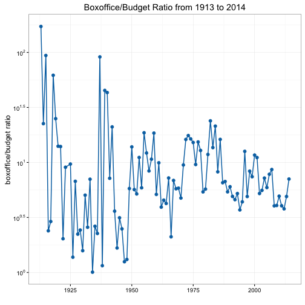
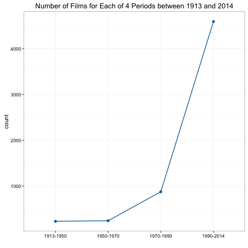
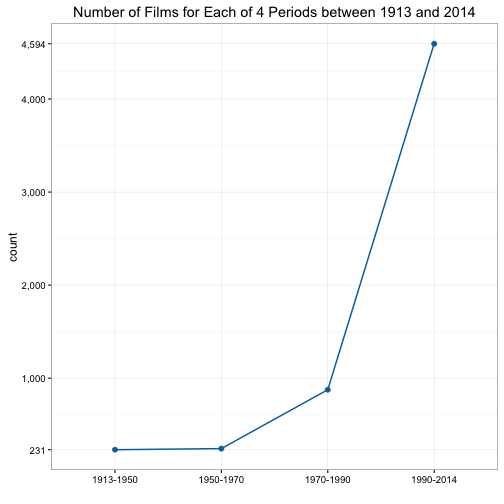

### Line plot

Line plots are good for showing trends. A line plot has time on its x-axis and a continuous variable on its y-axis. The `mk_lineplot()` function makes drawing line plots super easy. Let's see how it works. The ezplot package comes with a data set containing the annual boxoffice/budget ratio between 1913 and 2014.

A>
```r
library(ezplot)
str(bo_bt_ratio_by_year)
```

A>
```
Classes 'tbl_df', 'tbl' and 'data.frame':	101 obs. of  2 variables:
 $ year       : int  1913 1914 1915 1916 1917 1918 1919 1920 1921 1922 ...
 $ bo_bt_ratio: num  172.11 22.52 93.76 2.39 2.9 ...
 - attr(*, "drop")= logi TRUE
```

We can plot these ratios over the years.

A>
```r
plt = mk_lineplot(bo_bt_ratio_by_year)
title = "Boxoffice/Budget Ratio from 1913 to 2014"
p = plt("year", "bo_bt_ratio", ylab="boxoffice/budget ratio", main=title)
print(p)
```


It might be more informative if we use log10 scale on the y-axis.  

A>
```r
scale_axis(p, scale = "log10")
```



We can also draw two lines and color them differently. For example, we can plot annual total budget and boxoffice over the years on one plot.

A>
```r
str(btbo_by_year)
```

A>
```
'data.frame':	202 obs. of  4 variables:
 $ year: int  1913 1913 1914 1914 1915 1915 1916 1916 1917 1917 ...
 $ type: Factor w/ 2 levels "budget","boxoffice": 2 1 2 1 2 1 2 1 2 1 ...
 $ tot : num  0.000981 0.0000057 0.0010134 0.000045 0.022652 ...
 $ avg : num  0.981 0.0057 0.5067 0.0225 2.5169 ...
```

A>
```r
plt = mk_lineplot(btbo_by_year)
title = "Annual Total Budget and Boxoffice from 1913 to 2014"
red = cb_color("reddish_purple")
green = cb_color("bluish_green")
p = plt("year", "tot", "type", ylab="total amount ($billion)", main=title,
        linew=0.5, pt_size=1) 
p = p + ggplot2::scale_color_manual(values=c(red, green))
p
```


Now, the time variable on the x-axis doesn't has to be continuous. It can also be a character variable or a factor. The function `mk_lineplot()` is smart enough to take care of the difference under the hood, and you don't need to do anything different. For example, the `films` dataset has a character variable `year_cat` with only 4 unique values, indicating 4 different periods. We can look at the frequency counts of each period.

A>
```r
str(films$year_cat)
```

A>
```
 chr [1:5944] "1913-1950" "1990-2014" "1990-2014" "1990-2014" ...
```

A>
```r
table(films$year_cat)
```

A>
```

1913-1950 1950-1970 1970-1990 1990-2014 
      231       243       876      4594 
```

We can tally up the number of films for each period.

A>
```r
library(tidyr)
library(dplyr)
films_cnt = films %>% group_by(year_cat) %>% summarise(n = n())
films_cnt
```

A>
```
Source: local data frame [4 x 2]

   year_cat     n
      (chr) (int)
1 1913-1950   231
2 1950-1970   243
3 1970-1990   876
4 1990-2014  4594
```

Instead of visualizing the film counts using a bar chart, we use a line plot here because there's a time order to the periods.

A>
```r
plt = mk_lineplot(films_cnt)
title = "Number of Films for Each of 4 Periods between 1913 and 2014"
p = plt("year_cat", "n", ylab="count", main=title) 
p
```



But of course, we can add the min and max values on the y-axis to make the plot clearer.

A>
```r
ymin = min(films_cnt$n)
ymax = max(films_cnt$n)
p = p + ggplot2::scale_y_continuous(limits = c(ymin, ymax), 
                                    breaks = c(ymin, seq(1000, 4000, 1000), ymax), 
                                    labels = scales::comma)
p
```



This concludes our session on line plots. If you want to look under the hood, simply run `mk_lineplot` in Rstudio. I receive many sales data analysis projects and I use line plots in my reports all the time. The `mk_lineplot()` function saves me a lot of time. In the next section, we'll discuss the famous tufte slopegraph (or slopeplot).
