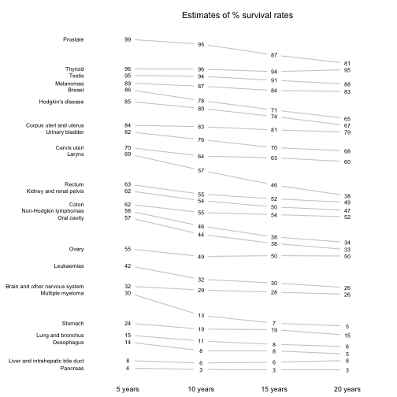
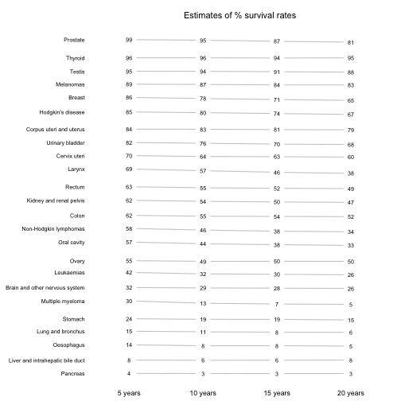

## Slopegraph

If I'm not mistaken, slopegraphs are invented by Edward Tufte. They compare changes over time for a group of ordered categories. To see what they look like, please visit Tufte's website to see some [examples](http://www.edwardtufte.com/bboard/q-and-a-fetch-msg?msg_id=0003nk). In this section, we're going to reproduce the cancer survival rates example using the `slopegraph_data_prep()` and the `mk_slopegraph()` functions. First, we take a look at the `cancer` data, and see it has 3 variables: group, year, and value, where group indicates the type of cancer, year is the number of years since cancer onset, and value is the proportion of patients still survived.

A>
```r
library(ezplot)
str(cancer)
```

A>
```
Classes 'tbl_df', 'tbl' and 'data.frame':	96 obs. of  3 variables:
 $ group: chr  "Oral cavity" "Oesophagus" "Stomach" "Colon" ...
 $ year : int  5 5 5 5 5 5 5 5 5 5 ...
 $ value: num  56.7 14.2 23.8 61.7 62.6 7.5 4 68.8 15 89 ...
```

A>
```r
head(cancer)
```

A>
```
Source: local data frame [6 x 3]
                             group  year value
                             (chr) (int) (dbl)
1                      Oral cavity     5  56.7
2                       Oesophagus     5  14.2
3                          Stomach     5  23.8
4                            Colon     5  61.7
5                           Rectum     5  62.6
6 Liver and intrahepatic bile duct     5   7.5
```

The cancer data is in long format, and we can put it in wide format.

A>
```r
df = tidyr::spread(cancer, key=year, value=value)
names(df) = c("", paste(names(df)[-1], "year"))
knitr::kable(df, caption="Survival Rates by Cancer Type")
```


|                                 | 5 year| 10 year| 15 year| 20 year|
|:--------------------------------|------:|-------:|-------:|-------:|
|Brain and other nervous system   |   32.0|    29.2|    27.6|    26.1|
|Breast                           |   86.4|    78.3|    71.3|    65.0|
|Cervix uteri                     |   70.5|    64.1|    62.8|    60.0|
|Colon                            |   61.7|    55.4|    53.9|    52.3|
|Corpus uteri and uterus          |   84.3|    83.2|    80.8|    79.2|
|Hodgkin's disease                |   85.1|    79.8|    73.8|    67.1|
|Kidney and renal pelvis          |   61.8|    54.4|    49.8|    47.3|
|Larynx                           |   68.8|    56.7|    45.8|    37.8|
|Leukaemias                       |   42.5|    32.4|    29.7|    26.2|
|Liver and intrahepatic bile duct |    7.5|     5.8|     6.3|     7.6|
|Lung and bronchus                |   15.0|    10.6|     8.1|     6.5|
|Melanomas                        |   89.0|    86.7|    83.5|    82.8|
|Multiple myeloma                 |   29.5|    12.7|     7.0|     4.8|
|Non-Hodgkin lymphomas            |   57.8|    46.3|    38.3|    34.3|
|Oesophagus                       |   14.2|     7.9|     7.7|     5.4|
|Oral cavity                      |   56.7|    44.2|    37.5|    33.0|
|Ovary                            |   55.0|    49.3|    49.9|    49.6|
|Pancreas                         |    4.0|     3.0|     2.7|     2.7|
|Prostate                         |   98.8|    95.2|    87.1|    81.1|
|Rectum                           |   62.6|    55.2|    51.8|    49.2|
|Stomach                          |   23.8|    19.4|    19.0|    14.9|
|Testis                           |   94.7|    94.0|    91.1|    88.2|
|Thyroid                          |   96.0|    95.8|    94.0|    95.4|
|Urinary bladder                  |   82.1|    76.2|    70.3|    67.9|

We can visualize the above table using a slopegraph. To do that, we need to first prep the data a little bit and this is where you need to use the function `slopegraph_data_prep()`. Notice we need to pass to it the long formatted `cancer` data frame.

A>
```r
df = slopegraph_data_prep(cancer, xvar="year", yvar="value", gpvar="group")
head(df)
```

A>
```
                             group year value yshift   ypos
1                         Pancreas    5   4.0  0.000  4.000
2 Liver and intrahepatic bile duct    5   7.5  2.005  9.505
3                       Oesophagus    5  14.2  9.010 23.210
4                Lung and bronchus    5  15.0 13.415 28.415
5                          Stomach    5  23.8 13.415 37.215
6                 Multiple myeloma    5  29.5 30.220 59.720
```

Next, we change the x variable (year) to factor, ensuring the time order is ascending, and label it so that it's human readable. We also round the y values.

A>
```r
df = within(df, {year = factor(year, levels=c(5,10,15,20), 
                               labels=c("5 years", "10 years", 
                                        "15 years", "20 years"))
                 value= round(value)})
```

Finally, we are ready to make a slopegraph.

A>
```r
plt = mk_slopegraph(df) 
p = plt("year", "value", "group", main="Estimates of % survival rates") 
p
```



When preparing data, we can also set values for `min_space` (defaul is 0.05) and `line_gap_scale` (default is 1). The first parameter controls the minimum gap between the lines, and the second parameter plays a role in calculating `ypos`. For example, we can set `min_space=0.5` and `line_gap_scale=2` and re-draw the slopegraph.

A>
```r
# prep data
df = slopegraph_data_prep(cancer, xvar="year", yvar="value", gpvar="group",
                          min_space=0.5, line_gap_scale=2)
df = within(df, {year = factor(year, levels=c(5,10,15,20), 
                               labels=c("5 years", "10 years", 
                                        "15 years", "20 years"))
                 value= round(value)})
# make slopegraph
plt = mk_slopegraph(df) 
p = plt("year", "value", "group", main="Estimates of % survival rates") 
p
```



We see all the lines are almost parallel, which are misleading, but you get the idea. You can always adjust these two parameter values to make the lines reflect the relative sizes of the numbers. This concludes our section. Go grab a coffee, and when you come back, we'll discuss the heatmap, which is the last type of chart we'll talk about.
