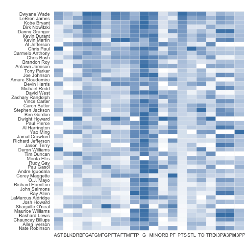
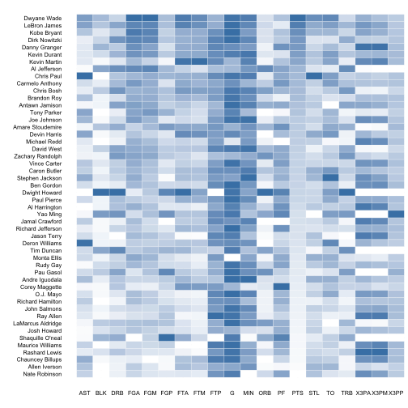

## Heatmap

Heatmaps are good for visualizing three (2 categorical and 1 numerical) variables. In this section, we'll learn how to make them using ezplot. The main function we'll use is called `mk_heatmap()`. We'll use a dataset of NBA basketball statistics. I originally downloaded the dataset from flowingdata.com, a site devoted to data visualization by a statistician with a PhD from UCLA. It's a cool site and you should check it out. But now, let's get dive in to our task. First, we examine the `nba` dataset a little bit.

A>
```r
library(dplyr)
library(tidyr)
library(ezplot)
# look at the first 5 rows and 8 columns
nba[1:5, 1:8]
```

A>
```
            Name  G  MIN  PTS  FGM  FGA   FGP FTM
1   Dwyane Wade  79 38.6 30.2 10.8 22.0 0.491 7.5
2  LeBron James  81 37.7 28.4  9.7 19.9 0.489 7.3
3   Kobe Bryant  82 36.2 26.8  9.8 20.9 0.467 5.9
4 Dirk Nowitzki  81 37.7 25.9  9.6 20.0 0.479 6.0
5 Danny Granger  67 36.2 25.8  8.5 19.1 0.447 6.0
```

A>
```r
# check the dimensions
dim(nba)
```

A>
```
[1] 50 21
```

A>
```r
# check the colnames
colnames(nba)
```

A>
```
 [1] "Name" "G"    "MIN"  "PTS"  "FGM"  "FGA"  "FGP"  "FTM"  "FTA"  "FTP" 
[11] "X3PM" "X3PA" "X3PP" "ORB"  "DRB"  "TRB"  "AST"  "STL"  "BLK"  "TO"  
[21] "PF"  
```

It has a variable called `Name` containing the names of the NBA players, and it's a Factor with levels ordered alphabetically. Let's reorder its levels by the points each player scored.

A>
```r
# reorder the levels of Name by points scored
nba$Name = with(nba, reorder(Name, PTS))
```

The rest of the variables are various performance statistics. To visualize the data in a heatmap, we first need to put the data in long format, a.k.a., we need to gather the names of the statistics in one column and their values in another column.

A>
```r
# change to long format
nba_m = nba %>% gather(stats, val, -Name)
head(nba_m)
```

A>
```
            Name stats val
1   Dwyane Wade      G  79
2  LeBron James      G  81
3   Kobe Bryant      G  82
4 Dirk Nowitzki      G  81
5 Danny Granger      G  67
6  Kevin Durant      G  74
```

In order to correctly display the information, we need to scale the values so that they are between 0 and 1 for each performance statistics. 

A>
```r
# scale the values of each performance statistics.
dat = nba_m %>% group_by(stats) %>% mutate(val_scaled = scales::rescale(val))
head(dat)
```

A>
```
Source: local data frame [6 x 4]
Groups: stats [1]
            Name stats   val val_scaled
          (fctr) (chr) (dbl)      (dbl)
1   Dwyane Wade      G    79    0.94737
2  LeBron James      G    81    0.98246
3   Kobe Bryant      G    82    1.00000
4 Dirk Nowitzki      G    81    0.98246
5 Danny Granger      G    67    0.73684
6  Kevin Durant      G    74    0.85965
```

With all the data prep work done, we're ready to make a heatmap, which is super easy because of `ezplot`.

A>
```r
# make a heatmap
plt = mk_heatmap(dat)
plt("stats", "Name", "val_scaled", legend=F)
```



The heatmap we just made uses the gray theme by default. Type `?theme_gray()` to learn more. Alternatively, we can make a heatmap using minimal theme by setting `use_theme_gray=F`, and we can also change the size of the tick text on both axes. 

A>
```r
# make a heatmap using the minimal theme and
# change tick text to 9 (default is 12)
plt("stats", "Name", "val_scaled", legend=F, use_theme_gray=F, base_size=9)
```



Now it's your turn. Try to make a heatmap using the unscaled values, and compare it with the scaled version. You will see the two look very differently. The scaled version is the correct one here. With that, we conclude this section. In the next section, we'll discuss how to easily annotate the charts we've been making and make them suitable for web display. See you soon. 
