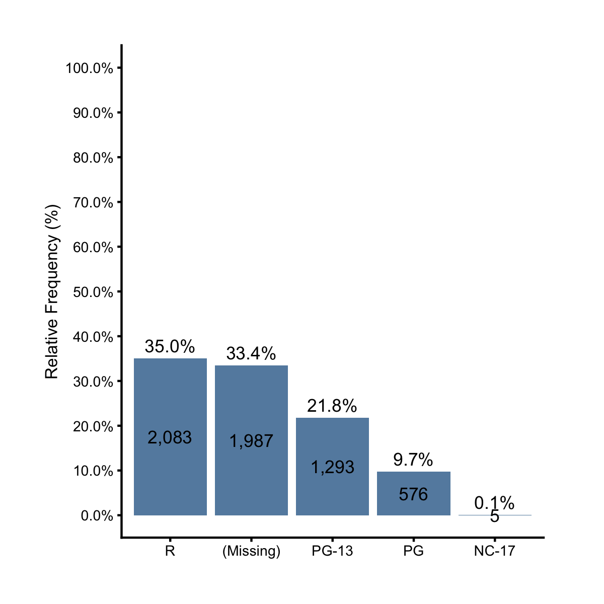

# Plot the Distribution of a Categorical Variable

The chart types we learned so far are good for showing the distribution of a continuous variable. What about categorical variables? The distribution of a categorical variable is made up by the frequencies (counts) or relative frequencies (percentages) of its levels. It's best to be visualized with bar charts. Let's start with an example. The variable `mpaa` of the `films` dataset has 5 unique values: `(Missing), PG-13, R, PG, NC-17`. 


```r
library(ezplot)
unique(films$mpaa)
```

```
[1] NA      "PG-13" "R"     "PG"    "NC-17"
```

Let's make a bar chart to show its frequency counts. Note that we don't need to tally the counts ourselves. The function `mk_barplot_freq` does that automatically. All we need is to pass the name of the categorical variable (`"mpaa"`) to the function returned by `mk_barplot_freq(films)`. 


```r
plt = mk_barplot_freq(films)
plt("mpaa", font_size = 8)
```


The resulting bar chart has many details. It has the frequency counts labeled on top of each bar, and the relative frequency percents labeled in the middle. The levels are ordered alphanumerically from left to right by default. With a few strokes, we can easily re-order them in ascending or descending order of bar heights. And we can set the number of decimal places of the % labels.


```r
plt("mpaa", xorder = "descend", label_decimals = 2, font_size = 8)
```


We can also show relative frequencies (%) on the y-axis by setting `show_pct = TRUE`. If we do that, the top and middle bar labels will also switch places.  


```r
plt("mpaa", show_pct = TRUE, xorder = "descend", font_size = 8) 
```



To summarize, when we have a dataset where each row is an individual record and the frequency distribution of a categorical variable is not directly available, we can use `mk_barplot_freq()` to understand its distribution without having to first tally up the frequencies and calculate their percentages. 

Now try the following exercises.

1. Read the document of `mk_barplot_freq()`. You can pull it up by running `?mk_barplot_freq` in Rstudio. 
2. Use it to show the number of drama films for each MPAA rating (`mpaa`). 
3. Use it to show the percent of action films for each period (`year_cat`).
