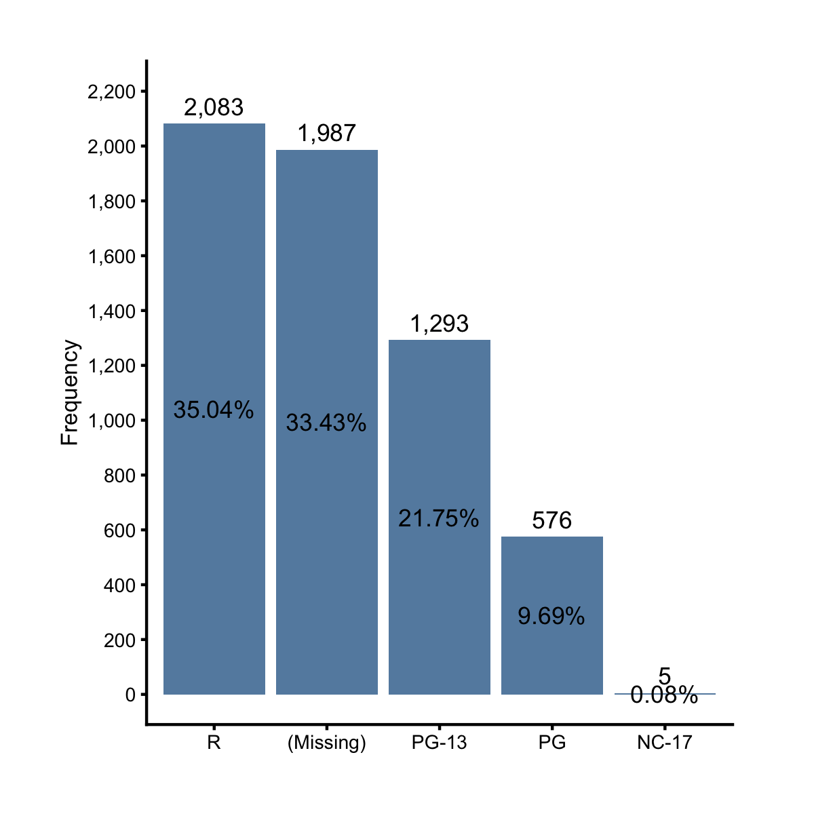

### Regular Bar Chart

Previously, we learned four tools for displaying the distribution of a continuous
variable. What about categorical variables? How can we show the frequencies 
(counts) or relative frequencies (percentages) of its levels? The answer is bar 
chart. Let's start with an example. The `mpaa` variable from the `films` dataset
has 5 unique values: NA, "PG-13", "R", "PG", and "NC-17". Let's draw a bar chart
to show their frequencies. We can do this easily via the ezplot function 
`mk_barplot_freq()`. 

```r
library(ezplot)
str(films$mpaa)
```

```
 chr [1:5944] NA "PG-13" "PG-13" NA "PG-13" NA "PG-13" "R" NA NA "R" ...
```

```r
plt = mk_barplot_freq(films)
plt("mpaa")
```


Notice we didn't need to tally the counts ourselves. The ezplot function does
this automatically. All we need is to tell `plt()` the name of the categorical 
variable. Also notice how elobrate the resulting chart is. It has the count of 
each category labeled on top of each bar, and their percents labeled in the 
middle of each bar. By default, the bars are ordered alphanumerically from 
left to right. We can choose to sort them in descending order of the bar heights. 
In addition, we can change the percent bar labels to 2 decimal places.

```r
plt("mpaa", xorder = "descend", label_decimals = 2)
```



Instead of showing frequency counts, we can show relative frequencies (%) on 
the y-axis by setting `show_pct = T` in `plt()`. If we do that, the top and 
middle bar labels will also switch places.  

```r
plt("mpaa", show_pct = T, xorder = "descend") 
```


To summarize, when we have a granular dataset where each row is an individual
record, we can use `mk_barplot_freq()` to plot bar charts of a given categorical
variable. But what if we're given a summary data table where the frequency counts
are already tallied? For example, consider the following data set, where the
counts and percents of the categories are given along side the categories. How
shall we just display them on a bar chart?

```r
df = films %>% count(mpaa) %>% mutate(pct = n / sum(n))
df
```

```
# A tibble: 5 x 3
  mpaa      n      pct
  <chr> <int>    <dbl>
1 NC-17     5 0.000841
2 PG      576 0.0969  
3 PG-13  1293 0.218   
4 R      2083 0.350   
5 <NA>   1987 0.334   
```

The answer is a different ezplot function, `mk_barplot_resp()`. 

```r
plt = mk_barplot_resp(df)
p = plt(xvar = "mpaa", yvar = "n", label_decimals = 0) # default uses 1 decimal 
add_labs(p, ylab = "Frequency")
```


Notice we need to supply values to both `xvar` and `yvar` in `plt()`. Recall 
we've seen this pattern of usage before. We'll see it over and over again. Of
course, we can show the relative frequencies by setting `yvar = "pct"`.

```r
plt(xvar = "mpaa", yvar = "pct", show_pct = T, label_decimals = 2, font_size = 9)  
```


What will happen if we set `show_pct = F`? Try it.

The function `mk_barplot_resp()` is actually more powerful than the example we've
just shown. Consider the following data set, which further splits the counts
of each MPAA category by a binary flag of made money or not.

```r
df2 = films %>% count(mpaa, made_money) %>% mutate(pct = n / sum(n))
df2
```

```
# A tibble: 9 x 4
  mpaa  made_money     n      pct
  <chr> <fct>      <int>    <dbl>
1 NC-17 yes            5 0.000841
2 PG    no           118 0.0199  
3 PG    yes          458 0.0771  
4 PG-13 no           298 0.0501  
5 PG-13 yes          995 0.167   
6 R     no           813 0.137   
7 R     yes         1270 0.214   
8 <NA>  no           602 0.101   
9 <NA>  yes         1385 0.233   
```

What will happen if we make a bar chart using `df2`? Yes, we'll get the same bar 
chart as when using `df`! This is because `mk_barplot_resp()` is smart enough to 
aggregate `n` for each category of `mpaa`.

```r
plt = mk_barplot_resp(df2)
p = plt(xvar = "mpaa", yvar = "n", label_decimals = 0) # default uses 1 decimal 
add_labs(p, ylab = "Frequency")
```


To summarise, `mk_barplot_resp()` first aggregates the y values for each x 
category, and then makes a bar chart. Now we know this, we can use it to plot 
the total boxoffice of each MPAA rating on a bar chart.

```r
plt = mk_barplot_resp(films)
plt("mpaa", "boxoffice", xorder = "descend", font_size = 10, label_decimals = 0)
```


Now it's your turn. Try the following exercises for homework.

1. Read the document of `mk_barplot_freq()` and `mk_barplot_resp()`. You can 
pull up the documents by running `?mk_barplot_freq` or `?mk_barplot_resp` in 
Rstudio. 
2. Make a bar chart to show the number of drama films for each MPAA rating. 
3. Make a bar chart to show the percent of action films for each MPAA rating.
4. Make a bar chart to show the total budget of the films for each MPAA rating.
5. Make a bar chart to show the total boxoffice of profitable and unprofitable
films. 
