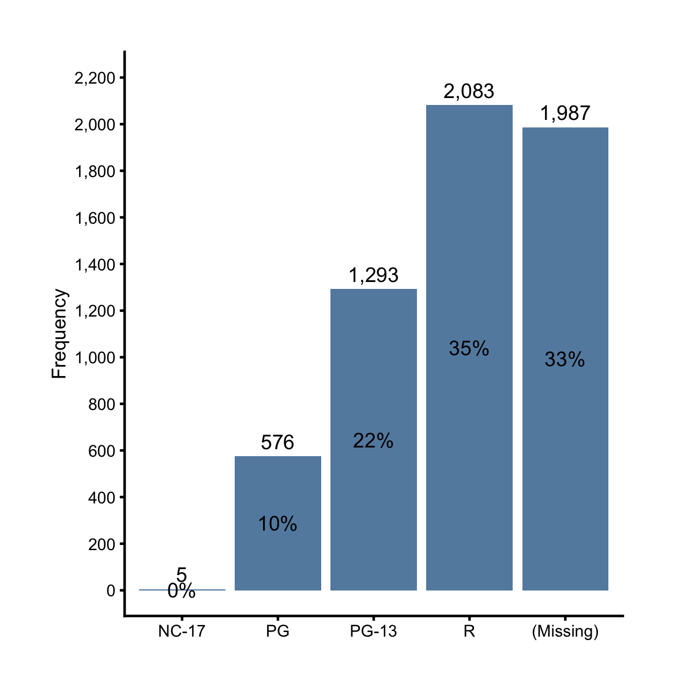
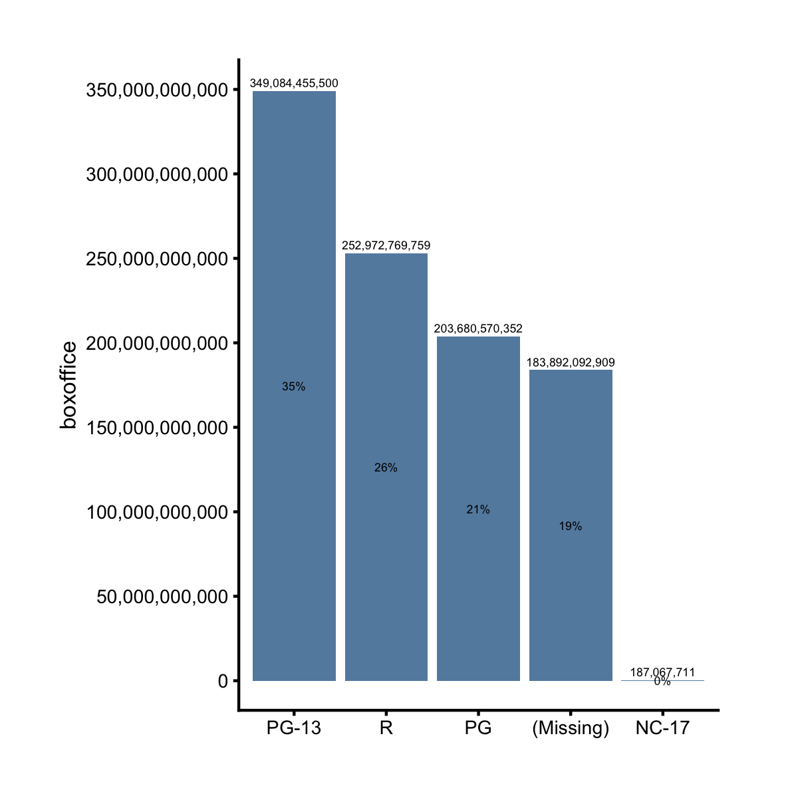

## Regular Bar Chart

What if we're given a summary dataset where the frequencies are already tallied? How can we visualize the frequencies on a bar chart? For example, let's create a data frame with counts and percentages of the `mpaa` categories. 


```r
library(dplyr)
df = films %>% count(mpaa) %>% mutate(pct = n / sum(n))
df
```

```
# A tibble: 5 x 3
  mpaa          n      pct
  <fct>     <int>    <dbl>
1 NC-17         5 0.000841
2 PG          576 0.0969  
3 PG-13      1293 0.218   
4 R          2083 0.350   
5 (Missing)  1987 0.334   
```

How can we make a bar chart to visualize the `n` values? The answer lies in a different ezplot function, `mk_barplot_resp()`. 


```r
plt = mk_barplot_resp(df)
p = plt(xvar = "mpaa", yvar = "n", label_decimals = 0, font_size = 8)
add_labs(p, ylab = "Frequency")
```


Notice that in addition to supplying a categorical variable name to `xvar`, we also need to supply a continuous variable name to `yvar`. We created the above chart by setting `yvar = "n"`, and we now set `yvar = "pct"` to visualize the relative frequencies.


```r
plt(xvar = "mpaa", yvar = "pct", show_pct = TRUE, 
    label_decimals = 2, font_size = 8) %>% 
        add_labs(ylab = 'Relative Frequency')
```


What will happen if you set `show_pct = FALSE`? Try it.

The function `mk_barplot_resp()` is actually more powerful than the example I just gave. Consider the following dataset, which further splits the counts of each MPAA category according to if the films made money or not.


```r
df2 = films %>% count(mpaa, made_money) %>% mutate(pct = n / sum(n))
df2
```

```
# A tibble: 9 x 4
  mpaa      made_money     n      pct
  <fct>     <fct>      <int>    <dbl>
1 NC-17     yes            5 0.000841
2 PG        no           118 0.0199  
3 PG        yes          458 0.0771  
4 PG-13     no           298 0.0501  
5 PG-13     yes          995 0.167   
6 R         no           813 0.137   
7 R         yes         1270 0.214   
8 (Missing) no           602 0.101   
9 (Missing) yes         1385 0.233   
```

What will happen if we make a bar chart using `df2`? We'll get exactly the same bar chart as when using `df`! This is because `mk_barplot_resp()` is smart enough to aggregate the `n` values for the same `mpaa` category.


```r
plt = mk_barplot_resp(df2)
p = plt(xvar = "mpaa", yvar = "n", label_decimals = 0, font_size = 8) 
add_labs(p, ylab = "Frequency")
```



To summarise, `mk_barplot_resp()` aggregates the y values for each x category before making a bar chart. Now we know this, we can use it to plot the total boxoffice for each MPAA rating.


```r
plt = mk_barplot_resp(films)
plt("mpaa", "boxoffice", xorder = "descend", font_size = 8, label_decimals = 0)
```



Now try the following exercises for homework.

1. Read the document of `mk_barplot_resp()`. You can pull up the documents by running `?mk_barplot_resp` in Rstudio. 
2. Make a bar chart to show the total budget of the films for each MPAA rating.
3. Make a bar chart to show the total boxoffice of profitable vs. unprofitable
films. 

