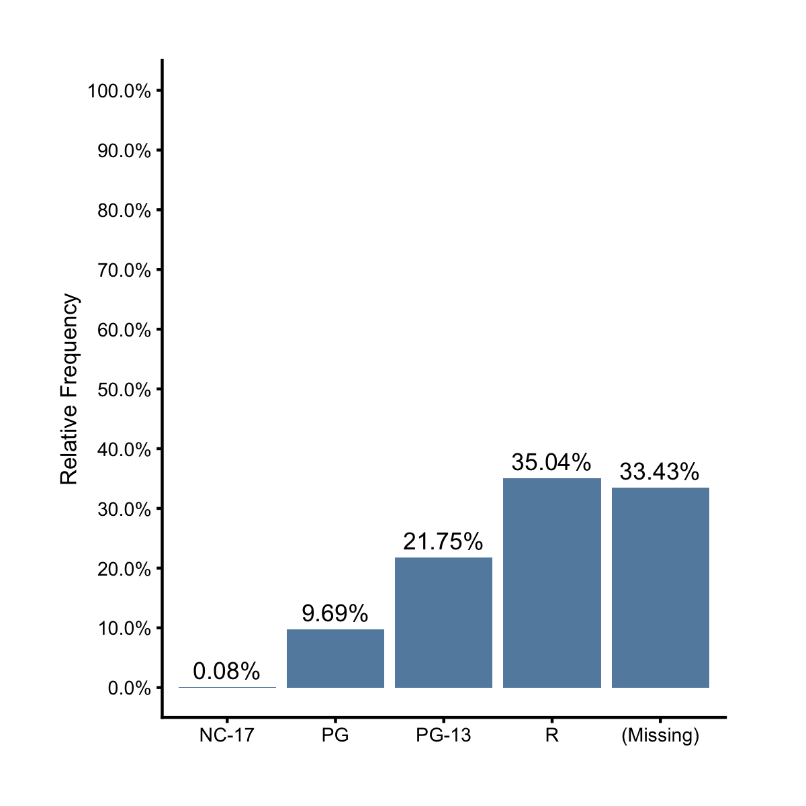

## Regular Bar Chart

What if we're given a summary dataset where the frequencies are already counted and available? How can we visualize them? For example, let's create a data frame with counts and percentages for the `mpaa` categories. 

```r
library(ezplot)
library(dplyr)
df = films %>% count(mpaa) %>% 
        mutate(mpaa = forcats::fct_explicit_na(mpaa), pct = n / sum(n))
df
```

```
       mpaa    n        pct
1     NC-17    5 0.00084118
2        PG  576 0.09690444
3     PG-13 1293 0.21753028
4         R 2083 0.35043742
5 (Missing) 1987 0.33428668
```

How can we make a bar chart to show the raw counts (or `n` values)? The function `mk_barplot_freq()` won't work and we need to use `mk_barplot_resp()`. 

```r
plt = mk_barplot_resp(df)
p = plt(xvar = "mpaa", yvar = "n", label_decimals = 0, font_size = 8)
add_labs(p, ylab = "Frequency")
```


Note that we need to supply a categorical variable name to the `xvar` parameter and a continuous variable name to `yvar`. To display the relative frequencies we simply set `yvar = "pct"` and `is_y_pct = TRUE`.

```r
plt(xvar = "mpaa", yvar = "pct", is_y_pct = T, label_decimals = 2, 
    font_size = 8) %>% add_labs(ylab = 'Relative Frequency')
```



The function `mk_barplot_resp()` is actually more powerful than the example I just gave. Consider the following dataset, which further splits the counts of each MPAA category according to if the films made money or not. 

```r
df2 = films %>% count(mpaa, made_money) %>% 
        mutate(mpaa = forcats::fct_explicit_na(mpaa), pct = n / sum(n))
df2 # compare df2 with df and understand their relationship
```

```
       mpaa made_money    n        pct
1     NC-17        yes    5 0.00084118
2        PG         no  118 0.01985195
3        PG        yes  458 0.07705249
4     PG-13         no  298 0.05013459
5     PG-13        yes  995 0.16739569
6         R         no  813 0.13677658
7         R        yes 1270 0.21366083
8 (Missing)         no  602 0.10127860
9 (Missing)        yes 1385 0.23300808
```

What will happen if we make a bar chart using `df2`? We'll get the same bar chart as under `df`! This is because `mk_barplot_resp()` is smart enough to aggregate the y values within each x category when the same category appears in multiple rows.

```r
plt = mk_barplot_resp(df2)
plt(xvar = "mpaa", yvar = "n", label_decimals = 0, font_size = 8) %>% 
        add_labs(ylab = "Frequency")
```


So behind the scence, `mk_barplot_resp()` aggregates the y values for each x category before drawing the bars. Let's now plot the total boxoffice for each MPAA rating level.

```r
plt = mk_barplot_resp(films %>% mutate(mpaa = forcats::fct_explicit_na(mpaa)))
plt("mpaa", "boxoffice", xorder = "descend", font_size = 8, label_decimals = 0,
    label_size = 1.5)
```


We can also choose to focus on the relative percentages of those boxoffice amounts at each MPAA rating level by setting `show_pct = TRUE`.

```r
plt("mpaa", "boxoffice", xorder = "descend", font_size = 8, label_decimals = 0,
    label_size = 1.5, show_pct = TRUE)
```


The parameters `is_y_pct` and `show_pct` are different in the following ways:

1. When `is_y_pct = TRUE`, `show_pct` will be ignored regardless of its value. Like the example shown in the beginning of this section, if your data already have a column of percents and you want to directly barplot them, set `is_y_pct = TRUE`. 
2. When `is_y_pct = FALSE`, `show_pct` controls if the resulting bars will show the raw aggregated y-values (`show_pct = FALSE`, default) or their relative percents (`show_pct = TRUE`). 

Try the following exercises for homework:

1. Read the document of `mk_barplot_resp()`. You can pull it up by running `?mk_barplot_resp` in Rstudio. 
2. Make a bar chart to show the total budget of each MPAA rating.
3. Make a bar chart to show the total boxoffice of profitable vs. unprofitable
   films. 
