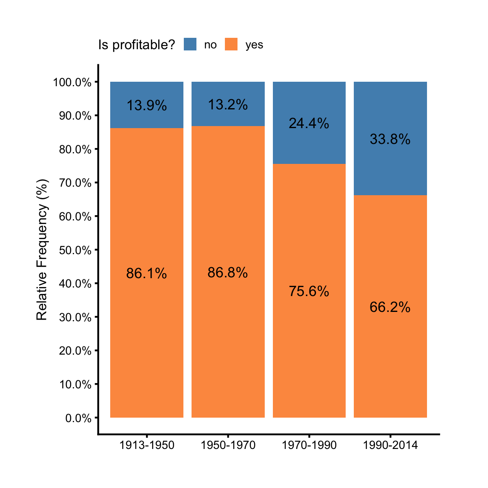
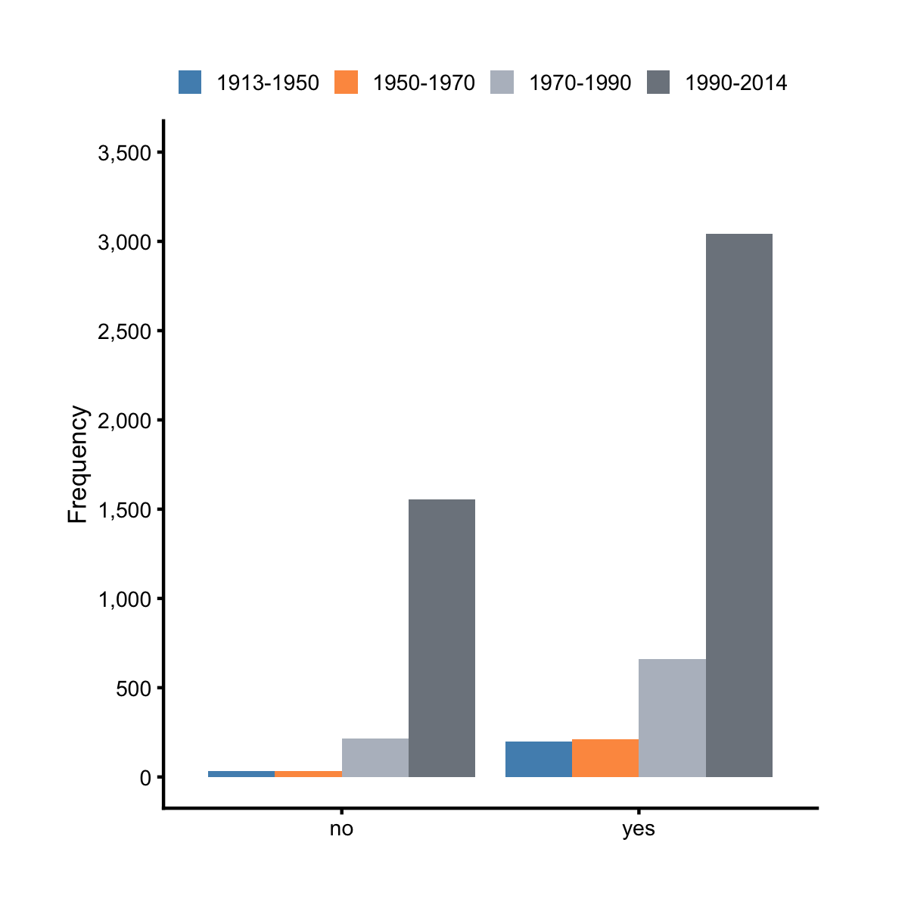
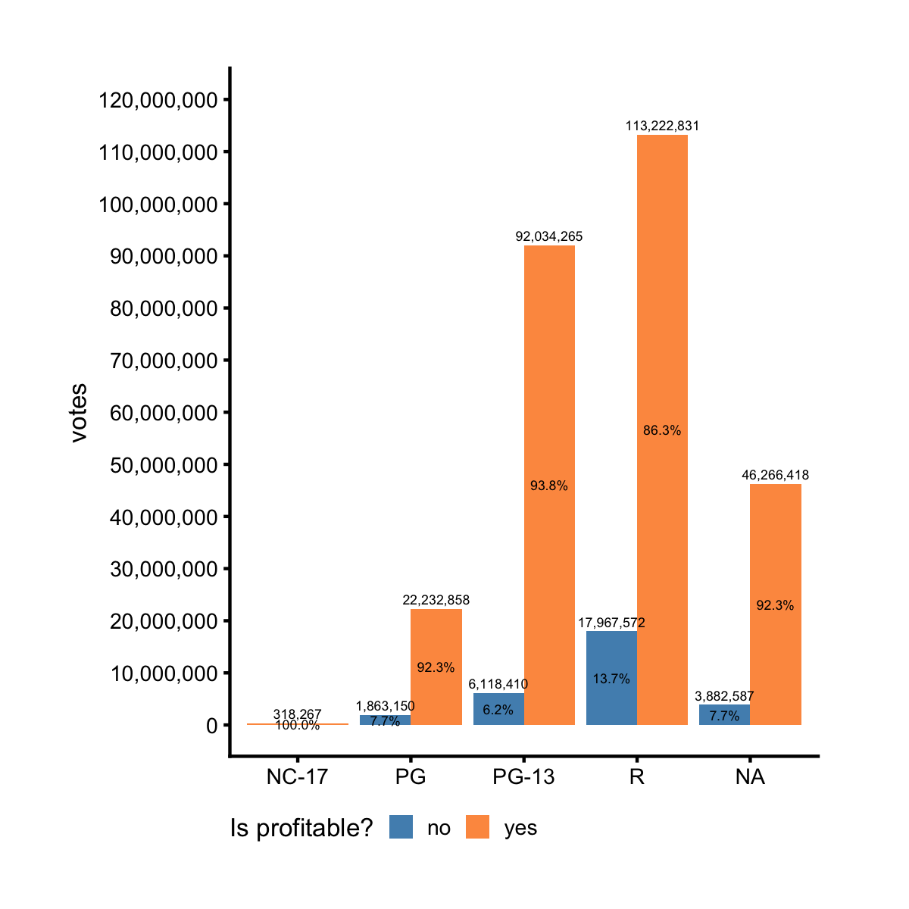

## Dodged and Stacked Bar Chart

A dodged or stacked bar chart is often used to show relationships among two 
categorical and one continous variables. For example, take the variables 
`year_cat` and `made_money` from the data frame `films`. The former brackets 
years into four categories and the latter flags if a film made money or not. 
Suppose we want to compare the frequencies of profitable vs. 
unprofitable films for each time period, we can draw a dodged bar chart.

```r
library(ezplot)
plt = mk_barplot_freq(films)
plt(xvar = "year_cat", fillby = "made_money")
```


 
We see there are way more profitable films than unprofitable ones at each time 
period. With only 2 lines of code, we got such a minimalistic and informative 
chart. By the way, the blue and orange colors are color-blind friendly. 
Of course, we can also draw a stacked bar chart instead. We do that by setting
`show_pct = T` inside `plt()`.

```r
plt(xvar = "year_cat", fillby="made_money", show_pct = T, 
    legend_title = "Is profitable?", legend_pos = "top")
```



We see stacked bar chart is better suited to compare the relative frequencies
between two categories. The proportion of profitable films has been decreasing
over the years. During 1950-1970, more than 86% of films made money. But between
1990 and 2014, only 66% of films made money. 

Just for fun, let's switch places for `year_cat` and `made_money`. We'll place
`made_money` on x-axis and color the bars with `year_cat`. We'll also disable
the bar labels by setting `label_size = 0`, which will make the chart uncluttered.

```r
plt(xvar = "made_money", fillby = "year_cat", label_size = 0,
    legend_title = NULL, legend_pos = "top")
```



In summary, when supplied a fillby variable, we can use `mk_barplot_freq()` to 
make bar charts to show frequencies or relative frequencies of a categorical 
variable grouped by the fillby variable. Now what if we are not interested in
frequencies or relative frequencies, but the aggregated value of continuous 
variable? For example, the data frame `films` has a variable `votes` that 
measures the number of votes a film received from imbd users. We want to know
how many votes there're under each MPAA rating for profitable and unprofitable
films respectively. We can draw a dodged bar chart using `mk_barplot_resp()` and
set `yvar = "votes"` inside `plt()`, as shown in the code block below. 

```r
plt = mk_barplot_resp(films)
plt(xvar = "mpaa", yvar = "votes", fillby = "made_money", label_size = 0,
    legend_title = "Is profitable?", legend_pos = "left")
```



Now it's your turn. Run `str(films)` to examine its variables. Pick two 
categorical variables and a continuous one, and visualize the relationships 
among them. You may also need to perform some data filtering. If you run into 
problems, read the document of `mk_barplot_freq()` and `mk_barplot_resp()`. 
To access the documents, run `?mk_barplot_freq` or `?mk_barplot_resp` in Rstudio.
