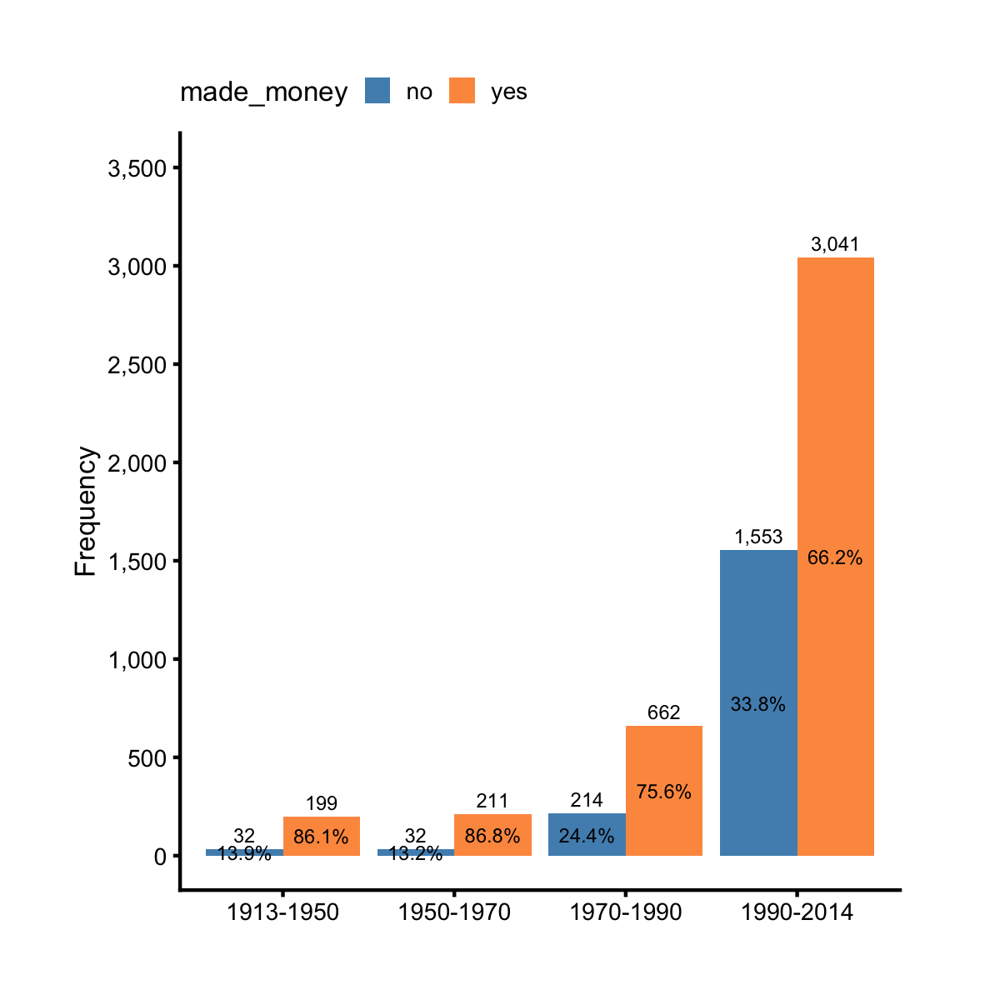
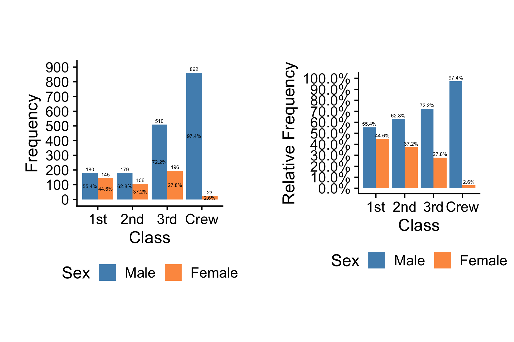

## Dodged or Stacked Bar Chart

A dodged or stacked bar chart is often used to show relationships between two 
categorical and one continuous variables. For example, take `year_cat` and `made_money` from the dataset `films`. The former groups years into four brackets and the latter flags if a film made money or not. If we want to compare the frequencies of profitable vs. unprofitable films for each time period, we can make a dodged bar chart.

```r
library(ezplot)
plt = mk_barplot_freq(films)
plt(xvar = "year_cat", fillby = "made_money", legend_pos = 'top', 
    label_size = 2, font_size = 8)
```



We see that there are more profitable films than unprofitable ones at each time 
period. By the way, the blue and orange colors are color-blind friendly. Instead of a dodged bar chart, we can draw a stacked bar chart by setting `show_pct = TRUE` inside `plt()`.

```r
plt(xvar = "year_cat", fillby="made_money", show_pct = TRUE, font_size = 8,
    legend_title = "Is profitable?", legend_pos = "top")
```


The stacked bar chart is more appropriate when comparing the relative frequencies
between categories. The proportion of profitable films has been decreasing
over the years. During 1950-1970, more than 86% of films made money. But only 66% of films made money between 1990 and 2014. 

Just for fun, let's switch places for `year_cat` and `made_money`. This will put
`made_money` on x-axis and color the bars with `year_cat`. In order to make the chart uncluttered, let's also disable the bar labels by setting `label_size = 0`.

```r
plt(xvar = "made_money", fillby = "year_cat", label_size = 0, font_size = 8,
    legend_title = NULL, legend_pos = "top")
```


So when supplied with a `fillby` variable name, the function `mk_barplot_freq()` can be used to visualize the frequencies or relative frequencies of a categorical variable grouped by the `fillby` variable. But what if you are not interested in
frequencies or relative frequencies? What if you are interested in the aggregated value of some continuous variable? For example, `films` has a variable `votes` for the number of votes a film received from IMBD users. We want to know the total number of votes for each MPAA rating by profitable and unprofitable films. We can use the function `mk_barplot_resp()` and set `yvar = "votes" and fillby = "made_money"` inside `plt()` as shown in the code below. 

```r
plt = mk_barplot_resp(films)
plt(xvar = "mpaa", yvar = "votes", fillby = "made_money", label_size = 0, 
    font_size = 8, legend_title = "Is profitable?", legend_pos = "bottom")
```


It's also helpful to see their relative frequencies for comparison. To do that, 
we just need to add a few strokes by setting `show_pct = TRUE`.

```r
plt = mk_barplot_resp(films)
plt(xvar = "mpaa", yvar = "votes", fillby = "made_money", show_pct = TRUE,
    font_size = 8, legend_title = "Is profitable?", legend_pos = "bottom")
```


As another example, consider the `Titanic` dataset.

```r
d = as.data.frame(Titanic)
head(d)
```

```
  Class    Sex   Age Survived Freq
1   1st   Male Child       No    0
2   2nd   Male Child       No    0
3   3rd   Male Child       No   35
4  Crew   Male Child       No    0
5   1st Female Child       No    0
6   2nd Female Child       No    0
```

Let's explore the relationship between the number of people survived and their cabin (or ticket) classes.

```r
plt = mk_barplot_resp(d)
p1 = plt('Class', 'Freq', fillby = 'Survived') %>% # dodged bar chart
    add_labs(ylab = 'Frequency')
p2 = plt('Class', 'Freq', fillby = 'Survived', show_pct = T) %>% # stacked bar chart
    add_labs(ylab = 'Relative Frequency (%)')

# install.packages('cowplot') # installs the cowplot pkg 
cowplot::plot_grid(square_fig(p1), square_fig(p2))
```


Once again, when frequencies and relative frequencies of a categorical variable are directly available, use `mk_barplot_resp()` to plot them.

```r
dat = d %>% group_by(Class, Sex) %>%
        summarise(cnt = sum(Freq), .groups = 'drop_last') %>%
        mutate(pct = cnt / sum(cnt))
head(dat)
```

```
# A tibble: 6 x 4
# Groups:   Class [3]
  Class Sex      cnt   pct
  <fct> <fct>  <dbl> <dbl>
1 1st   Male     180 0.554
2 1st   Female   145 0.446
3 2nd   Male     179 0.628
4 2nd   Female   106 0.372
5 3rd   Male     510 0.722
6 3rd   Female   196 0.278
```

```r
g = mk_barplot_resp(dat)
g('Class', 'cnt', fillby = 'Sex', legend_pos = 'bottom') %>% # dodged bar chart
  add_labs(xlab='Class', ylab='Frequency')
```



Note that the following two different ways result identical stacked bar charts.

```r
p1 = g('Class', 'cnt', fillby = 'Sex', show_pct = T) %>%
  add_labs(xlab='Class', ylab='Relative Frequency')
p2 = g('Class', 'pct', fillby = 'Sex', show_pct = T) %>%
  add_labs(xlab='Class', ylab='Relative Frequency')

cowplot::plot_grid(square_fig(p1), square_fig(p2))
```


Now it's your turn. Run `str(films)` to examine its variables. Pick two 
categorical and one continuous variables, and visualize their relationships. 
You may also need to perform some data filtering. If you run into 
problems, read the document of `mk_barplot_freq()` and `mk_barplot_resp()`. 
To access the documents, run `?mk_barplot_freq` or `?mk_barplot_resp` in Rstudio.
