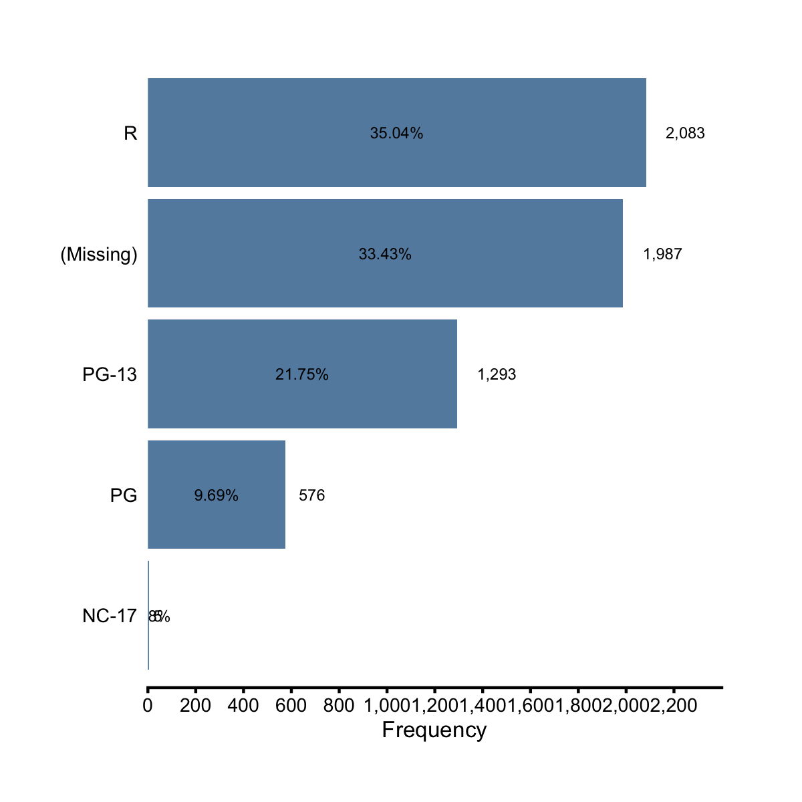
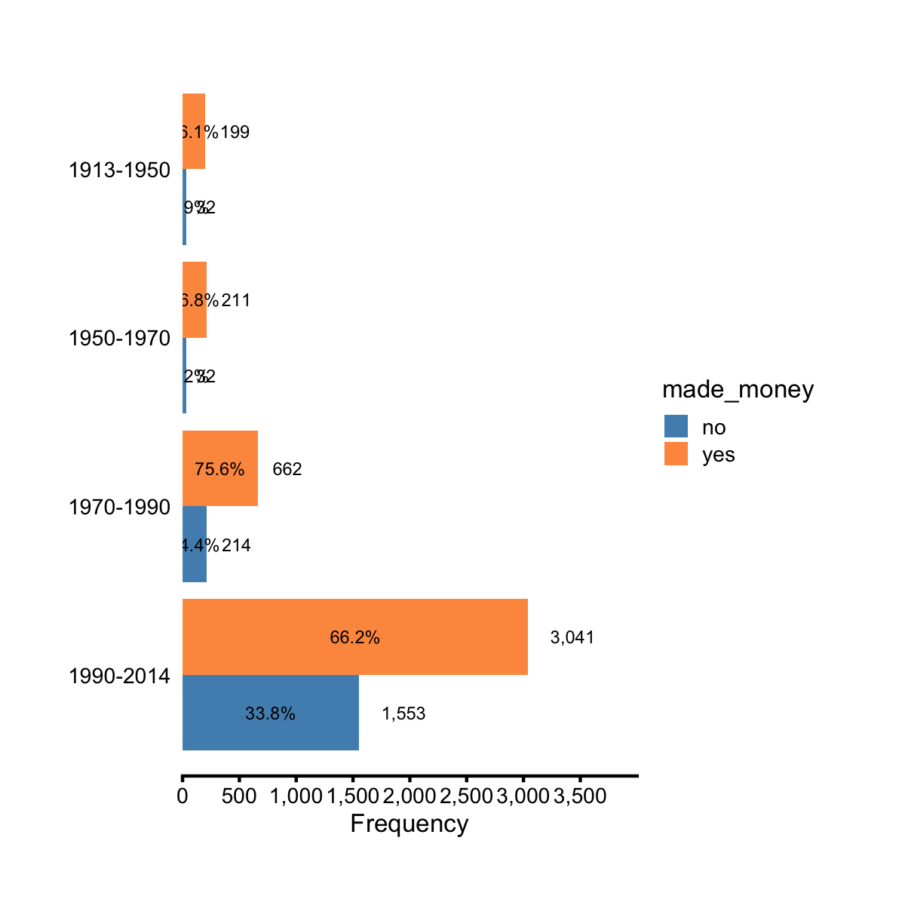
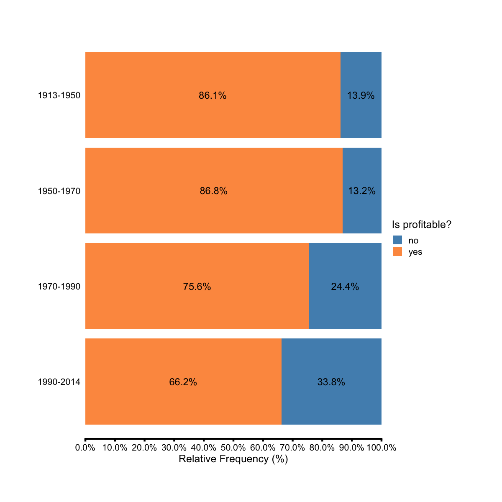
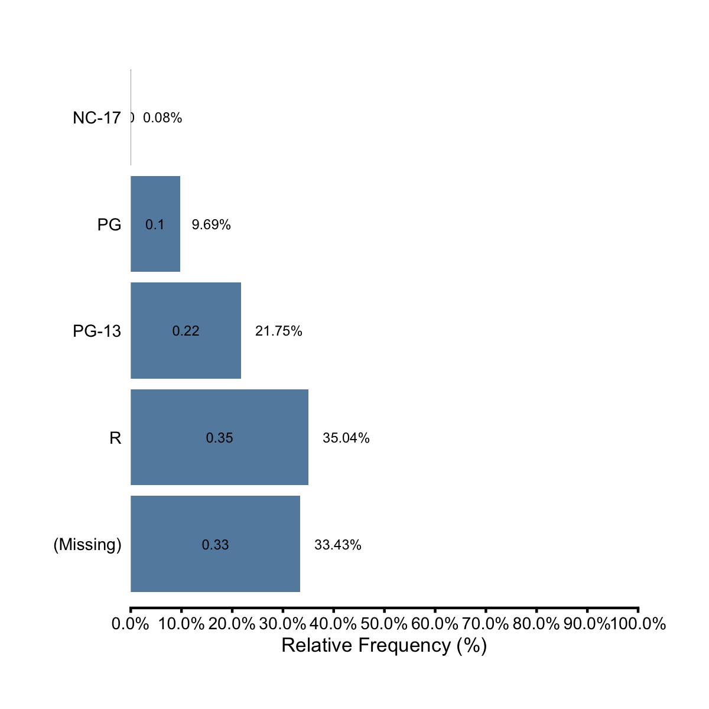
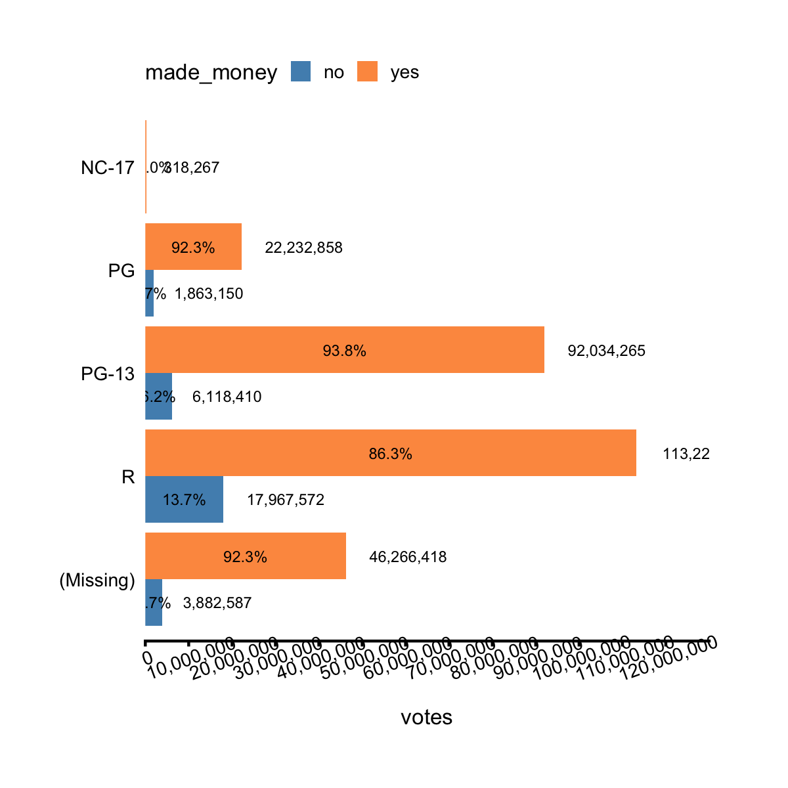

## Horizontal Bar Chart & Lollipop Plot

Previously, we mastered two ezplot functions, `mk_barplot_freq()` and 
`mk_barplot_resp()`. We can use them to easily make regular, dodged and stacked 
bar charts. There're two other ezplot functions, namely, 
`mk_barploth_freq()` and `mk_barploth_resp()` that can be used to create 
horizontal versions of the same bar charts. Let's make the horizontal versions
of the same bar charts we made in the last two sections.

The following 4 examples show how to use `mk_barploth_freq()`.

A>
```r
library(ezplot)
plt = mk_barploth_freq(films)
```

A>
```r
plt("mpaa", yorder = "descend", label_decimals = 2)
```



A>
```r
plt("mpaa", show_pct = T, yorder = "descend") 
```


A>
```r
plt(yvar = "year_cat", fillby = "made_money", label_size = 0) 
```



A>
```r
plt(yvar = "year_cat", fillby="made_money", show_pct = T)
```




The next 4 examples show how to use `mk_barploth_resp()`.

A>
```r
library(dplyr)
df = films %>% count(mpaa) %>% mutate(pct = n / sum(n))
plt = mk_barploth_resp(df)
```

A>
```r
p = plt(xvar = "n", yvar = "mpaa", label_decimals = 0) # default uses 1 decimal 
add_labs(p, xlab = "Frequency")
```


A>
```r
plt(xvar = "pct", yvar = "mpaa", show_pct = T, label_decimals = 2, font_size = 9)  
```



A>
```r
plt = mk_barploth_resp(films)
p = plt("boxoffice", "mpaa", yorder = "descend", font_size = 10, label_decimals = 0)
rotate_axis_text(p, 10)
```


A>
```r
plt("votes", "mpaa", fillby = "made_money", label_size = 0)
```



The next example shows how to create horizontal bar chart and lollipop chart 
using a common data set. 

Horizontal bar chart and lollipop chart are exchangeable. So if you use a lot of 
horizontal bar charts, maybe you want to switch to horizontal lollipop chart for
a change. Let's draw both using the following dataset.

A>
```r
df = read.csv(text="category,pct
               Other,0.09
               South Asian/South Asian Americans,0.12
               Interngenerational/Generational,0.21
               S Asian/Asian Americans,0.25
               Muslim Observance,0.29
               Africa/Pan Africa/African Americans,0.34
               Gender Equity,0.34
               Disability Advocacy,0.49
               European/European Americans,0.52
               Veteran,0.54
               Pacific Islander/Pacific Islander Americans,0.59
               Non-Traditional Students,0.61
               Religious Equity,0.64
               Caribbean/Caribbean Americans,0.67
               Latino/Latina,0.69
               Middle Eastern Heritages and Traditions,0.73
               Trans-racial Adoptee/Parent,0.76
               LBGTQ/Ally,0.79
               Mixed Race,0.80
               Jewish Heritage/Observance,0.85
               International Students,0.87", 
              stringsAsFactors = FALSE, sep = ",", header = TRUE)
# change category to factor and order its levels in ascending order of pct 
df$category = reorder(df$category, df$pct)
str(df)
```
A>
```
'data.frame':	21 obs. of  2 variables:
 $ category: Factor w/ 21 levels "               Other",..: 1 2 3 4 5 6 7 8 9 10 ...
  ..- attr(*, "scores")= num [1:21(1d)] 0.34 0.67 0.49 0.52 0.34 0.87 0.21 0.85 0.69 0.79 ...
  .. ..- attr(*, "dimnames")=List of 1
  .. .. ..$ : chr  "               Africa/Pan Africa/African Americans" "               Caribbean/Caribbean Americans" "               Disability Advocacy" "               European/European Americans" ...
 $ pct     : num  0.09 0.12 0.21 0.25 0.29 0.34 0.34 0.49 0.52 0.54 ...
```

A>
```r
plt = mk_barploth_resp(df)
plt("pct", "category", yorder = "descend", font_size = 10, show_pct = T,
    label_decimals = 0)
```


A>
```r
plt = mk_lollipop(df)
plt("pct", "category", yorder = "descend", font_size = 10, show_pct = T,
    label_decimals = 0)
```


