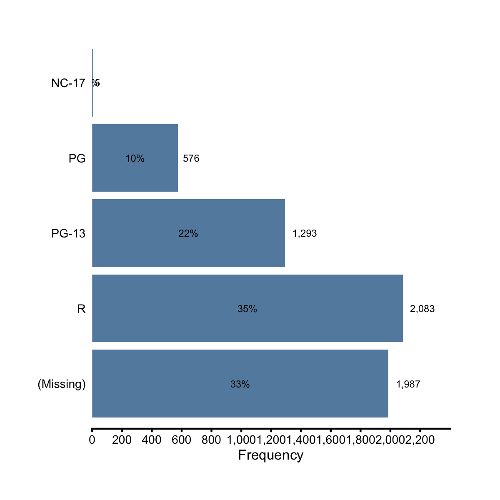
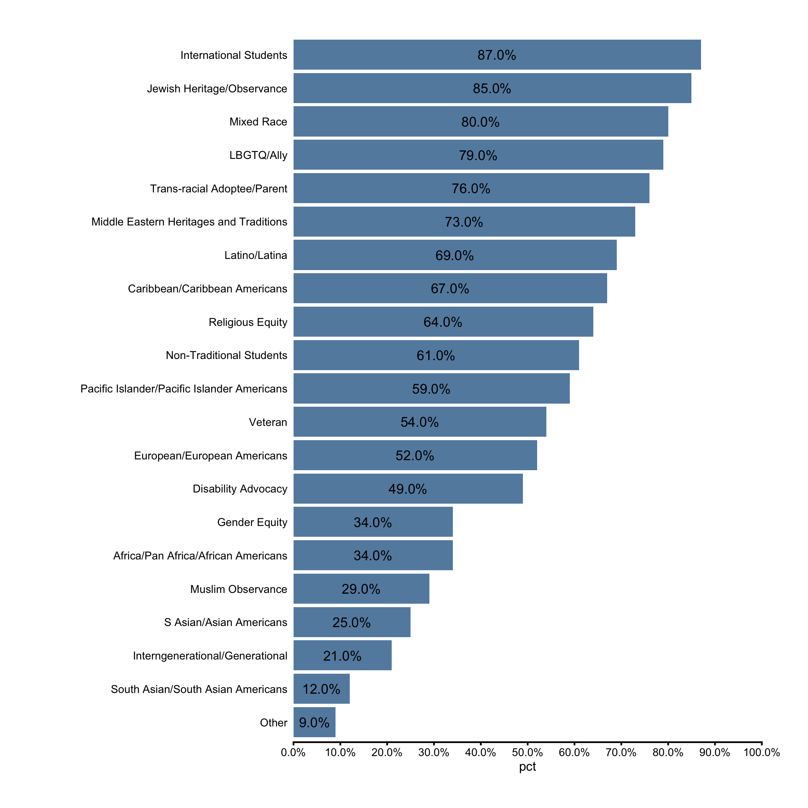
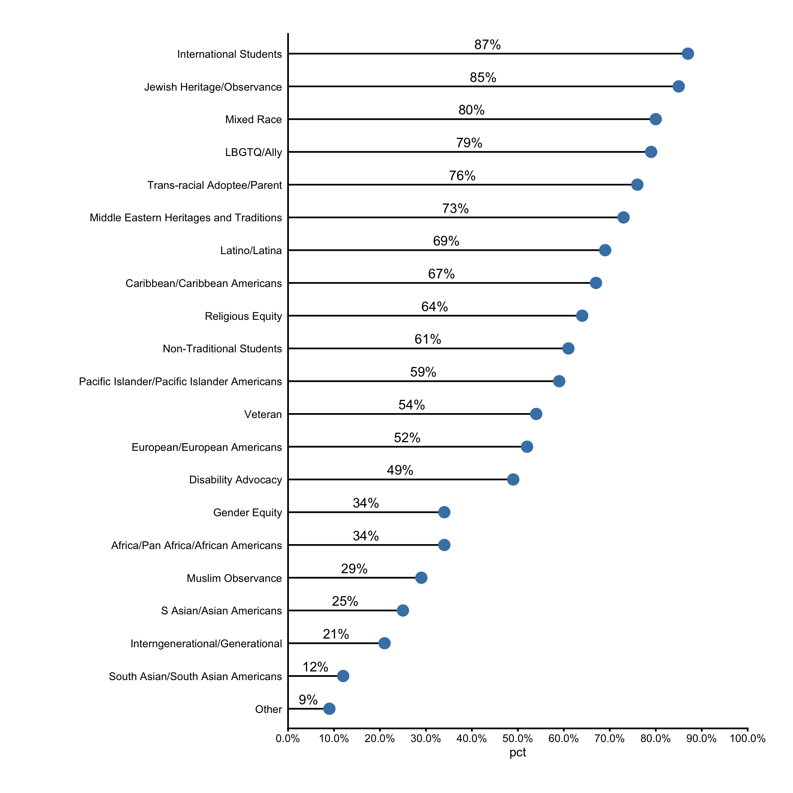

## Horizontal Bar Chart & Lollipop Plot

In previous sections, we learned `mk_barplot_freq()` and `mk_barplot_resp()` for making vertical bar charts. In this section we'll learn their close cousins `mk_barploth_freq()` and `mk_barploth_resp()` for making horizontal bar charts. 

We'll start by making the horizontal versions of the vertical bar charts we made before. First, let's see `mk_barploth_freq()` in action.

```r
library(ezplot)
films$mpaa = forcats::fct_explicit_na(films$mpaa)
plt = mk_barploth_freq(films)
```

```r
plt("mpaa", yorder = "descend", label_decimals = 2, label_size = 2, 
    font_size = 8)
```


```r
plt("mpaa", show_pct = TRUE, yorder = "descend", label_size = 2, font_size = 8) 
```


```r
plt(yvar = "year_cat", fillby = "made_money", label_size = 2, font_size = 8) 
```


```r
plt(yvar = "year_cat", fillby = "made_money", show_pct = TRUE, 
    legend_title = "Is profitable?", label_size = 2, font_size = 6)
```


Next, let's see `mk_barploth_resp()` in action.

```r
library(dplyr)
df = films %>% count(mpaa) %>% 
    mutate(mpaa = forcats::fct_explicit_na(mpaa), pct = n / sum(n))
plt = mk_barploth_resp(df)
```

```r
plt(xvar = "n", yvar = "mpaa", label_decimals = 0, label_size = 2, 
    font_size = 8) %>% add_labs(xlab = "Frequency")
```



```r
plt(xvar = "pct", yvar = "mpaa", show_pct = TRUE, label_decimals = 2, 
    label_size = 2, font_size = 8) %>% add_labs(xlab = 'Relative Frequency (%)')
```


```r
plt = mk_barploth_resp(films)
plt("boxoffice", "mpaa", yorder = "descend", label_decimals = 0, 
    label_size = 2, font_size = 8) %>% rotate_axis_text(15)
```


```r
plt("votes", "mpaa", fillby = "made_money", label_size = 2, 
    font_size = 8, legend_pos = "top") %>% rotate_axis_text(20)
```


```r
plt("votes", "mpaa", fillby = "made_money", show_pct = T, label_size = 2, 
    font_size = 6, legend_pos = "top") %>% 
        add_labs(xlab = 'Relative Frequency (%)')
```


If you recall when we studied `mk_barplot_resp()` in the previous two sections, we specifically mentioned that setting `is_y_pct = TRUE` will allow us to display a variable of percents as is without aggregating its values by the x categories first. You can do the same when using `mk_barploth_resp()` to make horizontal bar chart by setting `is_x_pct=TRUE`. Here's an example. Consider the following fake dataset where the `pct` column contains numbers between 0 and 1 and represents the percentage of some measurement.

```r
df = read.csv(text="category,pct
               Other,0.09
               South Asian/South Asian Americans,0.12
               Interngenerational/Generational,0.21
               S Asian/Asian Americans,0.25
               Muslim Observance,0.29
               Africa/Pan Africa/African Americans,0.34
               Gender Equity,0.34
               Disability Advocacy,0.49
               European/European Americans,0.52
               Veteran,0.54
               Pacific Islander/Pacific Islander Americans,0.59
               Non-Traditional Students,0.61
               Religious Equity,0.64
               Caribbean/Caribbean Americans,0.67
               Latino/Latina,0.69
               Middle Eastern Heritages and Traditions,0.73
               Trans-racial Adoptee/Parent,0.76
               LBGTQ/Ally,0.79
               Mixed Race,0.80
               Jewish Heritage/Observance,0.85
               International Students,0.87", 
              stringsAsFactors = FALSE, sep = ",", header = TRUE)
# change category to factor and order its levels in ascending order of pct 
df$category = reorder(df$category, df$pct)
head(df)
```

```
                                            category  pct
1                                              Other 0.09
2                  South Asian/South Asian Americans 0.12
3                    Interngenerational/Generational 0.21
4                            S Asian/Asian Americans 0.25
5                                  Muslim Observance 0.29
6                Africa/Pan Africa/African Americans 0.34
```

The following code display the percentage values on a horizontal bar chart.

```r
plt = mk_barploth_resp(df)
plt("pct", "category", yorder = "descend", is_x_pct = TRUE, font_size = 8)
```



Alternatively, we can use the lollipop chart, which looks less crowded than the horizontal bar chart. 

```r
plt = mk_lollipop(df)
plt("pct", "category", yorder = "descend", show_pct = TRUE, label_decimals = 0,
    font_size = 8)
```


