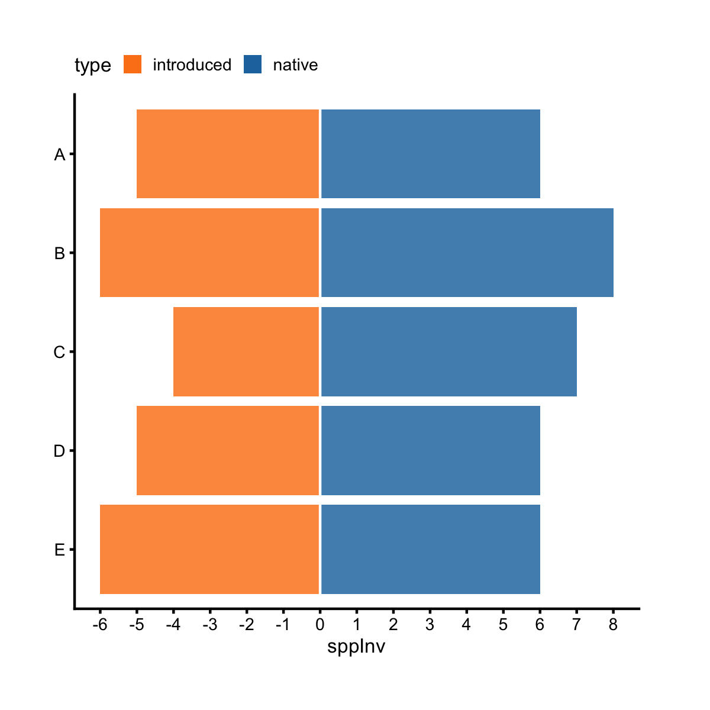
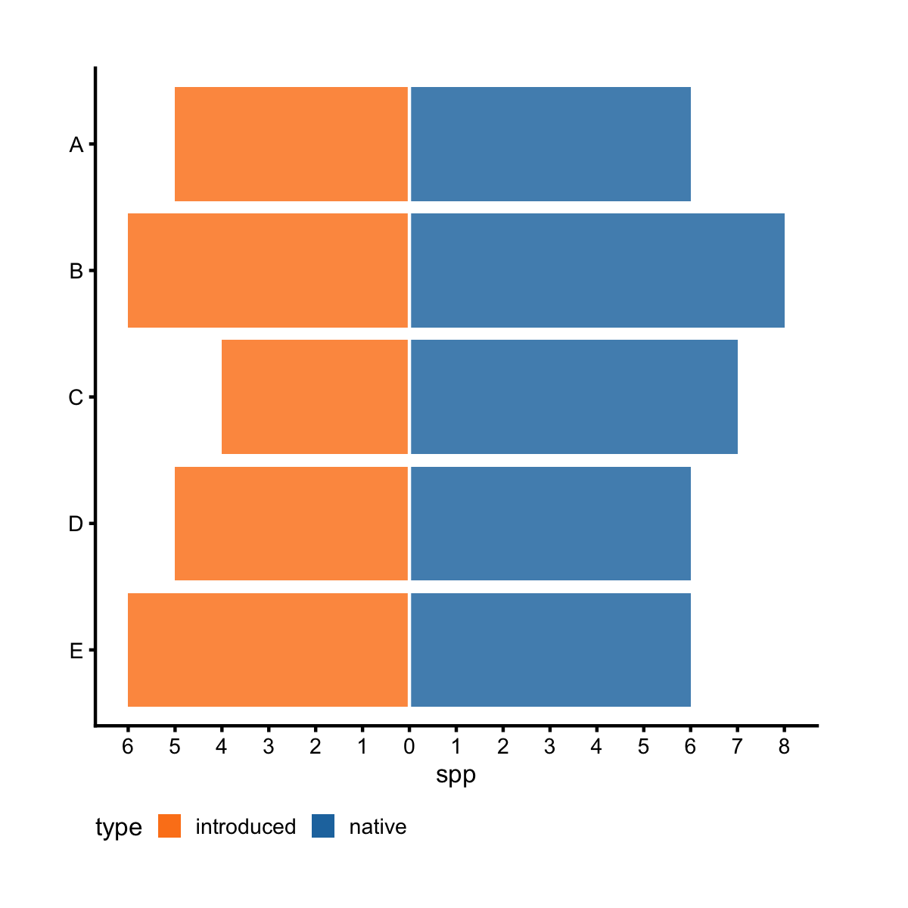
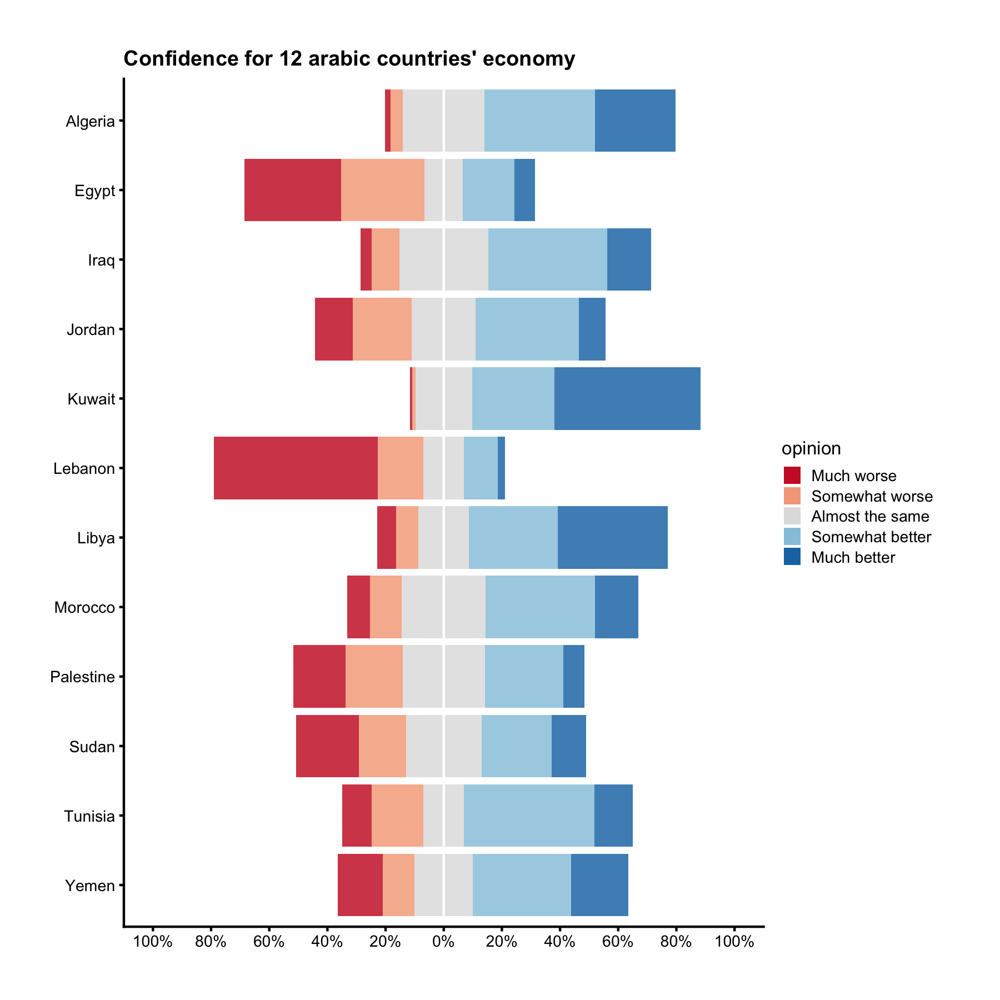

## Likert Chart

A special kind of horizontal bar chart is the horizontal diverging bar chart, also called the likert chart. Let's see an example.


```r
library(ezplot)
library(dplyr)
df = films %>% # convert implicit NA to explicit "(Missing)"
        mutate(mpaa = forcats::fct_explicit_na(mpaa)) %>% 
        count(mpaa, made_money) %>% group_by(mpaa) %>%
        mutate(pct = n/sum(n)) %>% ungroup()
plt = mk_likertplot(df)
plt(xvar = "n", yvar = "mpaa", fillby = "made_money", fillby_lvls = c("no", "yes"), 
    yorder = "ascend", font_size = 8, legend_pos = 'top') %>% 
        add_labs(xlab = 'Frequency')
```


We've already seen how to use `xvar`, `yvar`, `fillby`, and `yorder` before. The only parameter new here is `fillby_lvls`. We need to give it a character vector containing the unique levels of the `fillby` variable. The order of these values from left to right corresponds to the colored stacked bars from left to right. In this example, we set `fillby_lvls = c("no", "yes")`, as a result, the bars to the left of `x = 0` correspond to `made_money = no`, and to the right of `x = 0` correspond to `made_money = yes`. We can also show percent instead of raw count.


```r
plt("pct", "mpaa", fillby = "made_money", fillby_lvls = c("no", "yes"), 
    legend_title = "Is profitable?", x_as_pct = TRUE, font_size = 8) %>% 
        add_labs(xlab = 'Relative Frequency')
```


Let's consider another example by first making some fake data.


```r
df = data.frame(item = rep(LETTERS[1:5], 4),
                slope = c(rep("North", 10), rep("South", 10)),
                type = rep(c(rep("native", 5), rep("introduced", 5)), 2),
                spp = as.integer(abs(rnorm(20, 5, 2)))
                ) %>% 
        mutate(spp = ifelse(type == "introduced", spp+1, spp),
               sppInv = ifelse(type == "native", spp, spp*-1))
head(df)
```

```
  item slope       type spp sppInv
1    A North     native   3      3
2    B North     native   0      0
3    C North     native   4      4
4    D North     native   3      3
5    E North     native   3      3
6    A North introduced   5     -5
```

```r
tail(df)
```

```
   item slope       type spp sppInv
15    E South     native   3      3
16    A South introduced   5     -5
17    B South introduced   9     -9
18    C South introduced   2     -2
19    D South introduced   6     -6
20    E South introduced   5     -5
```

Let's focus on North and ignore South. 


```r
plt = mk_likertplot(df %>% filter(slope == "North"))
```

The variable `sppInv` is < 0 when `type` is "introduced", and > 0 when type is 
"native". We can make a likert chart to show the values of `sppInv` by `type` for
each `item`.


```r
plt("sppInv", "item", fillby = "type", fillby_lvls = c("introduced", "native"),
    legend_pos = "top", font_size = 8)
```



On the other hand, the variable `spp` is always > 0. Let's also make a likert 
chart to show the values of `spp` by `type` for each `item`.


```r
plt("spp", "item", fillby = "type", fillby_lvls = c("introduced", "native"),
    legend_pos = "bottom", font_size = 8)
```



To summarize, `mk_likertplot()` can work with both positive and negative x values
and show correct x-tick labels. When x-values are negative, the negative x-axis labels the ticks with negative numbers. When x-values are positive, the positive x-axis labels the ticks with positive numbers. 

Liker charts are commonly used for survey response data. For example, the dataset `ab3` contains respondents' confidence ratings for the future economy of 12 Arabic countries. Respondents were asked, "What do you think will be the economic situation in your country during the next few years (3-5 years) compared to the current situation?". We can visualize the info on a likert chart. 


```r
df = ab3 %>% tidyr::gather(opinion, pct, -Country)
lvls = unique(df$opinion)
plt = mk_likertplot(df)
plt("pct", "Country", fillby = "opinion", fillby_lvls = lvls, 
    x_as_pct = TRUE, font_size = 8) %>%
    add_labs(xlab = NULL, 
             title = "Confidence for 12 arabic countries' economy")
```




Here's your homework:

1. Read the document of `mk_likertplot()`. You can pull it up by running 
`?mk_likertplot` in Rstudio. 
2. There's a R package called `likert` that is more comprehensive for analyzing
and visualizing Likert-type items. If you work with survey data a lot, you may
want to check it out. The package link is located at [https://github.com/jbryer/likert](https://github.com/jbryer/likert).
