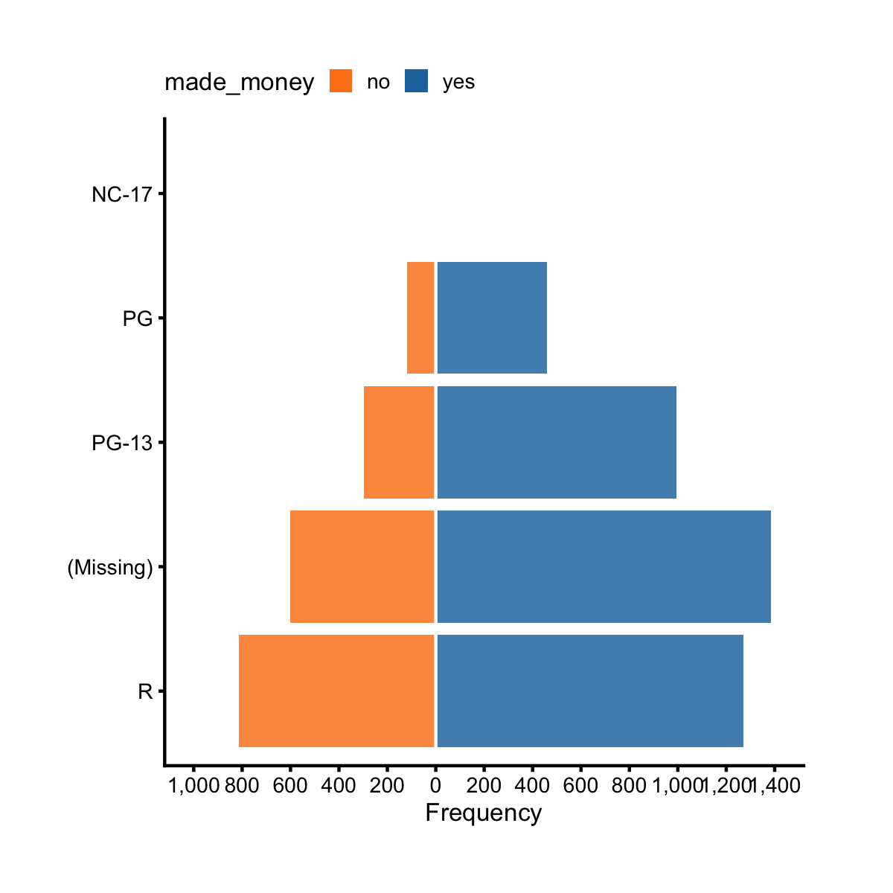

## Likert Chart

Previously, we learned how to make horizontal bar chart. There's another kind of
horizontal bar chart, namely, horizontal diverging bar chart, or likert chart. 
Let's see an example.

A>
```r
library(ezplot)
library(dplyr)
df = films %>% count(mpaa, made_money) %>% group_by(mpaa) %>%
        mutate(pct = n/sum(n)) %>% ungroup()
plt = mk_likertplot(df)
plt(xvar = "n", yvar = "mpaa", fillby = "made_money", 
    fillby_lvls = c("no", "yes"), yorder = "ascend")
```



We've already seen how to use `xvar`, `yvar`, `fillby`, and `yorder` many times 
before. The only parameter we haven't seen before is `fillby_lvls`. We need to 
supply to it a character vector of the unique values of the `fillby` variable.
The order of these values from left to right corresponds to the colored stacked
bars from left to right. In this example, we set `fillby_lvls = c("no", "yes")`,
as a result, the bars to the left of `x = 0` correspond to `made_money = no`, 
and to the right of `x = 0` correspond to `made_money = yes`. We can also choose 
to show percent instead of count.

A>
```r
plt("pct", "mpaa", fillby = "made_money", fillby_lvls = c("no", "yes"), 
    legend_title = "Is profitable?", x_as_pct = T)
```


Let's consider another example. First, we make some fake data.

A>
```r
df = data.frame(item = rep(LETTERS[1:5], 4),
                slope = c(rep("North", 10), rep("South", 10)),
                type = rep(c(rep("native", 5), rep("introduced", 5)), 2),
                spp = as.integer(abs(rnorm(20, 5, 2)))
                ) %>% 
        mutate(spp = ifelse(type == "introduced", spp+1, spp),
               sppInv = ifelse(type == "native", spp, spp*-1))
head(df)
```
A>
```
  item slope       type spp sppInv
1    A North     native   2      2
2    B North     native   5      5
3    C North     native   5      5
4    D North     native   3      3
5    E North     native   6      6
6    A North introduced   7     -7
```
A>
```r
tail(df)
```
A>
```
   item slope       type spp sppInv
15    E South     native   7      7
16    A South introduced   3     -3
17    B South introduced   4     -4
18    C South introduced   6     -6
19    D South introduced   2     -2
20    E South introduced   3     -3
```

Let's focus on North for now and ignore South. 

A>
```r
plt = mk_likertplot(df %>% filter(slope == "North"))
```

The variable `sppInv` is < 0 when `type` is "introduced", and > 0 when type is 
"native". We can make a likert chart to show the values of `sppInv` by `type` for
each `item`.

A>
```r
plt("sppInv", "item", fillby = "type", fillby_lvls = c("introduced", "native"),
    legend_pos = "top")
```


On the other hand, the variable `spp` is always > 0. Let's also make a likert 
chart to show the values of `spp` by `type` for each `item`.

A>
```r
plt("spp", "item", fillby = "type", fillby_lvls = c("introduced", "native"),
    legend_pos = "bottom")
```


To summarize, `mk_likertplot()` can work with both positive and negative x values
and show correct x-tick labels. In other words, when x-values are negative, 
display so, and when x-values are positive, display so too. 

Liker chart are used heavily to display survey response data. For example, 
the data frame `ab3` contains respondents' confidence ratings for the 
future economy of 12 Arabic countries. Respondents were asked, 
"What do you think will be the economic situation in 
your country during the next few years (3-5 years) compared to the current 
situation?". We can dispaly this info on a likert chart. 

A>
```r
library(tidyr)
df = ab3 %>% gather(opinion, pct, -Country)
lvls = unique(df$opinion)
plt = mk_likertplot(df)
plt("pct", "Country", fillby = "opinion", fillby_lvls = lvls, x_as_pct = T,
    font_size = 9) %>%
    add_labs(xlab = NULL, title = "Confidence for 12 arabic countries' economy")
```


For homework,

1. Read the document of `mk_likertplot()`. You can pull it up by running 
`?mk_likertplot` in Rstudio. 
2. There's a R package called `likert` that is more comprehensive for analyzing
and visualizing Likert type items. If you work with survey data a lot, you may
want to check it out. The package link is [https://github.com/jbryer/likert](https://github.com/jbryer/likert).
