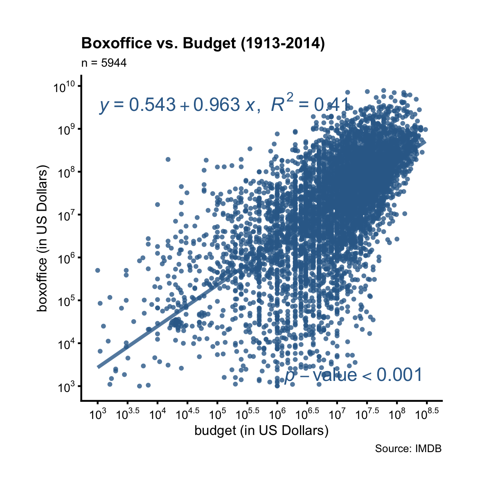
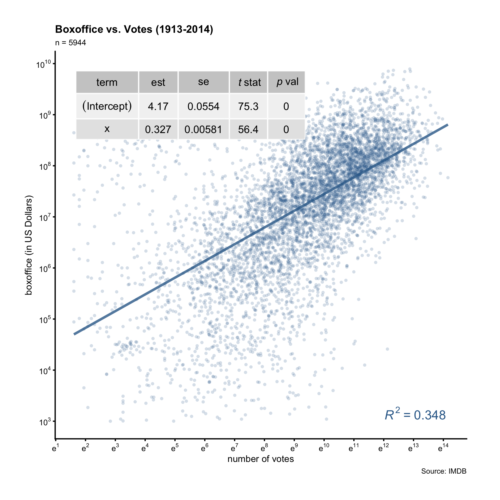

# Plot the Relationship of Two Variables

## Scatter Plot

A scatter plot shows the relationship between two continuous variables. Let's 
apply the ezplot function `mk_scatterplot()` to the data frame `films` to 
get a function that we can use to make scatter plots for any two continuous 
variables in `films`.

A>
```r
library(dplyr)
library(ezplot)
plt = mk_scatterplot(films)
```

For example, we can use `plt()` to draw a scatter plot of `boxoffice` vs. 
`budget`. We'll use `log10` scale on both axes because the two variables are 
heavily right-skewed.

A>
```r
p = plt(xvar = "budget", yvar = "boxoffice") %>% 
        add_labs(xlab="budget (in US Dollars)", 
                 ylab="boxoffice (in US Dollars)",         
                 title = "Boxoffice vs. Budget (1913-2014)",
                 caption = "Source: IMDB")
p = scale_axis(p, axis = "y", scale = "log10") # use log10 scale on y-axis
p = scale_axis(p, axis = "x", scale = "log10") # use log10 scale on x-axis
print(p)
```


There's a clear positive linear trend between boxoffice and budget. What's
the best line that summarizes this relationship? To find out the answer, we need 
to run linear regression. Luckily, the function `add_lm_line()` does it 
automatically. It adds to the plot the best fitting line, and displays its 
equation by default. In addtion, it also shows the R-squared value and the 
p-value associated with the coefficient estimate of x. Let's run `add_lm_line()` now. 

A>
```r
add_lm_line(p)
```



The tiny p-value implies the linear relationship is statistically significant. 
The R-squared value implies 41% of the variation in boxoffice can be explained
by the variation in budget (both at log10 scale). Taking its squared root, we
find the correlation between boxoffice and budget (both at log10 scale) to be 
0.61.

The function `plt()` can be re-used for other variables in the same data frame. 
For example, we can draw a scatter plot of `boxoffice` vs. `votes`:

A>
```r
p = plt("votes", "boxoffice", alpha = 0.2, jitter = T) %>% 
        add_labs(xlab = "number of votes", 
                 ylab = "boxoffice (in US Dollars)", 
                 title = "Boxoffice vs. Votes (1913-2014)",
                 caption = "Source: IMDB")
p = scale_axis(p, "y", scale = "log10") # use log10 scale on y-axis
p = scale_axis(p, "x", scale = "log") # use log scale on x-axis
# add to the plot: best fitting line, its equation and R2, and p-val
# overwrite the default x and y position of the equation
add_lm_line(p, eq_tb_ypos = 0.95, eq_tb_xpos = 0.5) 
```


We see there's also a pretty clear linear relationship between boxoffice and 
votes at log10 scale. The R-squared value measures the percent (35%) of variance 
in boxoffice that can be explained by the variance in votes, which translates
to a correlation of 0.59. This correlation and the linear relationship is 
statistically significant by the tiny p-value. 

Instead of the equation, we can show a table of more quantities related with the 
best line by setting `show = "tb"`:

A>
```r
add_lm_line(p, show = "tb") 
```



The table provides us with more info than the equation. In particular, it gives
us the standard errors of the coefficient estimates. We can thus calculate the
margin of error and confidence interval of the x coefficient. Take this 
example, from the table display we know the slope is 0.327 with a SE of 0.00581.
The margin of error of the slope is thus 0.0114 (0.00581 * 1.96). This means 
that for every unit increase in log10(votes), we can expect an 0.327-unit 
increase in log10(boxoffice), give or take 0.0114-unit. 

To summarize, setting `show = "tb"` inside `add_lm_line()` displays a table of
details such as standard errors and t-statistics; setting `show = "eq"` (default) displays the equation without those details. When displaying the equation (default),
we can supply a categorical variable to group and color the data points. 
For example, consider this question: did action movies make money year after year? 
To answer it, we'll draw a scatter plot of `bo_bt_ratio` vs. `year`, supplying the
`colorby` parameter the value `"action"`, the name of a binary variable indicating
if a film is an action film or not.

A>
```r
p = plt("year", "bo_bt_ratio", colorby = "action", 
        legend_title = "Is action film?", legend_pos = "top",
        alpha = 0.5, font_size = 9) %>% 
        add_labs(ylab = "boxoffice / budget", 
                 title = "Boxoffice / Budget (1913-2014)")
p = p + ggplot2::geom_hline(yintercept = 1)
p = scale_axis(p, scale="log10")
add_lm_line(p, pv_r2_xpos = "left")
```


The orange dots are action films, while the blue dots are non-action films. 
First, notice there are more blue dots than orange dots. Second, the orange line 
has a steeper negative slope. If we pay attention to the orange dots before 1960, 
we'll see all orange dots before 1960 are above the y = 1 line, meaning
action films always made money before 1960. But non-action films weren't as 
lucky. After 1960, some action films started losing money too. 

Now it's your turn. Make scatter plots to answer the following questions:

1. Does drama make money year after year? What about comedy? 
2. Is it true the higher the `rating`, the bigger the boxoffice/budget ratio 
(`bo_bt_ratio`)? What about when viewed separartely under romance vs. 
non-romance films?
3. Is it true the more `votes` a film gets, the bigger its boxoffice/budget 
ratio? What about when viewed separartely under drama vs. non-drama films?

