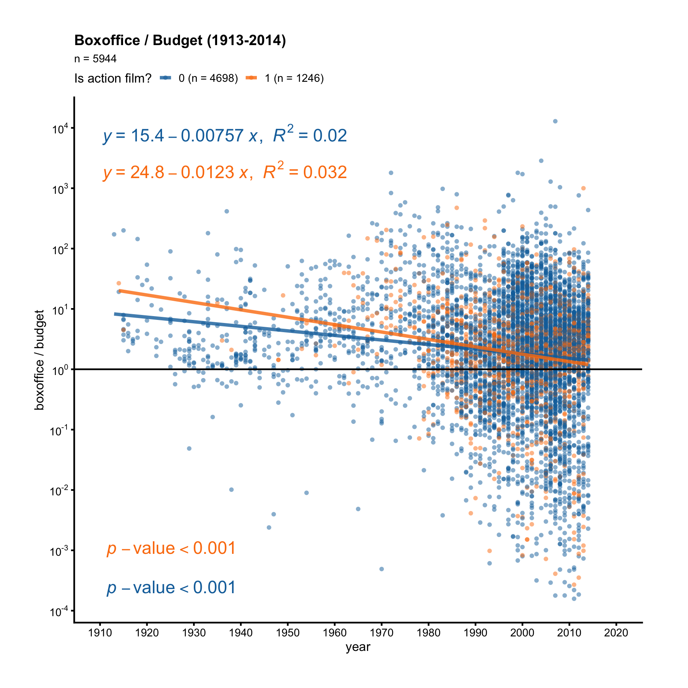

## Scatter Plot

A scatter plot shows the relationship between two continuous variables. Let's 
apply the ezplot function `mk_scatterplot()` to the data frame `films` to 
get a function that we can use to make scatter plots for any two continuous 
variables in `films`.

```r
library(dplyr)
library(ezplot)
plt = mk_scatterplot(films)
```

For example, we can use `plt()` to draw a scatter plot of `boxoffice` vs. 
`budget`. We'll use `log10` scale on both axes because the two variables are 
heavily right-skewed.

```r
p = plt(xvar = "budget", yvar = "boxoffice") %>% 
        add_labs(xlab="budget (in US Dollars)", 
                 ylab="boxoffice (in US Dollars)",         
                 title = "Boxoffice vs. Budget (1913-2014)",
                 caption = "Source: IMDB"
                 )
p = scale_axis(p, axis = "y", scale = "log10") # use log10 scale on y-axis
p = scale_axis(p, axis = "x", scale = "log10") # use log10 scale on x-axis
print(p)
```


We see there's a clear positive linear trend between boxoffice and budget. What's
the best line that summarizes this relationship? This is not an easy question. 
We need to run linear regression to find out. But luckily, we have the ezplot 
function `add_lm_line()`. It will add the best fitting line with its equation,
R-squared and p-valued displayed on the plot. Let's add the best fitting line now. 

```r
add_lm_line(p)
```


The tiny p-value implies the linear relationship is statistically significant. 
The R-squared value implies 41% of the variation in boxoffice can be explained
by the variation in budget (both at log10 scale).

The function `plt()` can be re-used. For example, we can use it to draw a 
scatter plot of `boxoffice` vs. `votes`.

```r
p = plt("votes", "boxoffice", alpha = 0.2, jitter = T) %>% 
        add_labs(xlab="number of votes", 
                 ylab="boxoffice (in US Dollars)", 
                 title = "Boxoffice vs. Votes (1913-2014)",
                 caption = "Source: IMDB"
                 )
p = scale_axis(p, "y", scale = "log10") # use log10 scale on y-axis
p = scale_axis(p, "x", scale = "log") # use log scale on x-axis
add_lm_line(p, eq_ypos = 0.95, eq_xpos = 0.5) 
```


We see there's also a strong linear relationship between boxoffice and votes.
The tiny p-value implies this relationship is statistically significant. 

We can also supply a categorical variable to color the data points. Consider this 
question: did action movies make money year after year? To answer it, we'll need 
to draw a scatter plot of `bo_bt_ratio` vs. `year` and color the points by the 
flagging variable `action`. 

```r
p = plt("year", "bo_bt_ratio", fillby = "action", alpha = 0.5) %>% 
        add_labs(ylab = "boxoffice/budget ratio", 
                 title = "Boxoffice / Budget ratio (1913-2014)")
p = p + ggplot2::geom_hline(yintercept = 1)
p = scale_axis(p, scale="log10")
add_lm_line(p, pval_xpos = "left")
```



The orange dots are action films, while the blue dots are non-action films. 
First, notice there are more blue dots than orange dots. Second, the orange line 
has a steeper negative slope. If we pay attention to the orange dots before 1960, 
we'll see all orange dots before 1960 are above the y = 1 line, meaning
action films always made money before 1960. But non-action films weren't as 
lucky. After 1960, some action films started losing money too. 

Now it's your turn. Make scatter plots to answer the following questions:

1. Does drama make money year after year? What about comedy? 
2. Is it true the higher the `rating`, the bigger the boxoffice/budget ratio 
(`bo_bt_ratio`)? What about when viewed separartely under romance vs. 
non-romance films?
3. Is it true the more `votes` a film gets, the bigger its boxoffice/budget 
ratio? What about when viewed separartely under drama vs. non-drama films?

