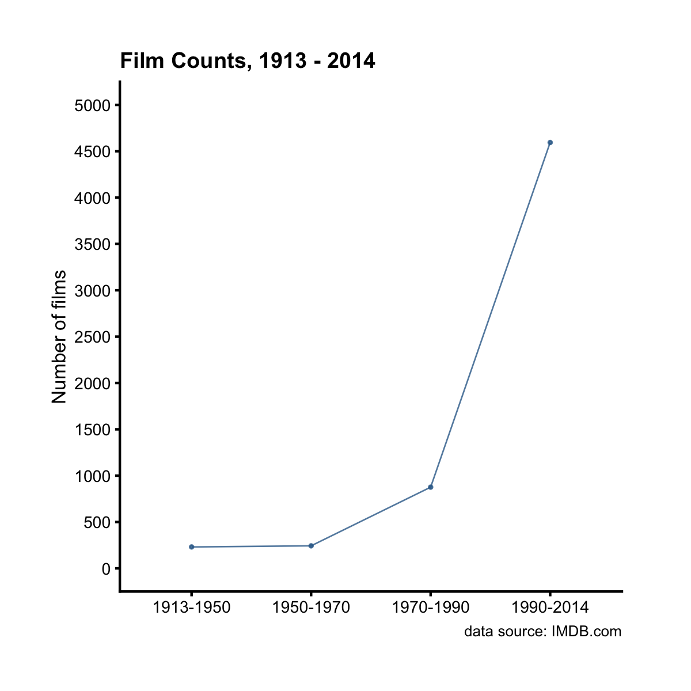

## Line plot

Line plots are good for showing trends over time. For example, let's plot the
annual average budget (and boxoffice) over the years.

```r
library(ezplot)
plt = mk_lineplot(btbo_by_year)
p = plt("year", "avg", fillby = "type", font_size = 10, add_cnt_to_legend = F)
add_labs(p, ylab = "total amount ($billion)",
         title = "Annual Total Budget and Boxoffice from 1913 to 2014",
         subtitle = NULL,
         caption = "data source: IMBD.com")
```


Notice we set `add_cnt_to_legend = F` above. Change it to `add_cnt_to_legend = T` 
and re-run. What's changed on the plot? 

Alternatively, we can calculate and plot the annual boxoffice/budget ratios over
the years.

```r
library(tidyr)
df = btbo_by_year %>% select(-avg) %>% spread(type, tot) %>% 
        mutate(bo_bt_ratio = boxoffice / budget)
plt = mk_lineplot(df)
p = plt("year", "bo_bt_ratio")
p = p + ggplot2::geom_hline(yintercept = 10, linetype = 2)
add_labs(p, ylab="boxoffice/budget ratio",
         title = "Boxoffice/Budget Ratio from 1913 to 2014",
         caption = "data source: IMDB.com")
```


We see it has become difficult for boxoffice to exceed 10x (dashed line 
level) of budget since 1990. 

The x variable `year` in the above example is of type "integer" (`class(df$year)`).
However, the `plt()` function also works with a x variable of type character or 
factor. For example, the `films` dataset has a character variable `year_cat` 
with only 4 unique values. 

```r
str(films$year_cat)
```

```
 chr [1:5944] "1913-1950" "1990-2014" "1990-2014" "1990-2014" ...
```

```r
table(films$year_cat)
```

```

1913-1950 1950-1970 1970-1990 1990-2014 
      231       243       876      4594 
```

Instead of plotting the films of each period on a bar chart, we can use a line 
plot because there's a time order to the periods.

```r
films_cnt = films %>% group_by(year_cat) %>% summarise(n = n())
plt = mk_lineplot(films_cnt)
plt("year_cat", "n") %>% 
        add_labs(title = "Films at 4 periods between 1913 and 2014",
                 subtitle = NULL, caption = "data source: IMDB.com",
                 ylab = "Number of films", xlab = NULL)
```



Now it's your turn. Try the following exercises for homework.

1. Read the document of `mk_lineplot()` by running `?mk_lineplot` in Rstudio. 
2. Make a line plot to show the trend of annual average boxoffice and votes over 
the years.
3. Make a line plot to show the trend of annual total number of action films 
over the years.

