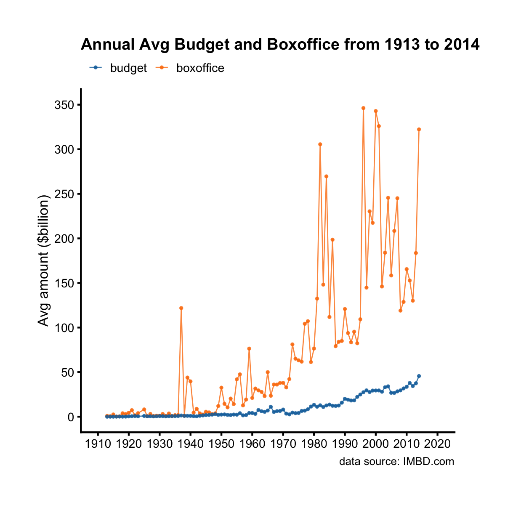
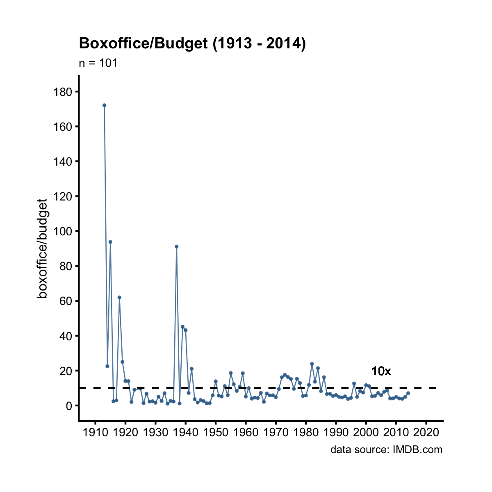
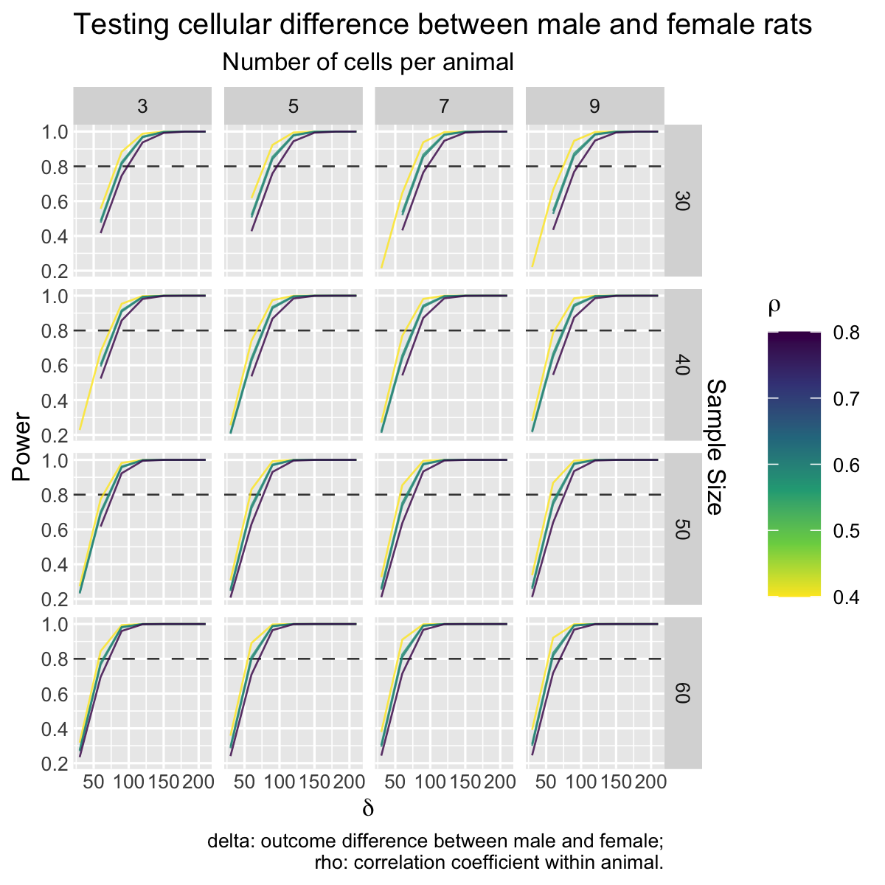

## Line Plot

Line plots are good for showing trends over time. For example, let's plot the
annual average budget (and boxoffice) over the years.

A>
```r
library(ezplot)
plt = mk_lineplot(btbo_by_year)
p = plt("year", "avg", fillby = "type", font_size = 10, add_cnt_to_legend = F)
add_labs(p, ylab = "total amount ($billion)", xlab = NULL, subtitle = NULL,
         title = "Annual Total Budget and Boxoffice from 1913 to 2014",
         caption = "data source: IMBD.com")
```



Notice we set `add_cnt_to_legend = F` above. Change it to `add_cnt_to_legend = T` 
and re-run. What's changed on the plot? 

Alternatively, we can calculate and plot the annual boxoffice/budget ratios over
the years.

A>
```r
library(dplyr)
library(tidyr)
df = btbo_by_year %>% select(-avg) %>% spread(type, tot) %>% 
        mutate(bo_bt_ratio = boxoffice / budget)
plt = mk_lineplot(df)
p = plt("year", "bo_bt_ratio")
p = p + ggplot2::geom_hline(yintercept = 10, linetype = 2) +
        ggplot2::geom_text(x = 2005, y = 20, color = "black",
                           label = "10x line")
add_labs(p, ylab="boxoffice/budget", xlab = NULL,
         title = "Boxoffice/Budget (1913 - 2014)",
         caption = "data source: IMDB.com")
```



We see it has become difficult for boxoffice to exceed 10x (dashed line 
level) of budget since 1990. 

The x variable `year` in the above example is of type "integer" (`class(df$year)`).
However, the `plt()` function also works with a x variable of type character or 
factor. For example, the `films` dataset has a character variable `year_cat` 
with only 4 unique values. 

A>
```r
str(films$year_cat)
```
A>
```
 chr [1:5944] "1913-1950" "1990-2014" "1990-2014" "1990-2014" ...
```
A>
```r
table(films$year_cat)
```
A>
```
1913-1950 1950-1970 1970-1990 1990-2014 
      231       243       876      4594 
```

Instead of plotting the films of each period on a bar chart, we can use a line 
plot because there's a time order to the periods.

A>
```r
films_cnt = films %>% group_by(year_cat) %>% summarise(n = n())
plt = mk_lineplot(films_cnt)
plt("year_cat", "n") %>% 
        add_labs(title = "Films at 4 periods between 1913 and 2014",
                 subtitle = NULL, caption = "data source: IMDB.com",
                 ylab = "Number of films", xlab = NULL)
```


Line plot can also be used to show complex relationships among upto 5 variables.
For example, it's a common task to calculate powers and sample sizes over a 
grid of effect sizes. Their relationships can be revealed best with a line plot, 
combined with facets when necessary. Consider the dataset `power_n_ssize_gender`. 
It contains powers and sample sizes over a grid of effect sizes when testing
some cellular chemical differences between Male and Female rats. The variable 
`ssize` is sample size (number of animals), `csize` is the number of cells taken
from each animal, `delta` is the effect size, and `rho` is the correlation among
different cells. 

A>
```r
head(power_n_ssize_gender)
```
A>
```
  ssize csize delta rho   Power
1    30     3    30 0.4      NA
2    40     3    30 0.4 0.22763
3    50     3    30 0.4 0.27310
4    60     3    30 0.4 0.31775
5    30     5    30 0.4      NA
6    40     5    30 0.4 0.25569
```

We can draw a faceted line plot using `mk_facet_lineplot()` to show all 5 
variables at once.

A>
```r
plt = mk_facet_lineplot(power_n_ssize_gender)
p = plt("delta", "Power", xvar_top = "csize", yvar_rt = "ssize", gpby = "rho",
        ylab_rt = "Sample Size", legend_title = bquote(rho))
cap = "delta: outcome difference between male and female;
         rho: correlation coefficient within animal."
add_labs(p, xlab = bquote(delta),
         title = "Testing cellular difference between male and female rats",
         subtitle = "Number of cells per animal",
         caption = cap)
```



Now it's your turn. Try the following exercises for homework.

1. Read the document of `mk_lineplot()` by running `?mk_lineplot` in Rstudio. 
2. Make a line plot to show the trend of annual average boxoffice and votes over 
the years.
3. Make a line plot to show the trend of annual total number of action films 
over the years.
4. Read the document of `mk_facet_lineplot()` by running `?mk_facet_lineplot`. 
