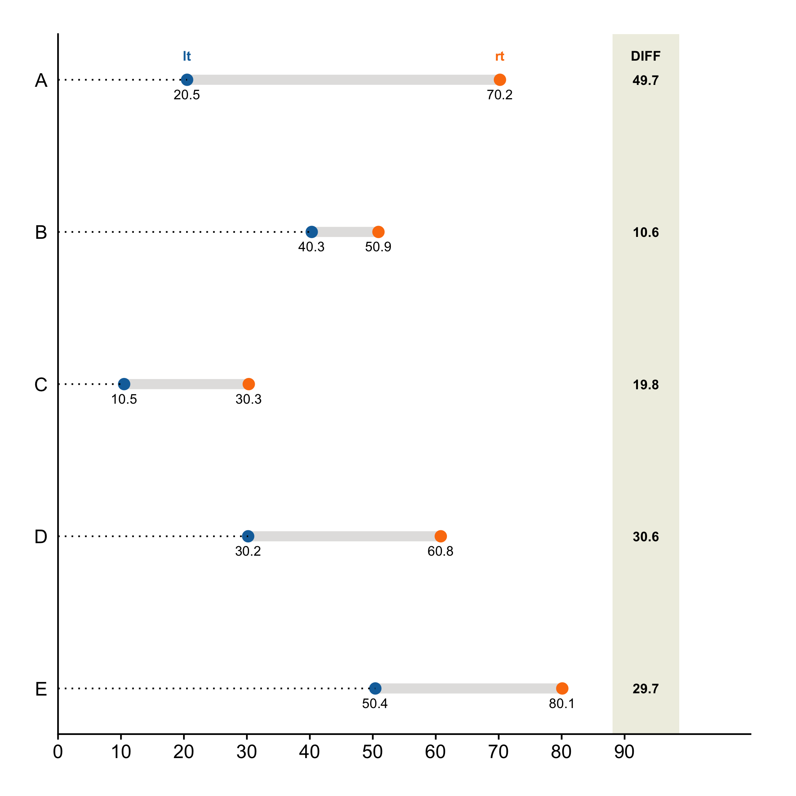
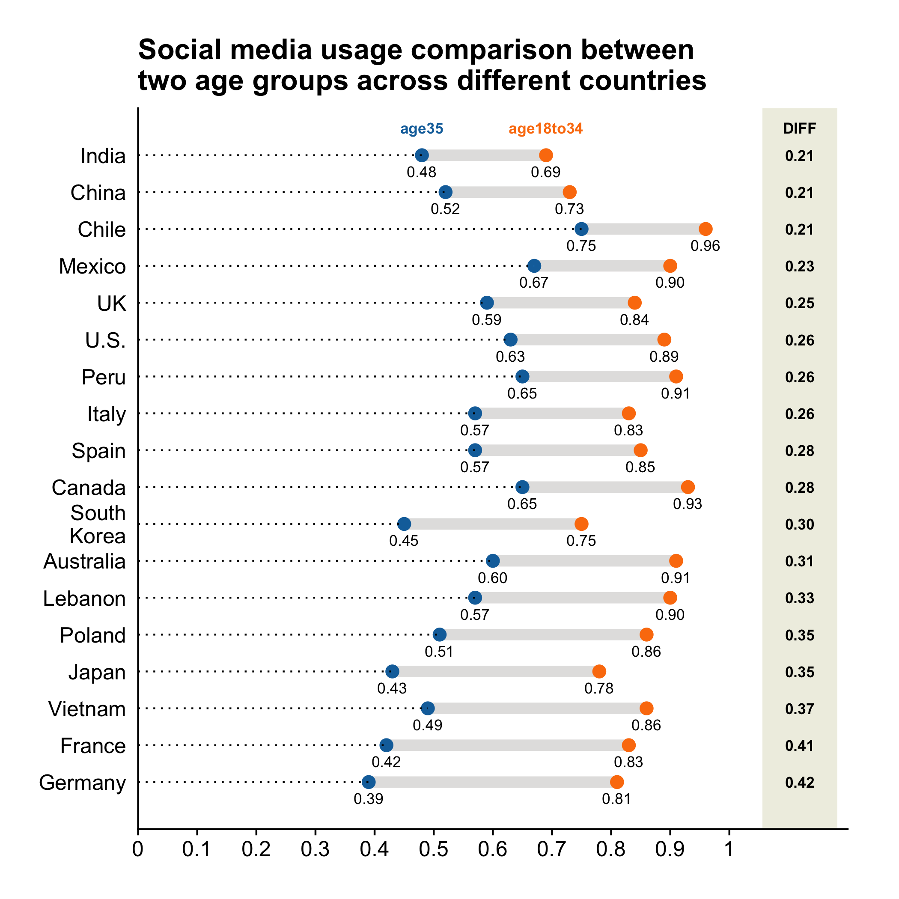

## Dumbbell Plot

Dumbbell plots are good for showing the differences between two variables across
the levels of a categorical variable. The two variables in comparison can 
measure before and after values, beginning and end values, or male and female 
values, and etc. Let's see an example. Consider the following fake data.

```r
df = data.frame(trt=LETTERS[1:5],
                lt =c(20.5, 40.3, 10.5, 30.2, 50.4),
                rt =c(70.2, 50.9, 30.3, 60.8, 80.1)
                )
df
```

```
  trt   lt   rt
1   A 20.5 70.2
2   B 40.3 50.9
3   C 10.5 30.3
4   D 30.2 60.8
5   E 50.4 80.1
```

We can draw a dumbbell plot to show `lt` and `rt` across different levels of
`trt`. What's attractive about dumbbell plot is that it displays both the 
original values of the variables in comparison and their differences. 

```r
plt = mk_dumbbell(df)
plt(xvar_left = "lt", xvar_right = "rt", yvar = "trt")
```



When making a dumbbell plot, the data frame must already be in a form such that
the categorical variable to be used has no repeated levels. For example, in the
above example, the data frame has 5 rows, and each has a unique `trt` value: A,
B, C, D, and E. Let's see a more interesting example. Consider the following
dataset of social media usage of two different age groups across 18 countries.

```r
df = data_frame(country = c("Germany", "France", "Vietnam", "Japan", "Poland",
                            "Lebanon", "Australia", "South\nKorea", "Canada",
                            "Spain", "Italy", "Peru", "U.S.", "UK", "Mexico",
                            "Chile", "China", "India"),
                age35 = c(0.39, 0.42, 0.49, 0.43, 0.51, 0.57, 0.60, 0.45, 0.65, 
                          0.57, 0.57, 0.65, 0.63, 0.59, 0.67, 0.75, 0.52, 0.48),
                age18to34 = c(0.81, 0.83, 0.86, 0.78, 0.86, 0.90, 0.91, 0.75, 
                              0.93, 0.85, 0.83, 0.91, 0.89, 0.84, 0.90, 0.96, 
                              0.73, 0.69)
                )
head(df)
```

```
# A tibble: 6 x 3
  country age35 age18to34
  <chr>   <dbl>     <dbl>
1 Germany 0.39       0.81
2 France  0.42       0.83
3 Vietnam 0.49       0.86
4 Japan   0.43       0.78
5 Poland  0.51       0.86
6 Lebanon 0.570      0.9 
```

Let's use a dumbbell plot to display the data.

```r
plt = mk_dumbbell(df)
plt(xvar_left = "age35", xvar_right = "age18to34", yvar = "country", 
    yorder = "ascend", label_decimals = 2)
```



In the chart above, we sorted the countries in ascending order of the differences
between the two age groups by setting `yorder = "ascend"`. We can also sort 
them in descending order. Plus, because all values are between 0 and 1, we can
choose to show them in % format by setting `show_pct = T`.

```r
plt("age35", "age18to34", "country", yorder = "descend", show_pct = T,
    label_decimals = 0)
```


Notice ezplot automatically uses the two x-variable names (age35 and 
age18to34) as the labels of the points. It also calculates the differences 
between the two x-variables under the hood, and displays them on the plot. 

Now it's your turn. Try the following exercises for homework.

1. Read the document of `mk_dumbbell()` by running `?mk_dumbbell` in Rstudio. 
2. Find some data online that can be displayed with a dumbbell chart and make
a dumbbell chart. 
