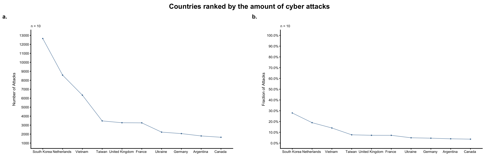
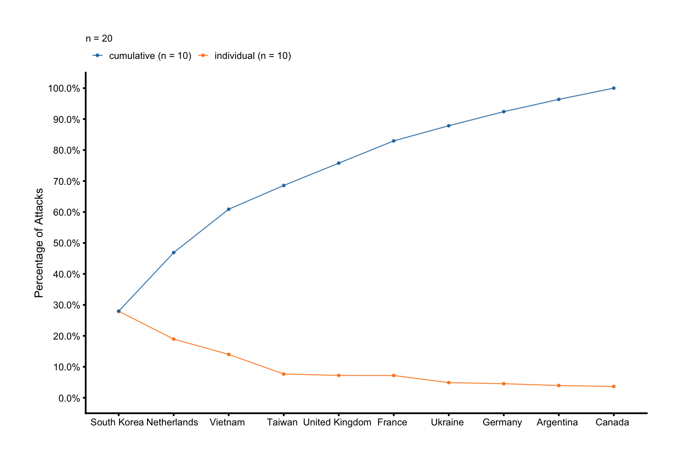

## Rank-Order Plots and Lift Charts

A rank-order plot is a special kind of line plots. Consider the `attacks_by_country` dataset, which contains the number of cyber attacks at each hour during a week for various countries. Which countries received the most attacks? Does the number of attacks follow the 80-20 rule (i.e., 80% of the attacks are received by 20% of the countries)? Or does the number of attacks have a long tail?

```r
library(ezplot)
head(attacks_by_country)
```

```
# A tibble: 6 x 5
  country        wkday  hour  country_code     n
  <fct>          <fct>  <chr> <chr>        <dbl>
1 Argentina (AR) Sunday 00    <NA>             0
2 Argentina (AR) Sunday 01    AR               1
3 Argentina (AR) Sunday 02    <NA>             0
4 Argentina (AR) Sunday 03    AR               2
5 Argentina (AR) Sunday 04    AR              18
6 Argentina (AR) Sunday 05    AR               1
```

In order to answer these questions, we simply aggregate the number of attacks for each country, and order the countries decreasingly according to their number of attacks. We then calculate the fractions of attacks for each country and the cumulative fractions.

```r
library(dplyr)
df_attacks = attacks_by_country %>% group_by(country) %>% 
        summarise(cnt = sum(n), .groups = 'drop') %>% 
        arrange(desc(cnt)) %>% 
        mutate(frac = cnt / sum(cnt), 
               cumu_frac = cumsum(frac),
               # remove country code from name       
               country = gsub('\\([A-Z]+\\)', '', country)) 
df_attacks
```

```
# A tibble: 10 x 4
   country             cnt   frac cumu_frac
   <chr>             <dbl>  <dbl>     <dbl>
 1 "South Korea "    12648 0.279      0.279
 2 "Netherlands "     8572 0.189      0.469
 3 "Vietnam "         6340 0.140      0.609
 4 "Taiwan "          3469 0.0766     0.686
 5 "United Kingdom "  3266 0.0722     0.758
 6 "France "          3252 0.0719     0.830
 7 "Ukraine "         2219 0.0490     0.879
 8 "Germany "         2055 0.0454     0.924
 9 "Argentina "       1793 0.0396     0.964
10 "Canada "          1646 0.0364     1    
```

We can then use a line plot to show the countries ordered in decreasing order of the number of attacks, fraction of attacks or cumulative fraction of attacks. The resulting plot is called "rank-order plot." When the values shown is the cumulative fraction, it's also called "lift chart." The following figure contains two rank-order plots showing number and fraction of attacks for each country.

```r
plt = mk_lineplot(df_attacks)
p1 = plt("country", "cnt", xorder = 'descend', font_size = 7, 
         pt_size = 0.4, linew = 0.3) %>% 
        add_labs(ylab = "Number of Attacks")
p2 = plt("country", "frac", xorder = 'descend', is_y_pct = T, font_size = 7, 
         pt_size = 0.4, linew = 0.3) %>% 
        add_labs(ylab = "Fraction of Attacks")
combine_plots(p1, p2, title = 'Countries ranked by the amount of cyber attacks')
```



Plot b of the above figure shows the individual fractions, let's also add the cumulative fractions to it. We first need to transform the data into long format. 

```r
df_long = df_attacks %>%
        pivot_longer(cols = c(frac, cumu_frac), names_to = 'type', values_to = 'pct') %>%
        mutate(country = factor(country, levels = df_attacks$country), # necessary
               type = gsub('cumu_frac', 'cumulative', type),
               type = gsub('frac', 'individual', type))

# put both cumulative (lift curve) and individual curves on one graph
plt = mk_lineplot(df_long)
plt('country', 'pct', colorby='type', is_y_pct=T, 
    font_size = 7, pt_size = 0.4, linew = 0.3,
    legend_title=NULL, legend_pos='top') %>% 
        add_labs(ylab = "Percentage of Attacks")
```



We see that South Korea, Netherlands, Vietnam and Taiwan account for nearly 70% of the cyber attacks, while the other six countries account for about only 30% of the attacks. 

Whenever you have a categorical variable of many unique categories, you can use rank-order plots to quickly discover the bigger categories, and hence focus on those categories that matter. 
