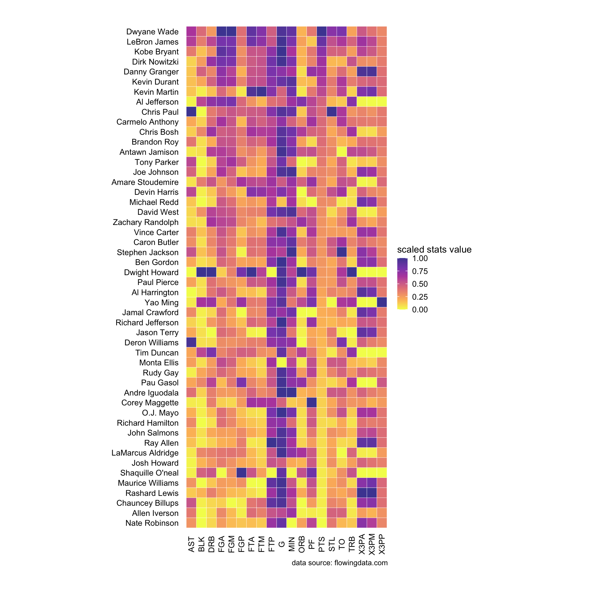
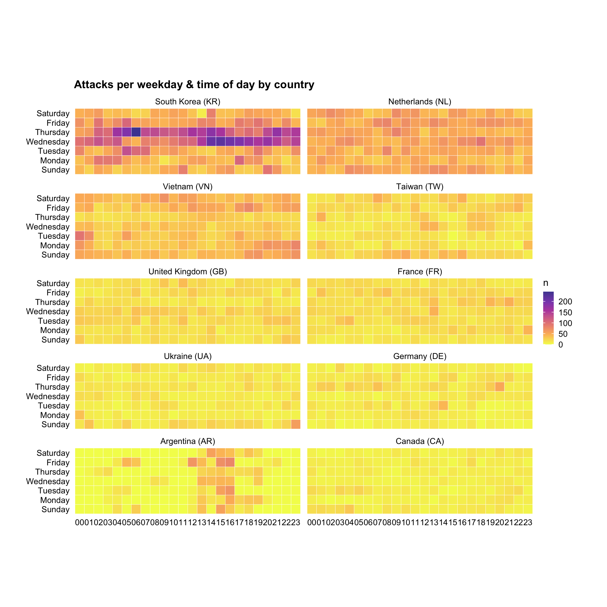

## Heatmap

Let's start with an example. Consider the dataset `nba`.

A>
```r
library(dplyr)
library(tidyr)
library(ezplot)
# look at the first 5 rows and 8 columns
nba[1:5, 1:8]
```
A>
```
            Name  G  MIN  PTS  FGM  FGA   FGP FTM
1   Dwyane Wade  79 38.6 30.2 10.8 22.0 0.491 7.5
2  LeBron James  81 37.7 28.4  9.7 19.9 0.489 7.3
3   Kobe Bryant  82 36.2 26.8  9.8 20.9 0.467 5.9
4 Dirk Nowitzki  81 37.7 25.9  9.6 20.0 0.479 6.0
5 Danny Granger  67 36.2 25.8  8.5 19.1 0.447 6.0
```
A>
```r
# check the dimensions
dim(nba)
```
A>
```
[1] 50 21
```
A>
```r
# check the colnames
colnames(nba)
```
A>
```
 [1] "Name" "G"    "MIN"  "PTS"  "FGM"  "FGA"  "FGP"  "FTM"  "FTA"  "FTP" 
[11] "X3PM" "X3PA" "X3PP" "ORB"  "DRB"  "TRB"  "AST"  "STL"  "BLK"  "TO"  
[21] "PF"  
```

The variable `Name` contains players' names. It's a factor with levels ordered 
alphabetically. Let's reorder the levels in ascending order of the points the 
players scored.

A>
```r
str(nba$Name)
```
A>
```
 Factor w/ 50 levels "Al Harrington ",..: 21 31 29 19 15 27 28 2 13 9 ...
```
A>
```r
levels(nba$Name)
```
A>
```
 [1] "Al Harrington "     "Al Jefferson "      "Allen Iverson "    
 [4] "Amare Stoudemire "  "Andre Iguodala "    "Antawn Jamison "   
 [7] "Ben Gordon "        "Brandon Roy "       "Carmelo Anthony "  
[10] "Caron Butler "      "Chauncey Billups "  "Chris Bosh "       
[13] "Chris Paul "        "Corey Maggette "    "Danny Granger "    
[16] "David West "        "Deron Williams "    "Devin Harris "     
[19] "Dirk Nowitzki "     "Dwight Howard "     "Dwyane Wade "      
[22] "Jamal Crawford "    "Jason Terry "       "Joe Johnson "      
[25] "John Salmons "      "Josh Howard "       "Kevin Durant "     
[28] "Kevin Martin "      "Kobe Bryant "       "LaMarcus Aldridge "
[31] "LeBron James "      "Maurice Williams "  "Michael Redd "     
[34] "Monta Ellis "       "Nate Robinson "     "O.J. Mayo "        
[37] "Pau Gasol "         "Paul Pierce "       "Rashard Lewis "    
[40] "Ray Allen "         "Richard Hamilton "  "Richard Jefferson "
[43] "Rudy Gay "          "Shaquille O'neal "  "Stephen Jackson "  
[46] "Tim Duncan "        "Tony Parker "       "Vince Carter "     
[49] "Yao Ming "          "Zachary Randolph " 
```
A>
```r
nba$Name = with(nba, reorder(Name, PTS))
```

The other variables are various performance statistics. In order to visualize 
the data in a heatmap, we first need to put the data in long format, a.k.a., we 
need to gather the names of the statistics in one column and their values in 
another column.

A>
```r
nba_m = nba %>% gather(stats, val, -Name)
head(nba_m)
```
A>
```
            Name stats val
1   Dwyane Wade      G  79
2  LeBron James      G  81
3   Kobe Bryant      G  82
4 Dirk Nowitzki      G  81
5 Danny Granger      G  67
6  Kevin Durant      G  74
```

Let's scale the values of every performance statistics so that they are between 
0 and 1. 

A>
```r
dat = nba_m %>% group_by(stats) %>% mutate(val_scaled = scales::rescale(val))
head(dat)
```

```
# A tibble: 6 x 4
# Groups:   stats [1]
  Name             stats   val val_scaled
  <fct>            <chr> <dbl>      <dbl>
1 "Dwyane Wade "   G        79      0.947
2 "LeBron James "  G        81      0.982
3 "Kobe Bryant "   G        82      1    
4 "Dirk Nowitzki " G        81      0.982
5 "Danny Granger " G        67      0.737
6 "Kevin Durant "  G        74      0.860
```

With the data prep work done, we're ready to make a heatmap using the 
`mk_heatmap()` function.

A>
```r
plt = mk_heatmap(dat)
plt(xvar = "stats", yvar = "Name", fillby = "val_scaled") %>%
        rotate_axis_text(text_angle_x = 90, vjust_x = 0.5) %>% 
        add_labs(caption = "data source: flowingdata.com")
```



Notice we used `rotate_axis_text()` to rotate the x-tick text by 90 degrees and
vertically adjusted the text by 0.5. Run the command `?rotate_axis_text` to read
its document to learn more about how to use it. 

Not only `mk_heatmap()` allows us to make one heatmap quickly, it also enables
us to make multiple heatmaps in one plot with no sweat. Let's see another 
example. The dataset `attacks_by_country` has the number of internet 
attacks of ten countries for each hour of a day during a fixed time period. 

A>
```r
str(attacks_by_country)
```
A>
```
Classes 'tbl_df', 'tbl' and 'data.frame':	1680 obs. of  5 variables:
 $ country     : Factor w/ 10 levels "South Korea (KR)",..: 9 9 9 9 9 9 9 9 9 9 ...
 $ wkday       : Factor w/ 7 levels "Sunday","Monday",..: 1 1 1 1 1 1 1 1 1 1 ...
 $ hour        : chr  "00" "01" "02" "03" ...
 $ country_code: chr  NA "AR" NA "AR" ...
 $ n           : num  0 1 0 2 18 1 28 1 0 0 ...
```

We can draw a heatmap for each country, showing the severity of attacks over 
time. Pay attention to the usage of `facet_by` and `facet_ncol` parameters in
the following code.

A>
```r
plt = mk_heatmap(attacks_by_country)
plt("hour", "wkday", fillby ="n", facet_by = "country", facet_ncol = 2) %>%
        add_labs(title = "Attacks per weekday & time of day by country")
```




Now it's your turn. Try the following exercises for homework.

1. Derive from `films` a data frame with 3 columns: `year_cat`, `made_money` and
`n`, where `n` counts the number of films. Hint: `?dplyr::count()`. Afterwards, 
make a heatmap to display the data.
2. Derive from `films` a data frame with 3 columns: `year_cat`, `action` and
`avg_rating`, where `avg_rating` summarizes the average rating. Hint: 
`?dplyr::group_by()` and `?dplyr::summarize()`. Afterwards, make a heatmap to
display the data.
3. Read the document of `mk_heatmap()` by running `?mk_heatmap` in Rstudio. 
What does the parameter `palette` do? Repeat exercise 1 and 2 using different 
values for `palette`.

