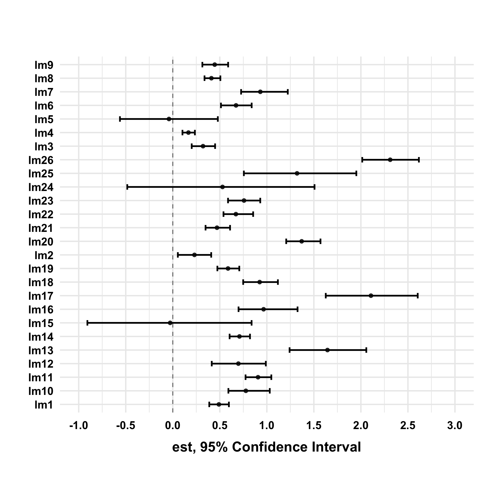
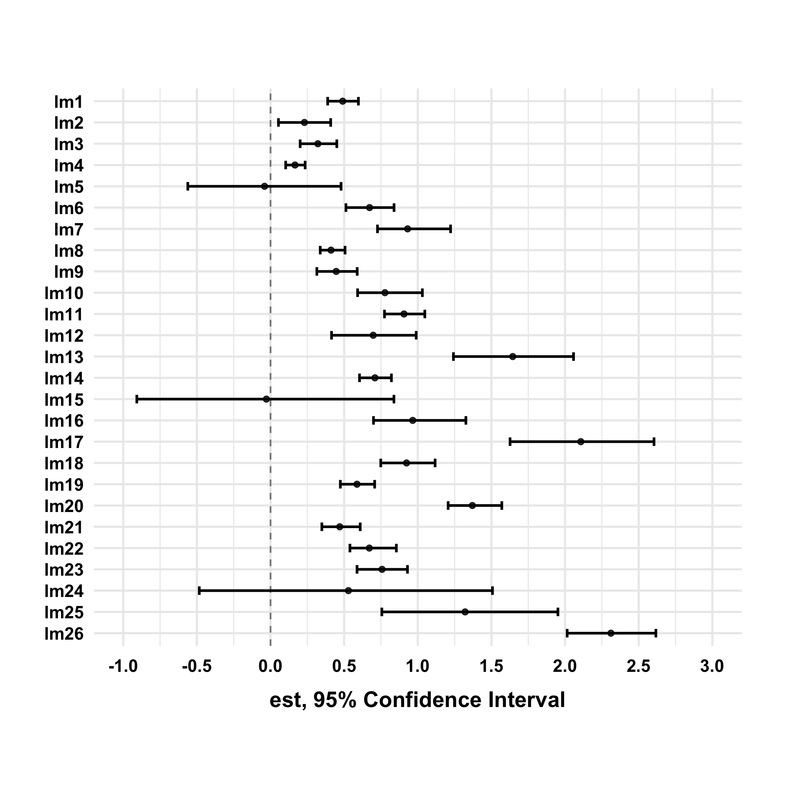
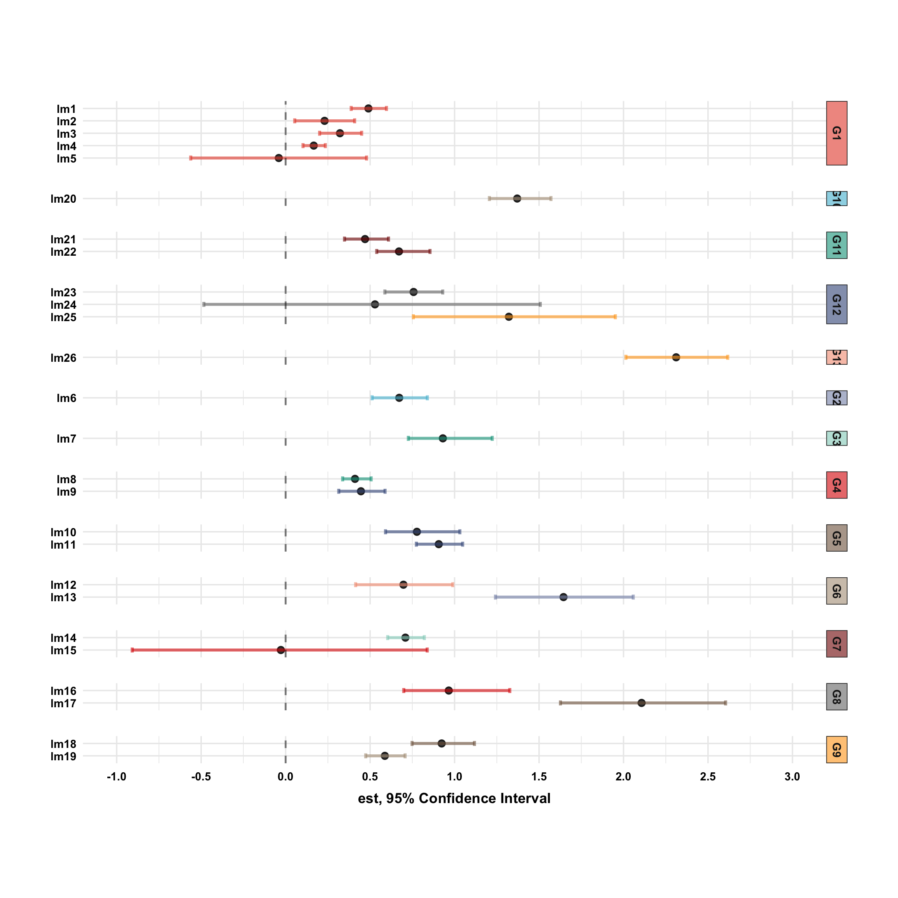

## Forest Plot

A forest plot allows us to visually compare ranges of values associated with different groups. Its typical use case is to display multiple rows of point estimates and their confidence intervals. For example, say you had a dataset of 1 continuous outcome and 10 features. Suppose you fitted a simple linear regression model using each feature and extracted the coefficient estimate and its 95% confidence interval, you could then stack them as rows into a data frame and call `mk_forestplot()` to visualize all coefficient estimates and their confidence intervals in a plot. This can allow you to quickly identify the features with the highest or lowest effect on the outcome. Let's see an example. The `ezplot` package includes a data frame called `ests_CIs` that contains fake coefficients and their confidence intervals. There's also a grouping variable (`group`) that groups the models, and as we'll see in a short while, this `group` variable can also be plotted.

```r
library(dplyr)
library(tidyr)
library(ezplot)
# look at the first 13 rows
head(ests_CIs, 13)
```

```
   model group       est       lwr     upr
1    lm1    G1  0.490050  0.387963 0.59670
2    lm2    G1  0.230431  0.053816 0.40853
3    lm3    G1  0.321576  0.201216 0.44998
4    lm4    G1  0.166360  0.102884 0.23506
5    lm5    G1 -0.040565 -0.561702 0.47897
6    lm6    G2  0.672317  0.512061 0.83874
7    lm7    G3  0.930626  0.726341 1.22269
8    lm8    G4  0.410582  0.337443 0.50596
9    lm9    G4  0.445794  0.314462 0.58849
10  lm10    G5  0.776940  0.591171 1.03113
11  lm11    G5  0.906348  0.773708 1.04765
12  lm12    G6  0.697296  0.414325 0.98923
13  lm13    G6  1.644717  1.241771 2.05748
```

First, let's simply plot out the coefficient estimates and their confidence intervals. Note that we need to pass a categorical variable that represents the row labels to the `yvar` parameter. The implicit message is that the input data frame must have unique rows. 

```r
plt = mk_forestplot(ests_CIs)
plt('est', xmin_var = 'lwr', xmax_var = 'upr', yvar = 'model')
```



We see from the above chart that the y-axis is ordered alphabetically by default. But we can order it however we want. For example, the following code re-orders the levels of `model` in descending alphanumerical order (`lm26, lm25, ..., lm10, lm9, ..., lm1`) in the data, and this will order the y-axis in ascending alphanumerical order (`lm1, ..., lm10, lm11, ..., lm26`).

```r
df = ests_CIs
df$model = factor(df[['model']], levels = rev(unique(df[['model']])))
plt2 = mk_forestplot(df)
plt2('est', xmin_var = 'lwr', xmax_var = 'upr', yvar = 'model')
```



Now let's add in the grouping variable `group` by passing it to the `colorby` parameter. Notice the ascending alphanumerical order is preserved within each group.

```r
plt2('est', xmin_var = 'lwr', xmax_var = 'upr', yvar = 'model', 
     colorby = 'group', font_size = 8)
```



As an exercise, can you re-order the y-axis in descending alphanumerical order? Can you re-order the facet panels (groups) in ascending alphanumerical order (i.e., `G1, G2, ..., G12`)?
