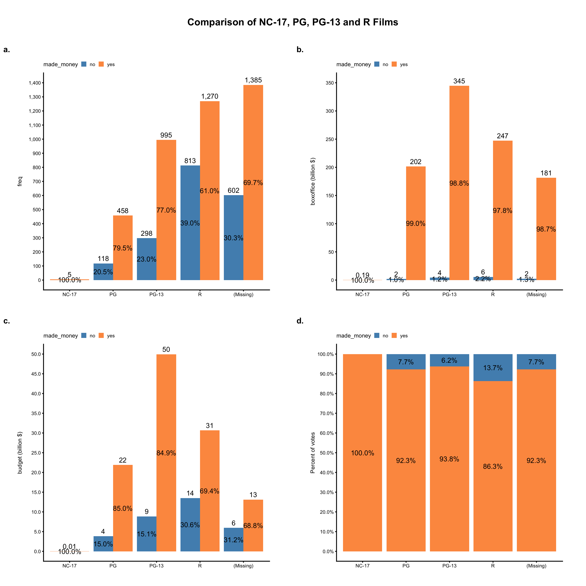

# Combine Plots

Sometimes you want to put several graphs together in a nice layed-out grid as one figure for publication. This can be easily done using the ezplot function `combine_plot()`, as long as your graphs are ggplot2 objects. Let's see an example. We'll make 4 plots, each with a different metric (the number of films, total boxoffices, total budget and number of votes received) over the MPAA levels. 

```r
library(ezplot)
library(dplyr)

# prep data
df = films %>% mutate(mpaa = forcats::fct_explicit_na(mpaa)) %>%
        group_by(mpaa, made_money) %>%
        summarise(freq = n(),
                  boxoffice = sum(boxoffice) / 1e9,
                  budget = sum(budget) / 1e9,
                  votes = sum(votes) / 1e9,
                  .groups = 'drop')

# make 4 separate plots
f = mk_barplot_resp(df)
p1 = f("mpaa", 'freq', fillby = "made_money", legend_pos = 'top', font_size = 7)
p2 = f("mpaa", 'boxoffice', fillby = "made_money", legend_pos = 'top',
       font_size = 7) %>% add_labs(ylab = 'boxoffice (billion $)')
p3 = f("mpaa", 'budget', fillby = "made_money", legend_pos = 'top',
       font_size = 7) %>% add_labs(ylab = 'budget (billion $)')
p4 = f("mpaa", 'votes', fillby = "made_money", show_pct = T,
       legend_pos = 'top', font_size = 7)

# combine them into one figure, by default, the plots are 
# arranged vertically into 2 columns with labels a. b. c. d.
combine_plots(p1, p2, p3, p4, 
              title = 'Comparison of NC-17, PG, PG-13 and R Films')
```



Make sure you read the documentation (`?combine_plots`) to learn about the other parameters. For example, you can change the graph index labels by passing a character 
vector to the `labels=` argument. 
